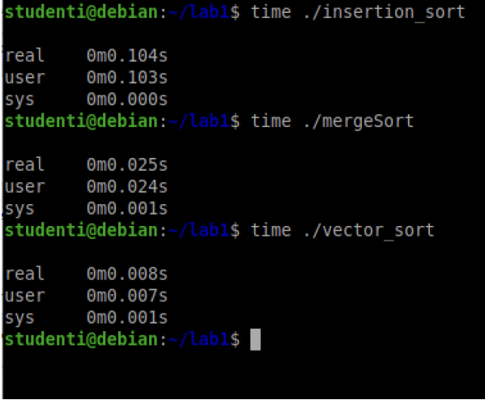

# LAB 2 - 17-03-2025

## MergeSort

Il mergeSort è un algoritmo di ordinamento che utilizza il paradigma divide et impera. L'idea principale è di dividere l'array da ordinare in due metà, ordinare ricorsivamente ciascuna metà e poi unire le due metà ordinate per ottenere l'array ordinato finale.

L'algoritmo si divide in tre passaggi:
1. **_Divide_**: Dividi l'array in due metà.
2. **_Conquer_**: Ordina ricorsivamente ciascuna metà.
3. **_Combina_**: Unisci le due metà ordinate per ottenere l'array ordinato finale.


Apriamo il terminale di UNIX, creiamo il file e modifichiamolo tramite NANO:

```bash
# Creiamo il file per mergeSort:
touch mergeSort.cpp

# Creiamo anche una cartella per il laboratorio 2:
mkdir LAB2

# Spostiamo il file nella cartella:
mv mergeSort.cpp LAB2

# Spostiamoci nella cartella:
cd LAB2

# Modifichiamo tramite NANO il file .cpp
nano mergeSort.cpp
```

Si aprirà un interfaccia per modificare il file e noi dovremmo implementare la nostra funzione **`mergeSort`**


```cpp
void combina(int arr[], intstart, int mid, int end){
    int iSx = start, iDx = mid;
    int * tempResult = new int[end-start+1];
    int vector_index = 0;
    while(1){
        if(arr[iSx] < arr[iDx]){
        tempResult[vector_index++] = arr[iSx++];
        if(iSx == mid) 
            break;
        }else{
        tempResult[vector_index++] = arr[iDx++];
        if(iDx == end + 1) 
            break;
        }
    }
    while(iSx < mid){
        tempResult[vector_index++] = arr[iSx++];
    }
    while(iDx <= end){
        tempResult[vector_index++] = arr[iDx++];
    }
    for(int i = 0; i <= end; i++){
        arr[i+start] = tempResult[i];
    }
    for(int i = 0; i <= end; i++){
        cout<<arr[i]<<endl;
    }
}

/* ---------------------------------------------------- */

void mergeSort(int* arr, int start, int end)
{
    int mid;
    if(start<end){
        mid = (start + end)/2; // Passaggio DIVIDE
        mergeSort(arr, start , mid); // Passaggio CONQUER
        mergeSort(arr, mid , end); // Passaggio CONQUER;
        combina(arr, start, mid+1, end); // Passaggio COMBINA;
    }
}
```

La complessità di questo algoritmo è *`O(log(n))`* 

---

## Lettura Input

Partiamo con il seguente esercizio:

>[!TIP]
>Crea due file input.txt contentente:
>```txt
>5
>10
>9
>15
>2
>12
>```
>e un file output.txt:
>```
>48
>32400
>2 9 10 12 15
>```
>Dobbiamo fare le seguenti cose:
>1. Legga un insieme di numeri interi da un file input.txt.
>2. Calcoli la somma e il prodotto di tutti i numeri letti.
>3. Ordini i numeri in ordine crescente.
>4. Stampi i risultati su standard output (cout).
>5. Confronti l'output generato con un file output.txt per verificare eventuali differenze.

- Per prima cosa...

    ```bash
    # Creiamo i due file .txt:
    touch input.txt
    touch output.txt

    # ---------------------------------- #

    # Inserire i valori tramite NANO nei vari .txt:
    nano input.txt
    # Scrivi qualcosa...
    5
    10
    9
    15
    2
    12
    CTRL + O            # Salva il file
    CTRL + X            # Esci da nano

    ## e...

    nano input.txt
    # Scrivi qualcosa...
    48
    32400
    2 9 10 12 15
    CTRL + O            # Salva il file
    CTRL + X            # Esci da nano

    # ---------------------------------- #

    # Creiamo il nostro file .cpp di nome 
    # letturaInput.cpp e lo spostiamo nella cartella LAB2

    touch letturaInput.cpp
    mv letturaInput.cpp LAB2
    cd LAB2
    ```

- Adesso attraverso l'utilizzo di `nano` andiamo a modificare il file `letturaInput.cpp`:

    ```cpp
    // Versione senza VECTOR
    int * leggiInputNOVECTOR( ){
        int len;
        cin >> len;
        int * arr = new int[len];
        for( int i = 0 ; i < len ; ++i )
            cin >> arr[i];
        return arr;
    }

    // Versione con VECTOR

    #include <vector>
    #include <algorithm>
    #include <iostream>
    using namespace std;
    
    void leggiInput( vector<int> &arr ){
        int len;
        cin >> len;
        int val;
        for( int i = 0 ; i < len ; ++i ){
            cin >> val;
            arr.push_back(val);
        }
        return;
    }
    
    
    int main(){
        vector<int> vettore;
        leggiInput(vettore);
        int somma = 0;
        int prodotto = 1;
        sort(vettore.begin(),vettore.end());
        for (int val : vettore) {
            somma += val;
            prodotto *= val;
            }
        cout << somma << endl;
        cout << prodotto << endl;
        for (int val : vettore){
            cout << val << " ";
        }
        cout << endl;

        return 0;
    }
    ```

- Compiliamo il codice letturaInput.cpp facendo:

    ```bash
    g++ -o eseguibile letturaInput.cpp
    ```

- Alla fine dovremmo digitare il seguente comando sul prompt dei comandi linux

    ```bash
    ./eseguibile < input.txt | diff - output.txt
    ```

Alla fine non dovrebbe mostrare differenze (perché confrontando i due output risulteranno entrambi uguali!).

---

Adesso però parliamo della classe `vector`:

>[!IMPORTANT]
>La classe `vector` è una delle più potenti e flessibili di C++. Può sostituire gli array tradizionali con molte funzionalità aggiuntive come ridimensionamento automatico, metodi per l'ordinamento e ricerca, iteratori e molto altro.
>
>| Funzione         | Descrizione |
>|-----------------|-------------------------------------------------------------|
>| `push_back(val)` | Aggiunge `val` alla fine del `vector`. |
>| `pop_ba>ck()`    | Rimuove l'ultimo elemento del `vector`. |
>| `insert(pos, val)` | Inserisce `val` in una posizione specifica (iteratore). |
>| `erase(pos)`    | Rimuove l'elemento in una posizione specifica (iteratore). |
>| `clear()`       | Rimuove tutti gli elementi dal `vector`. |
>| `resize(n)`     | Cambia la dimensione del `vector` a `n`. Se `n` è maggiore, riempie gli spazi con valori di default. |
>
>| Funzione         | Descrizione |
>|-----------------|-------------------------------------------------------------|
>| `at(i)`               | Ritorna l'elemento alla posizione `i`, con controllo sui limiti. |
>| `operator[]`          | Accede all'elemento alla posizione `i`, senza controllo sui limiti. |
>| `front()`             | Restituisce il primo elemento del `vector`. |
>| `back()`              | Restituisce l'ultimo elemento del `vector`. |
>| ------------------- |------------------------------------------------------------------- |
>| `size()`              | Restituisce il numero di elementi nel `vector`. |
>| `capacity()`          | Restituisce la capacità attuale del `vector`. |
>| `empty()`             | Ritorna `true` se il `vector` è vuoto, altrimenti `false`. |
>| `shrink_to_fit()`     | Riduce la capacità del `vector` alla sua dimensione attuale. |
>| ------------------- |------------------------------------------------------------------- |
>| `begin()`             | Restituisce un iteratore al primo elemento. |
>| `end()`               | Restituisce un iteratore dopo l'ultimo elemento. |
>| `rbegin()`            | Restituisce un iteratore inverso al primo elemento (cioè all'ultimo elemento in ordine normale). |
>| `rend()`              | Restituisce un iteratore inverso che punta prima del primo elemento. |
>
>C++ fornisce la libreria `#include <algorithm>` con funzioni utili per i `<vector>`:
>
>| Funzione | Descrizione |
>|-------------------------|-------------------------------------------------------------|
>| `sort(v.begin(), v.end())` | Ordina il `vector` in ordine crescente. |
>| `reverse(v.begin(), v.end())` | Inverte l'ordine degli elementi. |
>| `find(v.begin(), v.end(), val)` | Cerca un valore nel `vector` e restituisce l'iteratore corrispondente (se trovato). |
>| `count(v.begin(), v.end(), val)` | Conta quante volte `val` appare nel `vector`. |

---

>[!TIP]
> Le complessità dei vari sort che abbiamo studiato in questi laboratori sono i seguenti:
> 1. Insertion Sort: $O(n^2)$
> 2. Merge Sort: $O(nlog(n))$
> 3. STL Sort: $O(nlog(n))$
>
> e utlizzando nel cmd di linux `time ./stlSort` possiamo vedere il tempo si esecuzione dei vari Sort
> 
> 

---

## STL sort

La funzione sort della Standard Template Library (STL) di C++ è un algoritmo di ordinamento altamente ottimizzato che viene utilizzato per ordinare elementi contenuti in container come vector, array, deque e altri.

Esercitiamoci con un esercizio:

>[!TIP] Esercizio
>Si consideri un sistema per la gestione delle richieste.
>1. Si legga da tastiera N richieste e si inseriscano in un vettore.
>2. Si stampi l’ID delle richieste ordinate per ID. A parità di ID, vince la richiesta con priorità maggiore.
>3. La prima riga dell’input contiene l’intero N.
>4. Le successive righe contengono una richiesta per riga, con ID e
priorità separati da spazio.
>5. Si utilizzi la redirezione da file per leggere

- Per prima cosa...

    ```bash
    # Creiamo il file di input `input.txt` con i dati delle richieste 
    # e il file `output.txt` per confrontare l'output atteso.

    # Creiamo i due file .txt
    touch input.txt
    touch output.txt

    # Apriamo input.txt con Nano per inserire i dati
    nano input.txt

    # Scriviamo questi dati in input

    # Scrivi qualcosa...

    5
    2 5
    1 10
    2 8
    1 7
    3 4

    # La prima riga contiene il numero di richieste N.
    # Ogni riga successiva contiene ID e Priorità.

    # Premiamo CTRL + O per salvare e CTRL + X per uscire.
    ```

- Ora creiamo output.txt per confrontare il risultato:

    ```bash
    nano output.txt

    # Scriviamo l'output atteso...

    # Scrivi qualcosa...
    1 1 2 2 3
    
    # Premiamo CTRL + O per salvare e CTRL + X per uscire.

    # ------------------------------------------------------

    # Ora creiamo il file gestioneRichieste.cpp 
    # per implementare l'algoritmo.

    touch gestioneRichieste.cpp
    nano gestioneRichieste.cpp
    ```

- Scriviamo il codice:

    ```cpp
    #include <iostream>
    #include <vector>
    #include <algorithm>
    using namespace std;

    // Struttura per rappresentare una richiesta
    struct Richiesta {
        int id_;
        int prio_;
    };

    // Funzione di confronto per std::sort
    bool confrontaRichieste(Richiesta r1, Richiesta r2) {
        if (r1.id_ < r2.id_)
            return true;
        else if (r1.id_ == r2.id_)
            return r1.prio_ > r2.prio_;
        return false;
    }

    int main() {
        int N;
        cin >> N; // Leggiamo il numero di richieste

        vector<Richiesta> richieste(N);

        // Lettura delle richieste
        for (int i = 0; i < N; ++i) {
            cin >> richieste[i].id_ >> richieste[i].prio_;
        }

        // Ordinamento con std::sort e funzione di 
        // confronto personalizzata
        sort(richieste.begin(), richieste.end(), confrontaRichieste);

        // Stampa solo gli ID ordinati
        for (const auto& r : richieste) {
            cout << r.id_ << " ";
        }
        cout << endl;

        return 0;
    }

    // Salviamo in nano con CTRL + O per salvare 
    // e CTRL + X per uscire.
    ```

- Ora compiliamo ed eseguiamo il programma utilizzando la redirezione dell'input da file.

    ```bash
    # Compiliamo il codice
    g++ gestioneRichieste.cpp -o gestioneRichieste

    # Eseguiamo il programma leggendo l'input da file 
    # e confrontando l'output
    ./gestioneRichieste < input.txt | diff - output.txt
    ```

>[!IMPORTANT]
>La funzione `sort(v.begin(), v.end(), cmp)` ordina gli elementi di un vector usando un criterio personalizzato.
>
> ----------------------------
> 
> `confrontaRichieste` funziona nel seguente modo:
> 1. Ordina prima per ID crescente.
> 2. A parità di ID, ordina per priorità decrescente.
> 
> | Caso                                      | Restituisce                     |
> |-------------------------------------------|--------------------------------|
> | r1.id_ < r2.id_                           | true (r1 viene prima di r2)    |
> | r1.id_ > r2.id_                           | false (r2 viene prima di r1)   |
> | r1.id_ == r2.id_ && r1.prio_ > r2.prio_   | true (r1 viene prima di r2)    |
> | r1.id_ == r2.id_ && r1.prio_ <= r2.prio_  | false (r2 viene prima di r1)   |
