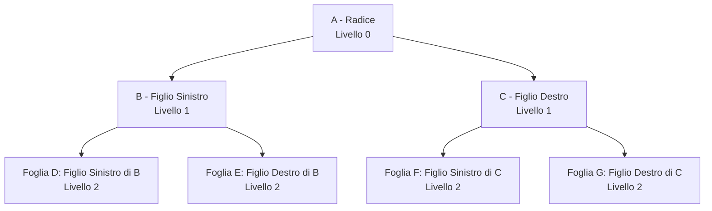
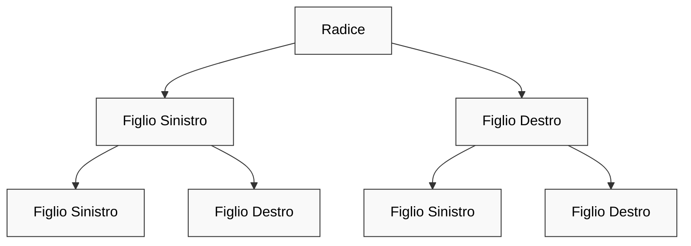
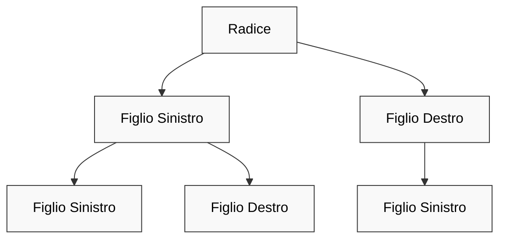
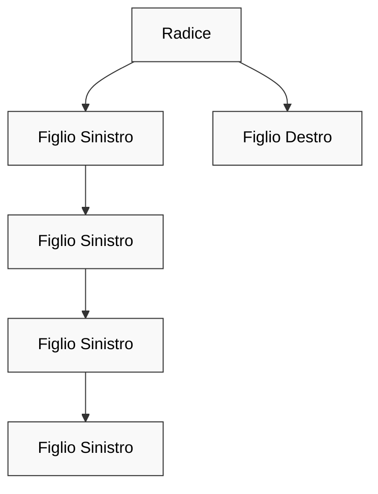
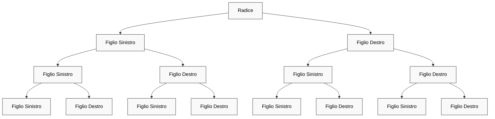

<h1> Lezione 5 - 12-03-2025 </h1>

---

<h1> 📚 Indice </h1>

- [Alberi](#alberi)
  - [Ricorsione su alberi binari](#ricorsione-su-alberi-binari)
  - [Visite di Alberi Binari](#visite-di-alberi-binari)
    - [Ordine Anticipato](#ordine-anticipato)
    - [Ordine Posticipato](#ordine-posticipato)
    - [Ordine Simmetrico](#ordine-simmetrico)
  - [Diverse categorie di alberi:](#diverse-categorie-di-alberi)
    - [1. **Alberi Bilanciati**](#1-alberi-bilanciati)
    - [2. **Alberi Quasi Bilanciati**](#2-alberi-quasi-bilanciati)
    - [3. **Alberi Non Bilanciati**](#3-alberi-non-bilanciati)
    - [4. **Alberi Completamente Binari**](#4-alberi-completamente-binari)
  - [Funzioni su Alberi](#funzioni-su-alberi)
    - [Funzione contaNodi:](#funzione-contanodi)
    - [Funzione contaFoglie:](#funzione-contafoglie)
    - [Funzione cercaEtichetta:](#funzione-cercaetichetta)
    - [Funzione cancellaAlbero:](#funzione-cancellaalbero)
    - [Funzione inserisciNodo e trovaNodo:](#funzione-inseriscinodo-e-trovanodo)


--- 

## Alberi

<div style="display: flex; justify-content: space-between; align-items: flex-start; align-items: center">
    <div>
        <h3 id="che-cosè-un-albero-binario"> Che cos'è un albero binario?</h3>
        <p>Un <strong>albero binario</strong> è una struttura dati composta da nodi, dove ogni nodo ha al massimo due figli. Questi alberi sono molto utilizzati in numerosi algoritmi, come quelli di ricerca, ordinamento e compressione dei dati.</p>
    </div>
    <div>
        
    </div>
</div>

Qui sopra troviamo uno schema di un albero che contiene:
- **_A (Radice)_**: Il nodo radice è il nodo principale da cui partono tutti gli altri nodi.
- **_B (Figlio Sinistro) e C (Figlio Destro)_**: Sono i figli di A. B è il figlio sinistro di A, mentre C è il figlio destro.
- **_D (Figlio Sinistro di B) e E (Figlio Destro di B)_**: Sono i figli di B. D è il figlio sinistro, mentre E è il figlio destro.
- **_F (Figlio Sinistro di C) e G (Figlio Destro di C)_**: Sono i figli di C. F è il figlio sinistro, mentre G è il figlio destro.

- NULL è un albero binario;
-  un nodo p più due alberi binari Bs e Bd forma un albero
binario

I concetti però da sapere e che sono fondamentali riguardo gli alberi binari sono:

1. **_Padre_** : Un nodo che ha almeno un figlio. Ad esempio, se un nodo A ha due figli B e C, allora A è il padre di entrambi.
2. **_Figlio sinistro e figlio destro_**: Ogni nodo può avere al massimo due figli:
    - Il figlio sinistro è il nodo collegato al lato sinistro del padre.
    - Il figlio destro è il nodo collegato al lato destro del padre.
3. **_Antecedente_**: Indica un nodo che si trova prima di un altro nella gerarchia dell'albero. In un albero binario di ricerca (BST), un antecedente di un nodo è il nodo che ha il valore immediatamente inferiore in ordine.
4. **_Foglia_**: Un nodo che non ha figli. È un nodo terminale dell'albero.
5. **_Discendente_**: Un nodo è discendente di un altro se può essere raggiunto seguendo i collegamenti dell'albero a partire da un nodo padre.
6. **_Livello di un nodo_**: Indica la profondità di un nodo nell'albero. La radice è al livello 0, i suoi figli sono al livello 1, i figli di questi ultimi sono al livello 2, e così via.
7. **_Livello dell’albero_**: Indica il livello massimo raggiunto nell’albero, ovvero la profondità massima dell'albero.


In questo schema possiamo dire che:
1. **A** è la **_RADICE_** del'albero e **_ANTECEDENTE_** di B e C;
2. **B** è **_Figlio Sinistro_** di A e **_ANTECEDENTE_** di D e E:
    - _D_ è **_Figlio Sinistro_** di B e **_Foglia_**;
    - _E_ è **_Figlio Destro_** di B e **_Foglia_**.
3. **C** è **_Figlio Destro_** di A e **_ANTECEDENTE_** di F e G:
    - _F_ è **_Figlio Sinistro_** di C e **_Foglia_**;
    - _G_ è **_Figlio Destro_** di C e **_Foglia_**.

Sotto forma di tabella...

| Nodo | Ruolo                     | Antecedente | Figlio Sinistro | Figlio Destro |
|------|----------------------------|-------------|-----------------|---------------|
| A    | **Radice**                 | —           | B               | C             |
| B    | **Figlio Sinistro di A**    | A           | D               | E             |
| C    | **Figlio Destro di A**      | A           | F               | G             |
| D    | **Foglia**                  | B           | —               | —             |
| E    | **Foglia**                  | B           | —               | —             |
| F    | **Foglia**                  | C           | —               | —             |
| G    | **Foglia**                  | C           | —               | —             |

Quello che abbiamo creato viene chiamato **_Albero Binario Etichettato_** **(ABE)** e...
>[!IMPORTANT]
>Un **albero binario etichettato** è un albero binario in cui _ad ogni nodo è associato un nome, o etichetta_.

---

### Ricorsione su alberi binari

Esistono due tipi di casi:
- **_Caso Base_**: albero vuoto (NULL):
  - Il caso base di una funzione ricorsiva su alberi binari si verifica quando l'albero è vuoto, cioè il nodo è NULL. Questo è il punto in cui la funzione smette di chiamarsi ricorsivamente, evitando di entrare in un ciclo infinito.

- **_Caso Ricorsivo_** radice + due sottoalberi:
  -  una funzione ricorsiva opera su un nodo della radice e invoca ricorsivamente la stessa funzione sui due sottoalberi: il sottoalbero sinistro e il sottoalbero destro. Questo processo continua fino a quando non si raggiunge il caso base.

### Visite di Alberi Binari

Le operazioni più comuni sugli alberi sono quelle di **linearizzazione, ricerca, inserimento, e cancellazione di nodi**. 
- Una linearizzazione di un albero è una sequenza contenente i nomi dei suoi nodi. 
  - Le più comuni linearizzazioni, dette visite, degli alberi binari sono tre:
    1. **_ordine anticipato (preorder)_**
    2. **_ordine differito (postorder)_**
    3. **_ordine simmetrico (inorder)_**

Per spiegare i diversi tipi di ordini definiamo una struct:
```cpp
struct Node {
    InfoType label;
    Node* left;
    Node* right;
};
```

#### Ordine Anticipato

```cpp
void preOrder ( albero ) {
    // se l'albero e' vuoto termina;
    /*altrimenti*/ {
        //esamina la radice;
        preOrder ( sottoalbero sinistro);
        preOrder ( sottoalbero destro);
    }
}
// il codice vero sotto...
void preOrder(Node* tree) {
    if (!tree) return;
    else {
        cout << tree->label;
        preOrder(tree->left);
        preOrder(tree->right);
    }
}
```

#### Ordine Posticipato

```cpp
void postOrder ( albero ) {
    //se l'albero e' vuoto termina;
    /*altrimenti*/ {
        postOrder ( sottoalbero sinistro);
        postOrder ( sottoalbero destro);
        //esamina la radice;
    }
}
// il codice vero sotto...
void postOrder(Node* tree) {
    if (!tree) return;
    else {
        postOrder(tree->left);
        postOrder(tree->right);
        cout << tree->label;
    }
}
```

#### Ordine Simmetrico

```cpp
void inOrder ( albero ) {
        //se l'albero e' vuoto termina;
        /*altrimenti*/ {
        inOrder ( sottoalbero sinistro);
        //esamina la radice;
        inOrder ( sottoalbero destro);
    }
}
// il codice vero sotto...
void inOrder(Node* tree) {
    if (!tree) return;
    else {
        inOrder(tree->left);
        cout << tree->label;
        inOrder(tree-> right);
    }
}
```

Possiamo dunque dire che:
1. **Visita in Ordine Anticipato (Preorder)**:
   - Visita prima la **radice**, poi esplora il **sottoalbero sinistro**, e infine esplora il **sottoalbero destro**.

2. **Visita in Ordine Posticipato (Postorder)**:
   - Esplora prima il **sottoalbero sinistro**, poi il **sottoalbero destro**, e infine visita la **radice**.

3. **Visita in Ordine Simmetrico (Inorder)**:
   - Esplora prima il **sottoalbero sinistro**, poi visita la **radice**, e infine esplora il **sottoalbero destro**.

Queste tre funzioni hanno una complessità T(n) = **O(n)** perché **_ogni funzione visita ogni nodo dell'albero una sola volta_**.  Durante la visita di ogni nodo, viene eseguita una costante quantità di lavoro (come la stampa del valore del nodo). Poiché la visita di ogni nodo richiede un tempo costante e ci sono n nodi, la complessità totale è **O(n)**.

### Diverse categorie di alberi:

Gli alberi binari possono essere classificati in diverse categorie in base alla loro struttura e bilanciamento. Ecco una descrizione di alcuni dei tipi più comuni:

#### 1. **Alberi Bilanciati**
Un **albero binario bilanciato** è un tipo di albero in cui la differenza tra la profondità del sottoalbero sinistro e del sottoalbero destro di ogni nodo è al massimo 1. Questo assicura che l'albero rimanga relativamente "piatto", con una complessità di ricerca e inserimento ottimale.

Albero Bilanciato:


- Un albero binario bilanciato di livello **k** (dove **k** è la profondità della radice) ha:
  - **2^(k+1) - 1** nodi totali (compreso la radice e tutte le foglie).
  - **2^k** foglie (il numero massimo di nodi senza figli che si trovano al livello più basso).

Questi alberi sono progettati per garantire che le operazioni (come ricerca, inserimento, cancellazione) vengano eseguite in **tempo logaritmico**, cioè **O(log n)**.

#### 2. **Alberi Quasi Bilanciati**
Un **albero quasi bilanciato** è simile a un albero bilanciato, ma con una differenza minore nel bilanciamento tra i sottoalberi sinistro e destro. In pratica, la profondità di un sottoalbero può essere maggiore di quella dell'altro, ma la differenza non è significativa come negli alberi non bilanciati. 

Albero quasi bilanciato:



La complessità delle operazioni in questi alberi può essere migliore rispetto agli alberi non bilanciati, ma non garantisce prestazioni logaritmiche costanti come negli alberi perfettamente bilanciati.

#### 3. **Alberi Non Bilanciati**
Un **albero non bilanciato** è un tipo di albero in cui non esistono vincoli sul bilanciamento dei sottoalberi. Ciò significa che uno dei sottoalberi può essere molto più profondo dell'altro, con la possibilità che l'albero diventi molto lungo e sottile, simile a una lista.

Albero non bilanciato:



 In questo caso, le operazioni di ricerca, inserimento e cancellazione possono richiedere un tempo lineare **O(n)**, che è inefficiente per grandi quantità di dati.

#### 4. **Alberi Completamente Binari**
Un **albero completamente binario** è un tipo di albero in cui tutti i livelli, eccetto forse l'ultimo, sono completamente riempiti. L'ultimo livello viene riempito da sinistra a destra.

- Un albero binario completamente pieno (o **perfetto**) ha un numero di nodi che segue la formula **2^(k+1) - 1**, come negli alberi bilanciati, ed è quindi anche un albero bilanciato.
- Un **albero binario completo** ha tanti nodi interni (cioè nodi con almeno un figlio) quanti sono le **foglie meno uno**.


Questa caratteristica significa che tutti i nodi interni hanno esattamente due figli e che non ci sono "buchi" tra le foglie, salvo che nell'ultimo livello. Gli alberi binari completi sono molto utili per strutture dati come gli **heap**, dove è necessario mantenere una struttura "compatta".

---

### Funzioni su Alberi

1. **_contaNodi_**: Conta ricorsivamente il numero totale di nodi nell'albero.
2. **_contaFoglie_**: Conta solo i nodi foglia (quelli senza figli).
3. **_cercaEtichetta_**: Cerca un valore specifico nell'albero.
4. **_cancellaAlbero_**: Elimina tutti i nodi dell'albero liberando la memoria.
5. **_inserisciNodo_**: Inserisce un nuovo nodo in un albero binario di ricerca.
    - **_trovaNodo_**: trova il nodo che ci serve esaminare.

Ovviamente per le nostre funzione necessitiamo della struttura che forma il nostro albero:

```cpp
struct Node {
    int data;
    Node* left;
    Node* right;
    
    // Costruttore
    Node(int val) {
        data = val;
        left = nullptr;
        right = nullptr;
    }
};
```

#### Funzione contaNodi:
La funzione **`contaNodi`** calcola il numero totale di nodi presenti in un albero binario. Utilizza un approccio ricorsivo basato sul principio di divisione e conquista:

1. **_Caso base_**: Se l'albero è vuoto (nullptr), restituisce 0 poiché non ci sono nodi.
2. **_Caso ricorsivo_**: Per ogni nodo non vuoto, somma:
    - 1 (per il nodo corrente)
    - Il numero di nodi nel sottoalbero sinistro
    - Il numero di nodi nel sottoalbero destro

La formula `1 + contaNodi(tree->left) + contaNodi(tree->right)` esprime elegantemente questo concetto. L'algoritmo attraversa l'intero albero, visitando ogni nodo esattamente una volta, risultando in una complessità temporale **O(n)** dove n è il numero di nodi nell'albero.

```cpp
int contaNodi(Node* tree) {
    // Caso base: albero vuoto
    if (tree == nullptr)
        return 0;
    
    // Conta ricorsivamente i nodi nei sottoalberi sinistro e destro
    // e aggiungi 1 per il nodo corrente
    return 1 + contaNodi(tree->left) + contaNodi(tree->right);
}
```

#### Funzione contaFoglie:

La funzione **`contaFoglie`** conta specificamente i nodi foglia in un albero binario. Un nodo foglia è definito come un nodo che non ha figli (né sinistro né destro). Anche questa funzione utilizza un approccio ricorsivo:

1. **_Caso base_**: Se l'albero è vuoto (nullptr), restituisce 0.
2. **_Controllo foglia_**: Se il nodo corrente è una foglia (entrambi i figli sono nullptr), restituisce 1.
3. **_Caso ricorsivo_**: Altrimenti, somma il numero di foglie presenti nei sottoalberi sinistro e destro.

Questa funzione è particolarmente utile nell'analisi della struttura di un albero e in applicazioni dove il comportamento specifico per i nodi terminali è richiesto. Come la funzione contaNodi, anche questa ha complessità temporale **O(n)**.

```cpp 
int contaFoglie(Node* tree) {
    // Caso base: albero vuoto
    if (tree == nullptr)
        return 0;
    
    // Se il nodo è una foglia (non ha figli), restituisci 1
    if (tree->left == nullptr && tree->right == nullptr)
        return 1;
    
    // Altrimenti, conta ricorsivamente le foglie nei sottoalberi
    return contaFoglie(tree->left) + contaFoglie(tree->right);
}
```

#### Funzione cercaEtichetta:

La funzione **`cercaEtichetta`** implementa un algoritmo di ricerca per trovare un **valore specifico** (_target_) in un albero binario. Utilizza una strategia di ricerca in profondità:

1. **_Caso base_**: Se l'albero è vuoto, restituisce false poiché il valore non può essere presente.
2. **_Controllo del nodo corrente_**: Se il valore del nodo corrente corrisponde a quello cercato, restituisce true.
3. **_Ricerca ricorsiva_**: Altrimenti, cerca il valore nei sottoalberi sinistro e destro. Il risultato finale è true se il valore è trovato in almeno uno dei sottoalberi.

L'operatore OR logico (`||`) tra le due chiamate ricorsive consente di interrompere la ricerca non appena il valore viene trovato nel sottoalbero sinistro, migliorando l'efficienza nel caso medio. Nel caso peggiore, quando il valore non è presente o si trova in un nodo foglia dell'ultimo livello, la complessità rimane **O(n)**.

```cpp
bool cercaEtichetta(Node* tree, int target) {
    // Caso base: albero vuoto
    if (tree == nullptr)
        return false;
    
    // Se il valore del nodo corrente corrisponde all'obiettivo
    if (tree->data == target)
        return true;
    
    // Cerca ricorsivamente nei sottoalberi
    return cercaEtichetta(tree->left, target) || cercaEtichetta(tree->right, target);
}
```

#### Funzione cancellaAlbero:

La funzione **`cancellaAlbero`** è responsabile della deallocazione completa della memoria occupata da un albero binario. Utilizza un attraversamento postordine per garantire che i nodi figli vengano deallocati prima del loro genitore:

1. **_Caso base_**: Se l'albero è vuoto, termina la ricorsione.
2. **_Deallocazione ricorsiva_**: Prima elimina il sottoalbero sinistro, poi il sottoalbero destro.
3. **_Deallocazione del nodo corrente_**: Infine, dealloca il nodo corrente e imposta il puntatore a nullptr per evitare riferimenti pendenti.

Questo approccio è essenziale per prevenire memory leak. La complessità è **O(n)** poiché ogni nodo viene visitato esattamente una volta. Il passaggio del puntatore per riferimento (Node* &tree) è cruciale perché permette di aggiornare il puntatore originale a nullptr dopo la deallocazione.
```cpp
void cancellaAlbero(Node* &tree) {
    // Caso base: albero vuoto
    if (tree == nullptr)
        return;
    
    // Prima cancella ricorsivamente i sottoalberi
    cancellaAlbero(tree->left);
    cancellaAlbero(tree->right);
    
    // Poi cancella il nodo corrente e imposta il puntatore a nullptr
    delete tree; // Cancellazione nodo corrente
    tree = nullptr; // Alla fine il puntatore deve essere NULL
}
```

#### Funzione inserisciNodo e trovaNodo:

Questa funzione implementa una ricerca in profondità per trovare un nodo con una specifica etichetta nell'albero:

Se l'albero è vuoto, il nodo non esiste.
Se l'etichetta del nodo corrente corrisponde a quella cercata, restituisce un puntatore a quel nodo.
Altrimenti, cerca ricorsivamente prima nel sottoalbero sinistro e poi, se necessario, nel destro.

```cpp
// Funzione "amica" per cercare un nodo con una specifica etichetta nell'albero
Node* trovaNodo(LabelType target, Node* tree) {
    if (tree == nullptr)
        return nullptr;
    
    if (tree->label == target)
        return tree;
    
    Node* trovato = trovaNodo(target, tree->left);
    if (trovato)
        return trovato;
    
    return trovaNodo(target, tree->right);
}
```

Questa funzione inserisce un nuovo nodo con etichetta son come figlio di un nodo esistente con etichetta father:

1. **_Caso albero vuoto_**: Se l'albero è vuoto, crea un nuovo nodo con etichetta son come radice.
2. **_Ricerca del padre_**: Utilizza trovaNodo per trovare il nodo con etichetta father.
3. **_Verifica esistenza del padre_**: Se il padre non esiste nell'albero, l'inserimento fallisce.
4. **_Inserimento come figlio sinistro_**: Se c è 'l' e non esiste già un figlio sinistro, crea un nuovo nodo con etichetta son come figlio sinistro.
5. **_Inserimento come figlio destro_**: Se c è 'r' e non esiste già un figlio destro, crea un nuovo nodo con etichetta son come figlio destro.
6. **_Gestione errori_**: Restituisce 1 in caso di successo, 0 in caso di fallimento.

Questa implementazione è particolarmente utile quando si vuole costruire un albero con una struttura specifica, piuttosto che un albero binario di ricerca dove la posizione di inserimento dipende dal valore. La complessità dipende dalla profondità dell'albero: nel caso peggiore è **O(n)** per trovare il nodo padre, più O(1) per l'inserimento effettivo.

```cpp
int inserisciNodo(Node* & tree, InfoType son, InfoType father, char c){
    // Caso albero vuoto: inserisco son come radice
    if (tree == nullptr) {
        tree = new Node;
        tree->info = son;
        tree->left = tree->right = nullptr;
        return 1;
    }
    
    // Cerco il nodo father nell'albero
    Node* nodoFather = trovaNodo(father, tree);
    
    // Se father non esiste nell'albero, restituisco 0 (fallimento)
    if (nodoFather == nullptr)
        return 0;
    
    // Se c=='l', provo inserimento a sinistra
    if (c == 'l') {
        // Verifico che non ci sia già un figlio sinistro
        if (nodoFather->left == nullptr) {
            // Creo il nuovo nodo e lo collego come figlio sinistro
            nodoFather->left = new Node;
            nodoFather->left->info = son;
            nodoFather->left->left = nodoFather->left->right = nullptr;
            return 1; // Successo
        }
        // Già presente un figlio sinistro, non posso inserire
        return 0; // Fallimento
    }
    
    // Se c=='r', provo inserimento a destra
    if (c == 'r') {
        // Verifico che non ci sia già un figlio destro
        if (nodoFather->right == nullptr) {
            // Creo il nuovo nodo e lo collego come figlio destro
            nodoFather->right = new Node;
            nodoFather->right->info = son;
            nodoFather->right->left = nodoFather->right->right = nullptr;
            return 1; // Successo
        }
        // Già presente un figlio destro, non posso inserire
        return 0; // Fallimento
    }
    
    // Se c non è né 'l' né 'r', restituisco 0 (fallimento)
    return 0;
}
```

---

>[!WARNING] Mettendo tutto insieme:
>```cpp
>template<class InfoType>
>class BinTree {
>   struct Node {
>       InfoType label;
>       Node *left, *right;
>   };
>   Node *tree;
>   Node* trovaNodo(InfoType, Node*);
>   void preOrder(Node*);
>   void inOrder(Node*);
>   void postOrder(Node*);
>   void cancellaAlbero(Node*&);
>   int inserisciNodo(Node*&, InfoType, InfoType, char)
>}
>```

