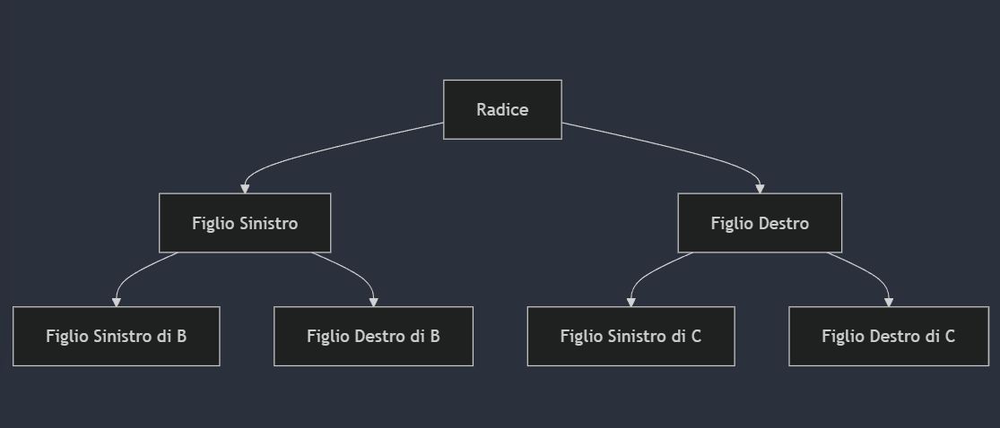
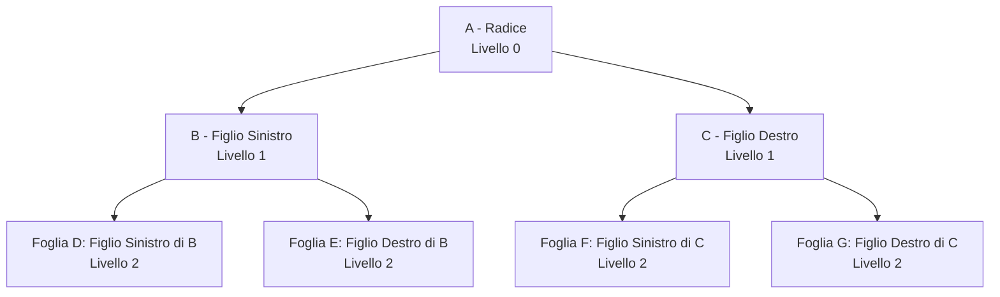
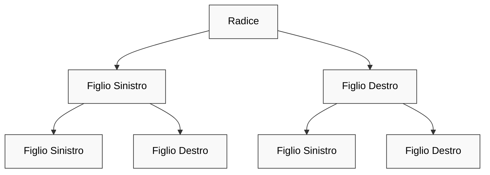
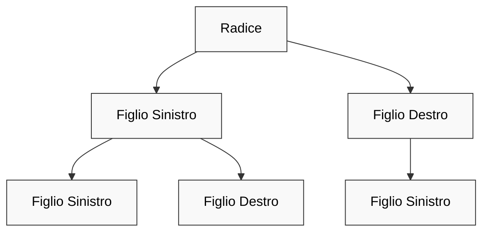
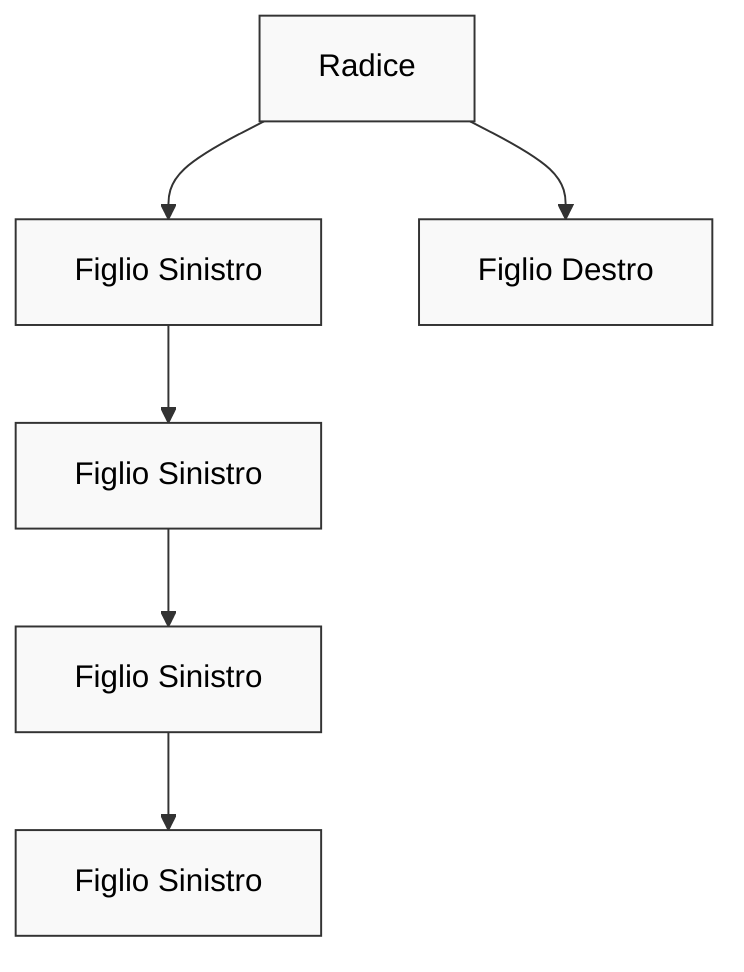
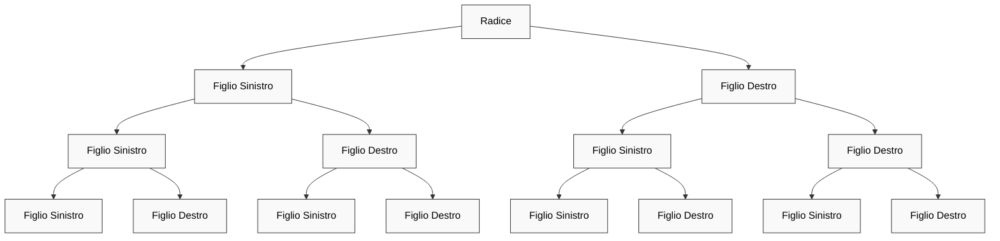
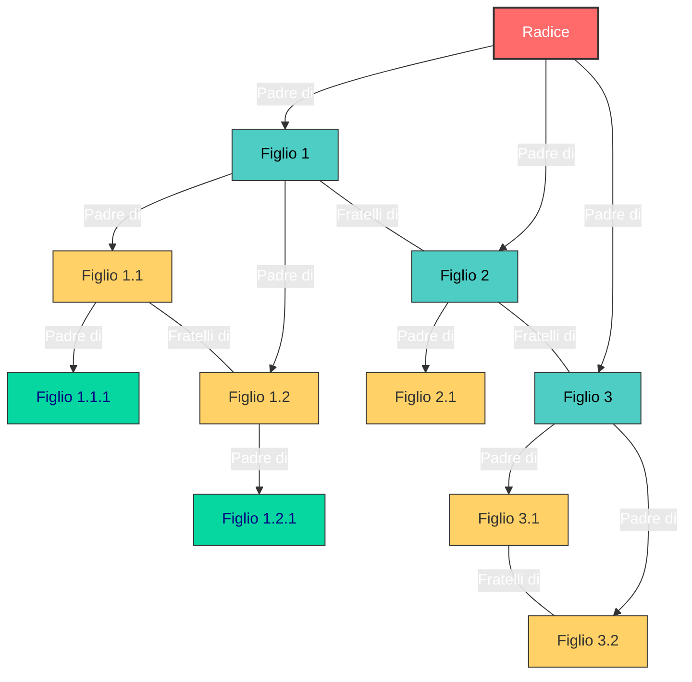

<h1> Lezione 5 - 12-03-2025 18-03-2025 </h1>

---

<h1> 📚 Indice </h1>

- [Alberi](#alberi)
  - [Ricorsione su alberi binari](#ricorsione-su-alberi-binari)
  - [Visite di Alberi Binari](#visite-di-alberi-binari)
    - [Ordine Anticipato](#ordine-anticipato)
    - [Ordine Posticipato](#ordine-posticipato)
    - [Ordine Simmetrico](#ordine-simmetrico)
  - [Diverse categorie di alberi:](#diverse-categorie-di-alberi)
    - [1. **Alberi Bilanciati**](#1-alberi-bilanciati)
    - [2. **Alberi Quasi Bilanciati**](#2-alberi-quasi-bilanciati)
    - [3. **Alberi Non Bilanciati**](#3-alberi-non-bilanciati)
    - [4. **Alberi Completamente Binari**](#4-alberi-completamente-binari)
  - [Funzioni su Alberi](#funzioni-su-alberi)
    - [Funzione contaNodi:](#funzione-contanodi)
    - [Funzione contaFoglie:](#funzione-contafoglie)
    - [Funzione cercaEtichetta:](#funzione-cercaetichetta)
    - [Funzione cancellaAlbero:](#funzione-cancellaalbero)
    - [Funzione inserisciNodo e trovaNodo:](#funzione-inseriscinodo-e-trovanodo)
- [Alberi generici](#alberi-generici)
  - [Visite](#visite)
  - [Memorizzazione](#memorizzazione)
    - [1. **Memorizzazione a liste multiple (o Lista di figli)**](#1-memorizzazione-a-liste-multiple-o-lista-di-figli)
    - [Come funziona:](#come-funziona)
    - [Vantaggi:](#vantaggi)
    - [Svantaggi:](#svantaggi)
    - [Esempio:](#esempio)
    - [2. **Memorizzazione figlio-fratello (o figlio-sorella)**](#2-memorizzazione-figlio-fratello-o-figlio-sorella)
    - [Come funziona:](#come-funziona-1)
    - [Vantaggi:](#vantaggi-1)
    - [Svantaggi:](#svantaggi-1)
      - [Esempio:](#esempio-1)
    - [Confronto tra i due approcci:](#confronto-tra-i-due-approcci)
  - [Corrispondenza fra visite](#corrispondenza-fra-visite)
    - [Esempi di programmi su alberi genereici:](#esempi-di-programmi-su-alberi-genereici)
- [Alberi binari di ricerca](#alberi-binari-di-ricerca)
  - [Proprietà](#proprietà)
  - [Operazioni](#operazioni)
  - [Proprietà degli Alberi Binari di Ricerca (BST):](#proprietà-degli-alberi-binari-di-ricerca-bst)
  - [Operazioni su Alberi Binari di Ricerca:](#operazioni-su-alberi-binari-di-ricerca)
    - [Pseudocodice delle operazioni principali:](#pseudocodice-delle-operazioni-principali)


--- 

## Alberi

<div style="display: flex; justify-content: space-between; align-items: flex-start; align-items: center">
    <div>
        <h3 id="che-cosè-un-albero-binario"> Che cos'è un albero binario?</h3>
        <p>Un <strong>albero binario</strong> è una struttura dati composta da nodi, dove ogni nodo ha al massimo due figli. Questi alberi sono molto utilizzati in numerosi algoritmi, come quelli di ricerca, ordinamento e compressione dei dati.</p>
    </div>
    <div>
        
    </div>
</div>

Qui sopra troviamo uno schema di un albero che contiene:
- **_A (Radice)_**: Il nodo radice è il nodo principale da cui partono tutti gli altri nodi.
- **_B (Figlio Sinistro) e C (Figlio Destro)_**: Sono i figli di A. B è il figlio sinistro di A, mentre C è il figlio destro.
- **_D (Figlio Sinistro di B) e E (Figlio Destro di B)_**: Sono i figli di B. D è il figlio sinistro, mentre E è il figlio destro.
- **_F (Figlio Sinistro di C) e G (Figlio Destro di C)_**: Sono i figli di C. F è il figlio sinistro, mentre G è il figlio destro.

- NULL è un albero binario;
-  un nodo p più due alberi binari Bs e Bd forma un albero
binario

I concetti però da sapere e che sono fondamentali riguardo gli alberi binari sono:

1. **_Padre_** : Un nodo che ha almeno un figlio. Ad esempio, se un nodo A ha due figli B e C, allora A è il padre di entrambi.
2. **_Figlio sinistro e figlio destro_**: Ogni nodo può avere al massimo due figli:
    - Il figlio sinistro è il nodo collegato al lato sinistro del padre.
    - Il figlio destro è il nodo collegato al lato destro del padre.
3. **_Antecedente_**: Indica un nodo che si trova prima di un altro nella gerarchia dell'albero. In un albero binario di ricerca (BST), un antecedente di un nodo è il nodo che ha il valore immediatamente inferiore in ordine.
4. **_Foglia_**: Un nodo che non ha figli. È un nodo terminale dell'albero.
5. **_Discendente_**: Un nodo è discendente di un altro se può essere raggiunto seguendo i collegamenti dell'albero a partire da un nodo padre.
6. **_Livello di un nodo_**: Indica la profondità di un nodo nell'albero. La radice è al livello 0, i suoi figli sono al livello 1, i figli di questi ultimi sono al livello 2, e così via.
7. **_Livello dell’albero_**: Indica il livello massimo raggiunto nell’albero, ovvero la profondità massima dell'albero.


In questo schema possiamo dire che:
1. **A** è la **_RADICE_** del'albero e **_ANTECEDENTE_** di B e C;
2. **B** è **_Figlio Sinistro_** di A e **_ANTECEDENTE_** di D e E:
    - _D_ è **_Figlio Sinistro_** di B e **_Foglia_**;
    - _E_ è **_Figlio Destro_** di B e **_Foglia_**.
3. **C** è **_Figlio Destro_** di A e **_ANTECEDENTE_** di F e G:
    - _F_ è **_Figlio Sinistro_** di C e **_Foglia_**;
    - _G_ è **_Figlio Destro_** di C e **_Foglia_**.

Sotto forma di tabella...

| Nodo | Ruolo                     | Antecedente | Figlio Sinistro | Figlio Destro |
|------|----------------------------|-------------|-----------------|---------------|
| A    | **Radice**                 | —           | B               | C             |
| B    | **Figlio Sinistro di A**    | A           | D               | E             |
| C    | **Figlio Destro di A**      | A           | F               | G             |
| D    | **Foglia**                  | B           | —               | —             |
| E    | **Foglia**                  | B           | —               | —             |
| F    | **Foglia**                  | C           | —               | —             |
| G    | **Foglia**                  | C           | —               | —             |

Quello che abbiamo creato viene chiamato **_Albero Binario Etichettato_** **(ABE)** e...
>[!IMPORTANT]
>Un **albero binario etichettato** è un albero binario in cui _ad ogni nodo è associato un nome, o etichetta_.

---

### Ricorsione su alberi binari

Esistono due tipi di casi:
- **_Caso Base_**: albero vuoto (NULL):
  - Il caso base di una funzione ricorsiva su alberi binari si verifica quando l'albero è vuoto, cioè il nodo è NULL. Questo è il punto in cui la funzione smette di chiamarsi ricorsivamente, evitando di entrare in un ciclo infinito.

- **_Caso Ricorsivo_** radice + due sottoalberi:
  -  una funzione ricorsiva opera su un nodo della radice e invoca ricorsivamente la stessa funzione sui due sottoalberi: il sottoalbero sinistro e il sottoalbero destro. Questo processo continua fino a quando non si raggiunge il caso base.

### Visite di Alberi Binari

Le operazioni più comuni sugli alberi sono quelle di **linearizzazione, ricerca, inserimento, e cancellazione di nodi**. 
- Una linearizzazione di un albero è una sequenza contenente i nomi dei suoi nodi. 
  - Le più comuni linearizzazioni, dette visite, degli alberi binari sono tre:
    1. **_ordine anticipato (preorder)_**
    2. **_ordine differito (postorder)_**
    3. **_ordine simmetrico (inorder)_**

Per spiegare i diversi tipi di ordini definiamo una struct:
```cpp
struct Node {
    InfoType label;
    Node* left;
    Node* right;
};
```

#### Ordine Anticipato

```cpp
void preOrder ( albero ) {
    // se l'albero e' vuoto termina;
    /*altrimenti*/ {
        //esamina la radice;
        preOrder ( sottoalbero sinistro);
        preOrder ( sottoalbero destro);
    }
}
// il codice vero sotto...
void preOrder(Node* tree) {
    if (!tree) return;
    else {
        cout << tree->label;
        preOrder(tree->left);
        preOrder(tree->right);
    }
}
```

#### Ordine Posticipato

```cpp
void postOrder ( albero ) {
    //se l'albero e' vuoto termina;
    /*altrimenti*/ {
        postOrder ( sottoalbero sinistro);
        postOrder ( sottoalbero destro);
        //esamina la radice;
    }
}
// il codice vero sotto...
void postOrder(Node* tree) {
    if (!tree) return;
    else {
        postOrder(tree->left);
        postOrder(tree->right);
        cout << tree->label;
    }
}
```

#### Ordine Simmetrico

```cpp
void inOrder ( albero ) {
        //se l'albero e' vuoto termina;
        /*altrimenti*/ {
        inOrder ( sottoalbero sinistro);
        //esamina la radice;
        inOrder ( sottoalbero destro);
    }
}
// il codice vero sotto...
void inOrder(Node* tree) {
    if (!tree) return;
    else {
        inOrder(tree->left);
        cout << tree->label;
        inOrder(tree-> right);
    }
}
```

Possiamo dunque dire che:
1. **Visita in Ordine Anticipato (Preorder)**:
   - Visita prima la **radice**, poi esplora il **sottoalbero sinistro**, e infine esplora il **sottoalbero destro**.

2. **Visita in Ordine Posticipato (Postorder)**:
   - Esplora prima il **sottoalbero sinistro**, poi il **sottoalbero destro**, e infine visita la **radice**.

3. **Visita in Ordine Simmetrico (Inorder)**:
   - Esplora prima il **sottoalbero sinistro**, poi visita la **radice**, e infine esplora il **sottoalbero destro**.

Queste tre funzioni hanno una complessità T(n) = **O(n)** perché **_ogni funzione visita ogni nodo dell'albero una sola volta_**.  Durante la visita di ogni nodo, viene eseguita una costante quantità di lavoro (come la stampa del valore del nodo). Poiché la visita di ogni nodo richiede un tempo costante e ci sono n nodi, la complessità totale è **O(n)**.

### Diverse categorie di alberi:

Gli alberi binari possono essere classificati in diverse categorie in base alla loro struttura e bilanciamento. Ecco una descrizione di alcuni dei tipi più comuni:

#### 1. **Alberi Bilanciati**
Un **albero binario bilanciato** è un tipo di albero in cui la differenza tra la profondità del sottoalbero sinistro e del sottoalbero destro di ogni nodo è al massimo 1. Questo assicura che l'albero rimanga relativamente "piatto", con una complessità di ricerca e inserimento ottimale.

Albero Bilanciato:


- Un albero binario bilanciato di livello **k** (dove **k** è la profondità della radice) ha:
  - **2^(k+1) - 1** nodi totali (compreso la radice e tutte le foglie).
  - **2^k** foglie (il numero massimo di nodi senza figli che si trovano al livello più basso).

Questi alberi sono progettati per garantire che le operazioni (come ricerca, inserimento, cancellazione) vengano eseguite in **tempo logaritmico**, cioè **O(log n)**.

#### 2. **Alberi Quasi Bilanciati**
Un **albero quasi bilanciato** è simile a un albero bilanciato, ma con una differenza minore nel bilanciamento tra i sottoalberi sinistro e destro. In pratica, la profondità di un sottoalbero può essere maggiore di quella dell'altro, ma la differenza non è significativa come negli alberi non bilanciati. 

Albero quasi bilanciato:



La complessità delle operazioni in questi alberi può essere migliore rispetto agli alberi non bilanciati, ma non garantisce prestazioni logaritmiche costanti come negli alberi perfettamente bilanciati.

#### 3. **Alberi Non Bilanciati**
Un **albero non bilanciato** è un tipo di albero in cui non esistono vincoli sul bilanciamento dei sottoalberi. Ciò significa che uno dei sottoalberi può essere molto più profondo dell'altro, con la possibilità che l'albero diventi molto lungo e sottile, simile a una lista.

Albero non bilanciato:



 In questo caso, le operazioni di ricerca, inserimento e cancellazione possono richiedere un tempo lineare **O(n)**, che è inefficiente per grandi quantità di dati.

#### 4. **Alberi Completamente Binari**
Un **albero completamente binario** è un tipo di albero in cui tutti i livelli, eccetto forse l'ultimo, sono completamente riempiti. L'ultimo livello viene riempito da sinistra a destra.

- Un albero binario completamente pieno (o **perfetto**) ha un numero di nodi che segue la formula **2^(k+1) - 1**, come negli alberi bilanciati, ed è quindi anche un albero bilanciato.
- Un **albero binario completo** ha tanti nodi interni (cioè nodi con almeno un figlio) quanti sono le **foglie meno uno**.


Questa caratteristica significa che tutti i nodi interni hanno esattamente due figli e che non ci sono "buchi" tra le foglie, salvo che nell'ultimo livello. Gli alberi binari completi sono molto utili per strutture dati come gli **heap**, dove è necessario mantenere una struttura "compatta".

---

### Funzioni su Alberi

1. **_contaNodi_**: Conta ricorsivamente il numero totale di nodi nell'albero.
2. **_contaFoglie_**: Conta solo i nodi foglia (quelli senza figli).
3. **_cercaEtichetta_**: Cerca un valore specifico nell'albero.
4. **_cancellaAlbero_**: Elimina tutti i nodi dell'albero liberando la memoria.
5. **_inserisciNodo_**: Inserisce un nuovo nodo in un albero binario di ricerca.
    - **_trovaNodo_**: trova il nodo che ci serve esaminare.

Ovviamente per le nostre funzione necessitiamo della struttura che forma il nostro albero:

```cpp
struct Node {
    int data;
    Node* left;
    Node* right;
    
    // Costruttore
    Node(int val) {
        data = val;
        left = nullptr;
        right = nullptr;
    }
};
```

#### Funzione contaNodi:
La funzione **`contaNodi`** calcola il numero totale di nodi presenti in un albero binario. Utilizza un approccio ricorsivo basato sul principio di divisione e conquista:

1. **_Caso base_**: Se l'albero è vuoto (nullptr), restituisce 0 poiché non ci sono nodi.
2. **_Caso ricorsivo_**: Per ogni nodo non vuoto, somma:
    - 1 (per il nodo corrente)
    - Il numero di nodi nel sottoalbero sinistro
    - Il numero di nodi nel sottoalbero destro

La formula `1 + contaNodi(tree->left) + contaNodi(tree->right)` esprime elegantemente questo concetto. L'algoritmo attraversa l'intero albero, visitando ogni nodo esattamente una volta, risultando in una complessità temporale **O(n)** dove n è il numero di nodi nell'albero.

```cpp
int contaNodi(Node* tree) {
    // Caso base: albero vuoto
    if (tree == nullptr)
        return 0;
    
    // Conta ricorsivamente i nodi nei sottoalberi sinistro e destro
    // e aggiungi 1 per il nodo corrente
    return 1 + contaNodi(tree->left) + contaNodi(tree->right);
}
```

#### Funzione contaFoglie:

La funzione **`contaFoglie`** conta specificamente i nodi foglia in un albero binario. Un nodo foglia è definito come un nodo che non ha figli (né sinistro né destro). Anche questa funzione utilizza un approccio ricorsivo:

1. **_Caso base_**: Se l'albero è vuoto (nullptr), restituisce 0.
2. **_Controllo foglia_**: Se il nodo corrente è una foglia (entrambi i figli sono nullptr), restituisce 1.
3. **_Caso ricorsivo_**: Altrimenti, somma il numero di foglie presenti nei sottoalberi sinistro e destro.

Questa funzione è particolarmente utile nell'analisi della struttura di un albero e in applicazioni dove il comportamento specifico per i nodi terminali è richiesto. Come la funzione contaNodi, anche questa ha complessità temporale **O(n)**.

```cpp 
int contaFoglie(Node* tree) {
    // Caso base: albero vuoto
    if (tree == nullptr)
        return 0;
    
    // Se il nodo è una foglia (non ha figli), restituisci 1
    if (tree->left == nullptr && tree->right == nullptr)
        return 1;
    
    // Altrimenti, conta ricorsivamente le foglie nei sottoalberi
    return contaFoglie(tree->left) + contaFoglie(tree->right);
}
```

#### Funzione cercaEtichetta:

La funzione **`cercaEtichetta`** implementa un algoritmo di ricerca per trovare un **valore specifico** (_target_) in un albero binario. Utilizza una strategia di ricerca in profondità:

1. **_Caso base_**: Se l'albero è vuoto, restituisce false poiché il valore non può essere presente.
2. **_Controllo del nodo corrente_**: Se il valore del nodo corrente corrisponde a quello cercato, restituisce true.
3. **_Ricerca ricorsiva_**: Altrimenti, cerca il valore nei sottoalberi sinistro e destro. Il risultato finale è true se il valore è trovato in almeno uno dei sottoalberi.

L'operatore OR logico (`||`) tra le due chiamate ricorsive consente di interrompere la ricerca non appena il valore viene trovato nel sottoalbero sinistro, migliorando l'efficienza nel caso medio. Nel caso peggiore, quando il valore non è presente o si trova in un nodo foglia dell'ultimo livello, la complessità rimane **O(n)**.

```cpp
bool cercaEtichetta(Node* tree, int target) {
    // Caso base: albero vuoto
    if (tree == nullptr)
        return false;
    
    // Se il valore del nodo corrente corrisponde all'obiettivo
    if (tree->data == target)
        return true;
    
    // Cerca ricorsivamente nei sottoalberi
    return cercaEtichetta(tree->left, target) || cercaEtichetta(tree->right, target);
}
```

#### Funzione cancellaAlbero:

La funzione **`cancellaAlbero`** è responsabile della deallocazione completa della memoria occupata da un albero binario. Utilizza un attraversamento postordine per garantire che i nodi figli vengano deallocati prima del loro genitore:

1. **_Caso base_**: Se l'albero è vuoto, termina la ricorsione.
2. **_Deallocazione ricorsiva_**: Prima elimina il sottoalbero sinistro, poi il sottoalbero destro.
3. **_Deallocazione del nodo corrente_**: Infine, dealloca il nodo corrente e imposta il puntatore a nullptr per evitare riferimenti pendenti.

Questo approccio è essenziale per prevenire memory leak. La complessità è **O(n)** poiché ogni nodo viene visitato esattamente una volta. Il passaggio del puntatore per riferimento (Node* &tree) è cruciale perché permette di aggiornare il puntatore originale a nullptr dopo la deallocazione.
```cpp
void cancellaAlbero(Node* &tree) {
    // Caso base: albero vuoto
    if (tree == nullptr)
        return;
    
    // Prima cancella ricorsivamente i sottoalberi
    cancellaAlbero(tree->left);
    cancellaAlbero(tree->right);
    
    // Poi cancella il nodo corrente e imposta il puntatore a nullptr
    delete tree; // Cancellazione nodo corrente
    tree = nullptr; // Alla fine il puntatore deve essere NULL
}
```

#### Funzione inserisciNodo e trovaNodo:

Questa funzione implementa una ricerca in profondità per trovare un nodo con una specifica etichetta nell'albero:

Se l'albero è vuoto, il nodo non esiste.
Se l'etichetta del nodo corrente corrisponde a quella cercata, restituisce un puntatore a quel nodo.
Altrimenti, cerca ricorsivamente prima nel sottoalbero sinistro e poi, se necessario, nel destro.

```cpp
// Funzione "amica" per cercare un nodo con una specifica etichetta nell'albero
Node* trovaNodo(LabelType target, Node* tree) {
    if (tree == nullptr)
        return nullptr;
    
    if (tree->label == target)
        return tree;
    
    Node* trovato = trovaNodo(target, tree->left);
    if (trovato)
        return trovato;
    
    return trovaNodo(target, tree->right);
}
```

Questa funzione inserisce un nuovo nodo con etichetta son come figlio di un nodo esistente con etichetta father:

1. **_Caso albero vuoto_**: Se l'albero è vuoto, crea un nuovo nodo con etichetta son come radice.
2. **_Ricerca del padre_**: Utilizza trovaNodo per trovare il nodo con etichetta father.
3. **_Verifica esistenza del padre_**: Se il padre non esiste nell'albero, l'inserimento fallisce.
4. **_Inserimento come figlio sinistro_**: Se c è 'l' e non esiste già un figlio sinistro, crea un nuovo nodo con etichetta son come figlio sinistro.
5. **_Inserimento come figlio destro_**: Se c è 'r' e non esiste già un figlio destro, crea un nuovo nodo con etichetta son come figlio destro.
6. **_Gestione errori_**: Restituisce 1 in caso di successo, 0 in caso di fallimento.

Questa implementazione è particolarmente utile quando si vuole costruire un albero con una struttura specifica, piuttosto che un albero binario di ricerca dove la posizione di inserimento dipende dal valore. La complessità dipende dalla profondità dell'albero: nel caso peggiore è **O(n)** per trovare il nodo padre, più O(1) per l'inserimento effettivo.

```cpp
int inserisciNodo(Node* & tree, InfoType son, InfoType father, char c){
    // Caso albero vuoto: inserisco son come radice
    if (tree == nullptr) {
        tree = new Node;
        tree->info = son;
        tree->left = tree->right = nullptr;
        return 1;
    }
    
    // Cerco il nodo father nell'albero
    Node* nodoFather = trovaNodo(father, tree);
    
    // Se father non esiste nell'albero, restituisco 0 (fallimento)
    if (nodoFather == nullptr)
        return 0;
    
    // Se c=='l', provo inserimento a sinistra
    if (c == 'l') {
        // Verifico che non ci sia già un figlio sinistro
        if (nodoFather->left == nullptr) {
            // Creo il nuovo nodo e lo collego come figlio sinistro
            nodoFather->left = new Node;
            nodoFather->left->info = son;
            nodoFather->left->left = nodoFather->left->right = nullptr;
            return 1; // Successo
        }
        // Già presente un figlio sinistro, non posso inserire
        return 0; // Fallimento
    }
    
    // Se c=='r', provo inserimento a destra
    if (c == 'r') {
        // Verifico che non ci sia già un figlio destro
        if (nodoFather->right == nullptr) {
            // Creo il nuovo nodo e lo collego come figlio destro
            nodoFather->right = new Node;
            nodoFather->right->info = son;
            nodoFather->right->left = nodoFather->right->right = nullptr;
            return 1; // Successo
        }
        // Già presente un figlio destro, non posso inserire
        return 0; // Fallimento
    }
    
    // Se c non è né 'l' né 'r', restituisco 0 (fallimento)
    return 0;
}
```

---

>[!WARNING] Mettendo tutto insieme:
>```cpp
>template<class InfoType>
>class BinTree {
>   struct Node {
>       InfoType label;
>       Node *left, *right;
>   };
>   Node *tree;
>   Node* trovaNodo(InfoType, Node*);
>   void preOrder(Node*);
>   void inOrder(Node*);
>   void postOrder(Node*);
>   void cancellaAlbero(Node*&);
>   int inserisciNodo(Node*&, InfoType, InfoType, char)
>}
>```

---

## Alberi generici

>[!IMPORTANT]
>Un albero generico è una struttura dati che consiste in una raccolta di nodi, dove ogni nodo può avere un numero qualsiasi di figli. A differenza degli alberi binari, dove ogni nodo può avere al massimo due figli (un figlio sinistro e uno destro), in un albero generico non c'è una restrizione sul numero di figli che un nodo può avere. Ogni nodo può quindi avere zero, uno o più figli.

>[!WARNING] 
Gli alberi generici vengono utilizzati per rappresentare strutture dati gerarchiche più complesse, come file system, organizzazioni aziendali, strutture di categorie in un catalogo di prodotti, e altre situazioni dove le relazioni di tipo "genitore-figlio" sono presenti ma non limitate a due figli.

esempio di albero generico:



Le differenze che esistono tra gli alberi generici e gli alberi binari sono le seguenti:

| **Caratteristica**              | **Albero Generico**                               | **Albero Binario**                                |
|----------------------------------|---------------------------------------------------|---------------------------------------------------|
| **Numero di figli per nodo**     | Un nodo può avere **zero o più** figli.           | Un nodo può avere al massimo **due** figli.       |
| **Tipo di figli**                | Non c'è distinzione tra i figli (possono essere qualsiasi nodo). | I figli sono distinti in **figlio sinistro** e **figlio destro**. |
| **Struttura**                    | Albero con una struttura gerarchica più flessibile. | Struttura rigida con al massimo due figli per nodo. |
| **Applicazioni comuni**          | Sistemi di file, gerarchie aziendali, rappresentazione di directory. | Alberi binari di ricerca (BST), heap, alberi di espressione, decision trees. |
| **Limiti strutturali**           | Nessun limite sul numero di figli.                | Limitato a due figli (sinistro e destro).         |
| **Complessità di ricerca**       | Potrebbe richiedere una ricerca più complessa a causa della struttura variabile. | La ricerca è ottimizzata in strutture come BST e heap. |
| **Utilizzo principale**          | Strutture gerarchiche più generali e flessibili.  | Ordinamento e ricerca di dati.                   |
| Esempio |  | 

### Visite
```cpp
void preOrder ( albero ) {
    // esamina la radice;
    //se l'albero ha n sottoalberi 
    {
        preOrder ( primo sottoalbero);
        // …
        preOrder ( n-esimo sottoalbero);
    }
}
```
```cpp
void postOrder ( albero ) {
    // se l'albero ha n sottoalberi {
    postOrder ( primo sottoalbero);
    // …
    postOrder ( n-esimo sottoalbero);
    // esamina la radice;
}
```

### Memorizzazione
La **memorizzazione a liste multiple** e **figlio-fratello** sono due approcci distinti per rappresentare **alberi generici** in memoria. Entrambi sono metodi per organizzare e memorizzare la struttura di un albero, ma differiscono nel modo in cui gestiscono le relazioni tra i nodi (in particolare tra figli e fratelli).

#### 1. **Memorizzazione a liste multiple (o Lista di figli)**

In questo approccio, ogni nodo dell'albero può avere un **elenco di figli**, che viene rappresentato come una lista o un array. Ogni nodo contiene un puntatore o una lista che punta ai suoi figli diretti, ma non necessariamente ai suoi fratelli.

#### Come funziona:
- Ogni nodo ha un campo che memorizza un puntatore a una lista di figli.
- La lista può contenere nodi figli, che a loro volta possono avere altri figli, formando un albero gerarchico.
- Ogni nodo può avere un numero variabile di figli (poiché non c'è un limite fisso).

#### Vantaggi:
- È un modo naturale per rappresentare alberi generici in cui un nodo può avere un numero arbitrario di figli.
- Ogni nodo può avere una lista di figli di lunghezza variabile, il che rende il modello flessibile e adatto agli alberi generici (dove non ci sono restrizioni sul numero di figli per nodo).

#### Svantaggi:
- Se l'albero è molto sbilanciato, con un nodo che ha pochi figli e altri che ne hanno molti, questo modello potrebbe comportare una gestione inefficiente della memoria.
  
#### Esempio:
Immagina un albero generico in cui ogni nodo contiene una lista dei figli. Un nodo "A" potrebbe avere 3 figli, ognuno dei quali potrebbe avere un numero variabile di figli.

```
A
├── B
├── C
└── D
    ├── E
    └── F
```

La memoria potrebbe essere rappresentata come segue:
- Nodo **A** punta a una lista contenente **B, C, D**.
- Nodo **D** punta a una lista contenente **E, F**.

#### 2. **Memorizzazione figlio-fratello (o figlio-sorella)**

In questo approccio, ogni nodo dell'albero ha due campi principali:
1. Un campo per **il figlio** (puntatore al primo figlio).
2. Un campo per **il fratello** (puntatore al prossimo nodo fratello).

In altre parole, ogni nodo ha un puntatore al suo primo figlio e un puntatore al suo fratello successivo, il che consente di navigare l'albero.

#### Come funziona:
- Ogni nodo ha un puntatore al suo primo figlio, il quale a sua volta può avere un puntatore al suo primo figlio, e così via.
- Ogni nodo ha anche un puntatore al suo fratello, che è il nodo successivo sullo stesso livello di profondità dell'albero.
- Con questo approccio, puoi attraversare un intero albero seguendo i figli (scorrendo il ramo) e i fratelli (spostandoti orizzontalmente tra i nodi allo stesso livello).

#### Vantaggi:
- Il modello è compatto in termini di memoria, poiché non è necessario mantenere una lista separata per ogni nodo, ma si usano solo due puntatori per ogni nodo.
- È molto utile per alberi generici, poiché consente di rappresentare qualsiasi numero di figli senza bisogno di una struttura separata (come una lista di figli).
  
#### Svantaggi:
- La navigazione attraverso gli alberi potrebbe richiedere più passaggi, poiché bisogna gestire sia i figli che i fratelli in modo separato.

##### Esempio:
Lo stesso albero di prima potrebbe essere rappresentato come segue:

```
A → B → C → D → E → F
```

In questo caso:
- **A** ha come primo figlio **B**, e **B** ha **C** come fratello.
- **D** ha **E** come figlio e **E** ha **F** come fratello.

La struttura di memoria potrebbe essere simile a:

- Nodo **A** ha un puntatore al figlio **B** e un puntatore al prossimo fratello (**null**, poiché non ha fratelli).
- Nodo **B** ha un puntatore al figlio **C** e un puntatore al prossimo fratello (**null**, poiché non ha fratelli).
- Nodo **C** ha un puntatore al figlio **D** e un puntatore al prossimo fratello (**null**).
- Nodo **D** ha un puntatore al figlio **E** e un puntatore al fratello **null**.
- Nodo **E** ha un puntatore al figlio **F** e un puntatore al fratello **null**.

#### Confronto tra i due approcci:
| Caratteristica               | Memorizzazione a Liste Multiple                    | Memorizzazione Figlio-Fratello          |
|------------------------------|---------------------------------------------------|----------------------------------------|
| **Numero di Puntatori per Nodo** | 1 (puntatore alla lista dei figli)                | 2 (puntatore al figlio e al fratello) |
| **Flessibilità**              | Molto flessibile per alberi con un numero variabile di figli per nodo | Flessibile, ma ogni nodo è più legato alla sua posizione specifica nell'albero |
| **Efficienza nella Memoria**  | Più costoso in termini di memoria se ci sono molti figli | Più compatto in termini di memoria   |
| **Navigazione**               | Più facile scorrere la lista dei figli             | Richiede passaggi per scorrere sia i figli che i fratelli |
| **Applicazioni Comuni**       | Alberi generici, dove ogni nodo può avere un numero variabile di figli | Alberi generici, con una rappresentazione compatta e facilmente navigabile |

### Corrispondenza fra visite

La visita **_preorder_** del trasformato corrisponde alla visita
**_preorder_** dell’albero generico e la visita **_inorder_** del trasformato corrisponde alla visita **_postorder_** dell’albero generico.

- il tempo delle visite in un albero generico è **lineare** nel numero dei
nodi.
- Per la **_ricerca_**, **_l’inserimento_** e la **_cancellazione_** di un nodo, il tempo è comunque lineare. Infatti queste operazioni possono essere programmate mantenendo la struttura delle visite. 

#### Esempi di programmi su alberi genereici:

1. Conta Nodi:
```cpp
int nodes (Node* tree) {
    if (!tree) return 0;
    return 1+nodes(tree->left)+nodes(tree->right);
} 
```
2. Conta foglie:
```cpp  
int leaves(Node* tree) {
    if (!tree) return 0;
    if (!tree->left) return 1+ leaves(tree->right); // foglia
    return leaves(tree->left)+ leaves(tree->right);
}
```
3. Inserimento in fondo 
```cpp
void addSon(InfoType x, Node* &list)
{
    if (!list) { //lista vuota
    list=new Node;
    list>label=x;
    list->left = list->right = NULL;
    }
    else //lista non vuota
    addSon(x, list->right);
}
```

4. inserisce son come ultimo figlio di father
```cpp
int insert(InfoType son, InfoType father, Node* &tree) {
    Node* a=findNode(father, tree); // a: puntatore di father
    if (!a) return 0; // father non trovato
    addSon(son, a->left);
    return 1;
}
```
---

## Alberi binari di ricerca

Un albero binario di ricerca è un albero binario tale che per ogni nodo p:
- i nodi del sottoalbero sinistro di p hanno etichetta minore dell’etichetta di p
- i nodi del sottoalbero destro di p hanno etichetta maggiore dell’etichetta di p 
    - Un esempio di un albero binario di ricerca:

    ```mermaid
    graph TD
        A[50] --> B[30]
        A[50] --> C[70]
        B --> D[20]
        B --> E[40]
        C --> F[60]
        C --> G[80]
    ```

    - oppure... 
        ```mermaid
        graph RL
            A[90] --> B[80]
            B ---> C[70]
            C ---> D[60]
            D ---> E[50]
            E ---> F[10]
        ```

<div align="center">Dalla proprietà base segue che i nodi di un albero binario di ricerca hanno tutti etichette diverse</div>

### Proprietà
1. Assenza di Doppioni:

- In un albero binario di ricerca, ogni nodo ha un'etichetta unica. Non sono ammessi duplicati, cioè non puoi avere due nodi con lo stesso valore.

2. Ordinamento:
- Gli alberi binari di ricerca sono ordinati in modo che:
    - Ogni nodo del sottoalbero sinistro contiene valori minori del nodo radice.
    - Ogni nodo del sottoalbero destro contiene valori maggiore del nodo radice.
- Di conseguenza, una visita simmetrica (inorder traversal) dell'albero visita i nodi in ordine crescente.

### Operazioni

Gli **alberi binari di ricerca (BST)** sono una struttura dati fondamentale in informatica grazie alle loro proprietà che permettono di eseguire operazioni efficienti come la ricerca, l'inserimento e la cancellazione. Vediamo le **proprietà** e le **operazioni principali** su un albero binario di ricerca.

### Proprietà degli Alberi Binari di Ricerca (BST):

1. **Assenza di Doppioni**: 
   - In un albero binario di ricerca, ogni nodo ha un'etichetta unica. Non sono ammessi duplicati, cioè non puoi avere due nodi con lo stesso valore.

2. **Ordinamento**:
   - Gli alberi binari di ricerca sono ordinati in modo che:
     - Ogni nodo del sottoalbero sinistro contiene valori **minori** del nodo radice.
     - Ogni nodo del sottoalbero destro contiene valori **maggiore** del nodo radice.
   - Di conseguenza, una **visita simmetrica (inorder traversal)** dell'albero visita i nodi in ordine crescente.

### Operazioni su Alberi Binari di Ricerca:

1. **Ricerca di un Nodo**:
   - La ricerca di un valore in un albero binario di ricerca inizia dalla radice.
   - Se il valore cercato è minore del nodo corrente, si continua la ricerca nel sottoalbero sinistro.
   - Se il valore cercato è maggiore del nodo corrente, si continua nel sottoalbero destro.
   - La ricerca termina quando il nodo con il valore cercato è trovato o se si arriva a una foglia (null) senza trovarlo.

2. **Inserimento di un Nodo**:
   - L'inserimento di un nodo segue la stessa logica della ricerca, ma invece di fermarsi quando il valore è trovato, si inserisce il nuovo nodo nel posto giusto (nella posizione di una foglia).
   - Se il valore è **minore** del nodo corrente, si inserisce nel sottoalbero sinistro; se è **maggiore**, si inserisce nel sottoalbero destro.
   - Se il sottoalbero in quella direzione è vuoto, il nuovo nodo viene inserito lì.

3. **Cancellazione di un Nodo**:
   La cancellazione di un nodo in un albero binario di ricerca è più complessa e può avvenire in tre casi:
   
   - **Caso 1: Nodo senza figli** (foglia):
     - Se il nodo da cancellare è una foglia (non ha figli), basta semplicemente rimuoverlo.
   
   - **Caso 2: Nodo con un solo figlio**:
     - Se il nodo ha un solo figlio (sinistro o destro), il nodo viene sostituito dal suo unico figlio. Questo significa che il padre del nodo da cancellare avrà come figlio il nodo che era precedentemente figlio di quest'ultimo.
   
   - **Caso 3: Nodo con due figli**:
      - Se il nodo da cancellare ha **due figli**, il processo diventa più complesso. In questo caso, bisogna trovare un **nodo sostituto**. Solitamente, si cerca:
      - Il **successore in ordine**: il nodo con il valore più piccolo nel sottoalbero destro del nodo da cancellare (il nodo più a sinistra del sottoalbero destro).
      - In alternativa, si può cercare il **precursore in ordine**: il nodo con il valore più grande nel sottoalbero sinistro del nodo da cancellare (il nodo più a destra del sottoalbero sinistro).
   
    - Una volta trovato il successore o il precursore, si **sostituisce il nodo da cancellare** con il successore o precursore. Successivamente, si elimina ricorsivamente il successore o precursore, che avrà al massimo un figlio (sinistro o destro), permettendo così di trattarlo come un caso di nodo con un solo figlio (Caso 2).

#### Pseudocodice delle operazioni principali:
Implementiamo il nostro nodo:
```cpp
struct Nodo {
    InfoType label;        // Il valore del nodo
    Nodo* left;       // Puntatore al figlio sinistro
    Nodo* right;      // Puntatore al figlio destro

    // Costruttore per creare un nodo
    Nodo(InfoType val) : label(val), left(nullptr), right(nullptr) {}
};
```


1. **Ricerca**:
```cpp
Nodo ricerca(Nodo* albero, InfoType valore) {
    if (albero == nullptr) return nullptr;
    if (valore == albero->label) return albero;
    if (valore < albero->label) return ricerca(albero->left, valore);
    return ricerca(albero->right, valore);
}

    // Complessità in media : O(log(n))
```

2. **Inserimento**:
```cpp
Nodo inserisci(Nodo* albero, InfoType valore) {
    if (albero == nullptr) {
        return nuovoNodo(valore);
    }
    if (valore < albero->label) {
        albero->left = inserisci(albero->left, valore);
    } else {
        albero->right = inserisci(albero->right, valore);
    }
    return albero;
}

    // Complessità in media : O(log(n))
```

3. **Cancellazione**:
```cpp
void eliminaMin(Nodo* &tree, InfoType &m) {
    if (tree->left) { // c'è un nodo più piccolo
        eliminaMin(tree->left, m);
    } else {
        m = tree->label; // restituisco l'etichetta
        Nodo* a = tree;
        tree = tree->right; // connetto il 
                            // sottoalbero destro al padre di m
        delete a; // elimino il nodo
    }
}
```

```cpp
void elimina(InfoType valore, Node* &albero) {
    if (albero == nullptr) return;
    
    if (valore < albero->label) //valore minore della radice

        { deleteNode(valore, albero->left); return; }

    else if (valore > albero->label) //valore maggiore della radice

        { deleteNode(valore, albero->right); return; }

    else if (!albero->left) //valore non ha figlio sinistro

        { Node* a=albero; albero=albero->right; delete a;return;}

    else if (!albero->right) //valore non ha figlio destro

        { Node* a=albero; albero=albero->left; delete a; return;}

    else deleteMin (albero->right, albero->label); //val. ha 
                                                   // entrambi i figli
}

    // Complessità in media : O(log(n))
```
