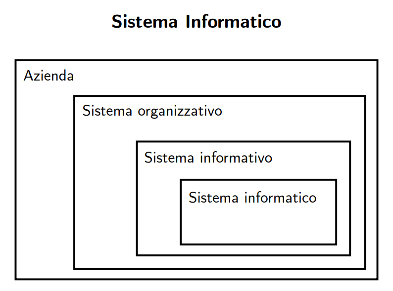

# Lezione 1 - Basi di Dati

## Introduzione alle Basi di Dati - Sistema informativo

Il **sistema organizzativo** è costituito da **risorse** (_denaro, persone, materiali, informazioni, etc._) e **regole** per lo **svolgimento coordinato** di **attività** (processi) per perseguire gli scopi di **un’organizzazione** (azienda o ente).

Il **sistema informativo** è una componente del sistema organizzativo che utilizza le **Tecnologie dell’Informazione e della Comunicazione (TIC)** per:
- **Acquisire**
- **Elaborare**
- **Conservare**
- **Produrre** le informazioni utili all'organizzazione  
e per **gestire i processi informativi** a supporto delle decisioni.

---

## Gestione delle Informazioni

1. **Raccolta / Acquisizione**
2. **Archiviazione / Conservazione**
3. **Elaborazione / Trasformazione / Produzione**
4. **Distribuzione / Comunicazione / Scambio**

---

## Sistema Informativo e AUTOMAZIONE

- Il concetto di **sistema informativo** è **indipendente dall'automatizzazione**.
- Esistono organizzazioni che gestiscono informazioni senza utilizzare automazioni (es. **biblioteche, archivi, uffici postali**).

La parte che impiega tecnologie informatiche si chiama **SISTEMA INFORMATIVO AUTOMATIZZATO** (o sistema informatico).

> **Schema del sistema informatico**  
> 

---

## Modalità di Gestione delle Informazioni

Le informazioni possono assumere forme diverse:
- **Idee informali**
- **Linguaggio naturale** (scritto e parlato)
- **Disegni, grafici, schemi**
- **Numeri e codici**

**Supporti utilizzati:**
- **Mente umana**
- **Carta**
- **Dispositivi elettronici**
- *e molto altro...*

---

## Informazioni e Dati

- **Informazione**: Conoscenza utile per uno scopo; una notizia, un dato o un elemento che consente di comprendere fatti, situazioni o modalità.
- **Dato**: Rappresentazione simbolica di un'informazione, esistente prima di ogni elaborazione.

### Esempi:

| **Informazione**                                                                 | **Dato**                                                                                                                                         |
| -------------------------------------------------------------------------------- | ------------------------------------------------------------------------------------------------------------------------------------------------ |
| Il numero di studenti iscritti all'università                                    | **1500**                                                                                                                                         |
| La temperatura di fusione dell'oro è 1064 °C                                     | **01000001 01110101 (au)**   **00000100 00101000 (1064)**   **01000011 (C)**                                                                 |
| Il numero di studenti iscritti all'università è aumentato del 10% rispetto all'anno scorso | **1500**   **+10%**                                                                                                                               |

> **Esempio grafico di dato e informazione**  
> 

> **Nota:** I dati sono spesso il risultato di **organizzazione e codifica** delle informazioni.  
> _Esempio nei servizi anagrafici:_  
> - **Descrizioni discorsive**  
> - **Nome e cognome**  
> - **Estremi anagrafici**  
> - **Codice fiscale**

---

## Perché i Dati?

- **Rappresentazione precisa** di informazioni complesse è difficile.
- I dati sono una **risorsa strategica** perché **più stabili nel tempo** rispetto alle informazioni e alla conoscenza.
- I dati sono **più facili da gestire, memorizzare, condividere e trasmettere**.

---

## Basi di Dati

### Cos'è una Base di Dati?

- **Accezione generica:** Un insieme organizzato di dati che supporta le attività di un ente.
- **Accezione specifica:** Un insieme di dati gestito da un **programma di gestione specializzato**.

Il **cuore** di un sistema informativo automatizzato è la **base di dati (database)**.

---

### Caratteristiche di una Base di Dati

1. **Dimensioni enormi:** Superano la memoria principale dei sistemi di calcolo.
2. **Persistenza:** Hanno un tempo di vita indipendente dalle esecuzioni dei programmi.
3. **Diversità dei dati:** Possono contenere informazioni di tipo **numerico, alfanumerico, ecc.**

### Gestione dei Dati

I dati sono gestiti tramite il **DBMS (DataBase Management System)**.
> [!IMPORTANT]
> Un DBMS (Database Management System) è un software che permette di creare, gestire e manipolare database in modo efficiente e sicuro. Esso funge da intermediario tra gli utenti e i dati, garantendo operazioni affidabili e ottimizzate.

Questo che garantisce:
- **Grandezze elevate**
- **Persistenza**
- **Condivisione**

Queste caratteristiche assicurano:
- **Privacy**
- **Affidabilità**
- **Efficienza**
- **Efficacia**

---

## Volume dei Dati

Le dimensioni dei dati sono **molto maggiori** della memoria principale dei sistemi di calcolo. Il limite è solo quello fisico dei dispositivi.

### Esempi di dimensioni:
- **500 GB:** Dati bancari
- **10 TB:** Dati societari
- **500 TB:** Dati scientifici
  - **Netflix:** Archivia miliardi di ore di film e serie, insieme ai dati degli utenti.
  - **Amazon:** Registra ogni acquisto, recensione e interazione degli utenti.
  - **Google:** Indicizza e aggiorna miliardi di pagine web.

### Persistenza dei Dati

- I dati sono **memorizzati permanentemente**, anche se il sistema viene spento.
- **Esempio:** I voti degli esami degli studenti restano salvati e accessibili il giorno successivo.

### Condivisione dei Dati

Le organizzazioni, specialmente quelle di grandi dimensioni, sono suddivise in settori o attività diverse.  
Un **database condiviso** può essere utilizzato da:
- **Segreteria**
- **Docenti**
- **Studenti**

> **Esempio di condivisione:**  
> - Uno studente può vedere i propri voti ma non modificarli.  
> - Un docente può inserire nuovi voti per i corsi da lui gestiti.  
> - La segreteria gestisce le iscrizioni agli esami.

#### Problemi della Condivisione dei Dati

1. **Ridondanza dei dati:** Dati duplicati in diverse applicazioni.
2. **Incoerenza:** Possibilità di dati contraddittori.
3. **Perdita di dati:** Rischio in caso di guasto di un'applicazione.

---

## I DBMS

**| DBMS garantiscono privacy**

Strumenti per proteggere i dati sensibili e impedire accessi non autorizzati
- Si possono definire meccanismi di autorizzazione
  - l'utente A è autorizzato a leggere tutti i dati e a
  modificare X;
  - l'utente B è autorizzato a leggere i dati X e a
  modificare Y;
- Esempi:
  - Database ospedaliero
  - Database bancario

**| DBMS garantiscono affidabilità**

Resistenza a malfunzionamenti hardware e software.

- Un database affidabile non perde dati, non si corrompe
e garantisce operazioni coerenti, anche in situazioni
critiche come crash del sistema o blackout
- Esempi:
  - in un bonifico bancario, se il sistema si blocca mentre i
soldi vengono trasferiti, il DBMS assicura che il denaro
non sparisca nel nulla
  - se due persone prenotano lo stesso biglietto aereo nello
stesso momento, il DBMS gestisce la priorità evitando
doppie prenotazioni

**| DBMS debbono essere efficienti**

Devono essere in grado di gestire grandi quantità di dati e
operazioni nel minor tempo possibile, utilizzando le risorse del
sistema in modo ottimale. 

- Il Miglior compromesso tra spazio di memoria e tempo di esecuzione. I DBMS, con tante funzionalità da garantire, rischiano l'inefficienza e
per questo ci sono grandi investimenti e competizione
- Esempi:
  - Un sito di e-commerce deve recuperare i prodotti in pochi istanti,
altrimenti gli utenti abbandonano il carrello
  - Un sistema sanitario deve archiviare milioni di cartelle cliniche e
permettere di trovarle rapidamente
  - Un servizio di streaming video deve scalare da pochi utenti a milioni
senza interruzioni del servizio

**| DBMS debbono essere efficaci**

Devono fornire risultati corretti e completi, soddisfacendo le necessità degli utenti e delle applicazioni in modo affidabile e funzionale.
- Esempio: database aziendale
  - **Efficiente**: Trova i dati di un dipendente rapidamente
  - **Efficace**: Mostra tutti i dati corretti del dipendente
- Esempio: database universitario
  - **Efficiente**: Trova i voti di uno studente rapidamente
  - **Efficace**: Mostra tutti i voti corretti

### Transazione: che cos'è?

Le **transazioni** sono uno degli strumenti principali con
cui i DBMS garantiscono affidabilità. Quest'ultime rappresentano un **insieme di operazioni** da considerare **indivisibile**, corretto anche in presenza di **concorrenza** e con **effetti definitivi**.

>[!IMPORTANT]
> Una transazione è un’unità logica di elaborazione che consiste in una sequenza di operazioni eseguite su un database. Affinché una transazione sia affidabile, deve rispettare le proprietà ACID:
> - **Atomicità**: l’intera transazione viene eseguita completamente o non viene eseguita affatto.
> - **Consistenza**: dopo l’esecuzione, il database rimane in uno stato valido.
> - **Isolamento**: le transazioni non interferiscono tra loro.
> - **Durabilità**: i cambiamenti apportati da una transazione completata vengono conservati anche in caso di guasto del sistema.

* **| Le transizioni sono atomiche (indivisibili)**
Una sequenza di operazioni correlate:
• trasferimento di fondi da un conto ad un conto :
o si fanno il prelevamento da e il versamento su
o nessuno dei due
• deve essere eseguita per intero o per niente:
• o si fanno il prelevamento da e il versamento su
o nessuno dei due
**| Le transizioni sono concorrenti**
L'effetto di transazioni concorrenti deve essere
coerente
• se due assegni emessi sullo stesso conto corrente
vengono incassati contemporaneamente
• … si deve evitare di trascurarne uno!
• se due agenzie richiedono lo stesso posto (libero) su
un treno
• … si deve evitare di assegnarlo due volte!

**| I risultati delle transazioni sono permanenti**
La conclusione positiva di una transazione
corrisponde ad un impegno a mantenere traccia del
risultato in modo definitivo, anche in presenza di
guasti e di esecuzione concorrente

--- 

## | DBMS vs File System

La gestione di insiemi di dati grandi e persistenti è
possibile anche attraverso sistemi più semplici — gli
ordinari file system dei sistemi operativi
- I **file system** prevedono forme rudimentali di
condivisione: “_tutto o niente_”
- I **DBMS** estendono le funzionalità dei file system,
fornendo più servizi ed in maniera integrata

### Descrizione dei Dati:

1. Nei programmi tradizionali che accedono a file, ogni
programma contiene una descrizione della struttura
del file stesso, con i conseguenti rischi di incoerenza
fra le descrizioni (ripetute in ciascun programma) e i
file stessi;
2. Nei DBMS, esiste una porzione della base di dati che
contiene una descrizione centralizzata dei dati, che
può essere utilizzata dai vari programmi.
3. I programmi fanno riferimento ai dati, ma la loro struttura in memoria deve poter esserem odificata senza over modificare i programmi stessi.

Viene introdotto il concetto di **modello dei dati** che rappresenta un insieme di costrutti usati per organizzare i dati di interesse e descriverne la dinamica. Questo modello fornisce ai programmi una **vista astratta** dei dati.

### Schema e Istanza

- **Schema**: struttura della base di dati, descrive i dati che possono essere memorizzati. L'insieme di regole che definiscono la struttura della base di dati Sostanzialmente invariante nel tempo, che ne descrive la struttura.
  - es: "le intestazioni delle tabelle"; 
- **Istanza**: insieme di dati effettivamente memorizzati in un dato momento. Sostanzialmente sono i valori attuali, che possono cambiare anche molto rapidamente.
  - es: le "righe di ciascuna tabella;

#### Esempio:

<strong>Lo schema della base di dati</strong>

| Insegnamento     |   Docente   | Aula | Ora  |
|------------------|-------------|------|------|
| Analisi Matem. I | Luigi Neri  | N1   | 8:00 |
| Basi di Dati     | Piero Rossi | N2   | 9:45 |
| Chimica          | Nicola Mori | N1   | 9:45 |
| Fisica I         | Mario Bruni | N1   | 11:45|
| Fisica II        | Mario Bruni | N3   | 9:45 |
| Sistemi Inform.  | Piero Rossi | N3   | 8:00 |

<strong>L'istanza della base di dati</strong>

## | Modelli dei dati

1. **Modelli logici**
   - Adottati nei DBMS esistenti per l’organizzazione dei dati utilizzati dai programmi
   - indipendenti dalle strutture fisiche
   - Esempi: relazionale, reticolare, gerarchico, a oggetti, basato su
XML
1. **Modelli concettuali**
   - Permettono di rappresentare i dati in modo indipendente da ogni sistema
   - cercano di descrivere i concetti del mondo reale
   - sono utilizzati nelle fasi preliminari di progettazione
- Il più diffuso è il modello Entity-Relationship (ER)

### Architettura Semplificata di un DBMS
>

<strong>Schema di un'architettura semplificata di un DBMS</strong>

### Schema logico:
- Descrizione della base di dati nel modello logico
- Ad esempio, la struttura della tabella

### Schema fisico (o interno):
- Rappresentazione dello schema logico per mezzo di strutture di memorizzazione (file)
- Ad esempio, record con puntatori, ordinati in un certo modo

### Indipendenza tra livelli:
- Il livello logico è indipendente da quello fisico
- Una tabella è utilizzata nello stesso modo qualunque sia la sua realizzazione fisica
- In questo corso vedremo solo il livello logico e non quello fisico

## Linguaggi per basi di dati

- Disponibilità di vari linguaggi e interfacce per la definizione di schemi e per la lettura/modifica di istanze
- **Linguaggi testuali interattivi** (SQL)
- **Comandi SQL immersi in un linguaggio ospite** (Java, C++, ...)
- **Interfacce amichevoli** (senza linguaggio testuale come Access)

### Distinzione terminologica:
- **Data Definition Language (DDL):** per la definizione di schemi (logici, fisici)
- **Data Manipulation Language (DML):** per l'interrogazione e l'aggiornamento di (istanze di) basi di dati

## Architettura a tre livelli di DBMS

### Schema logico:
- Descrizione dell'intera base di dati nel modello logico "principale" del DBMS. L'intestazione di una tabella per esempio...

### Schema fisico (o interno):
- Rappresentazione dello schema logico per mezzo di strutture fisiche di memorizzazione. 

>[!IMPORTANT]
>Colui che scrive la base di dati MAI conoscerà lo schema fisico - dettaglio di implementazione del DBMS.

### Schema esterno:
- Descrizione di parte della base di dati in un modello logico ("viste" parziali, derivate, anche in modelli diversi).

## Indipendenza dei Dati

- L'accesso ai dati avviene solo tramite il livello esterno (che può coincidere con il livello logico)

### Indipendenza fisica:
- Il livello logico e quello esterno sono indipendenti da quello fisico
- Una tabella è utilizzata nello stesso modo qualunque sia la sua realizzazione fisica
- La realizzazione fisica può cambiare senza che debbano essere modificati i programmi

### Indipendenza logica:
- Il livello esterno è indipendente da quello logico
- Aggiunte o modifiche alle viste non richiedono modifiche al livello logico
- Modifiche allo schema logico che lascino inalterato lo schema esterno sono trasparenti

## Personaggi

- **Progettisti e realizzatori di DBMS**
- **Progettisti della base di dati e amministratori della base di dati**
- **Progettisti e programmatori di applicazioni**
- **Utenti:**
  - **Utenti finali:** eseguono applicazioni predefinite (transazioni)
  - **Utenti casuali:** eseguono operazioni non previste a priori, usando linguaggi interattivi

## Vantaggi dei DBMS

- Dati come risorsa comune, base di dati come modello della realtà
- Gestione centralizzata con possibilità di standardizzazione ed "economia di scala"
- Disponibilità di servizi integrati
- Riduzione di ridondanze e inconsistenze
- **Indipendenza dei dati:** favorisce lo sviluppo e la manutenzione delle applicazioni

## Svantaggi dei DBMS
- Costo dei prodotti e della transizione verso di essi
- Non scorporabilità delle funzionalità (con riduzione di efficienza)
- Rischio di perdita di dati e di accesso non autorizzato
- Elevata complessità: l'implementazione, la configurazione e la manutenzione di un DBMS richiedono competenze tecniche avanzate.
- Consumo di risorse: i DBMS necessitano di una quantità significativa di memoria, CPU e spazio di archiviazione.
- Possibili colli di bottiglia nelle prestazioni: operazioni complesse o un gran numero di utenti simultanei possono rallentare il sistema.
- Dipendenza da un fornitore: l'utilizzo di un DBMS proprietario può portare a vincoli tecnologici e costi di licenza elevati.
- Rischi di corruzione dei dati: errori nel software o guasti hardware possono causare inconsistenze nei dati.
- Difficoltà nella migrazione: il passaggio da un DBMS a un altro può essere complesso e costoso.