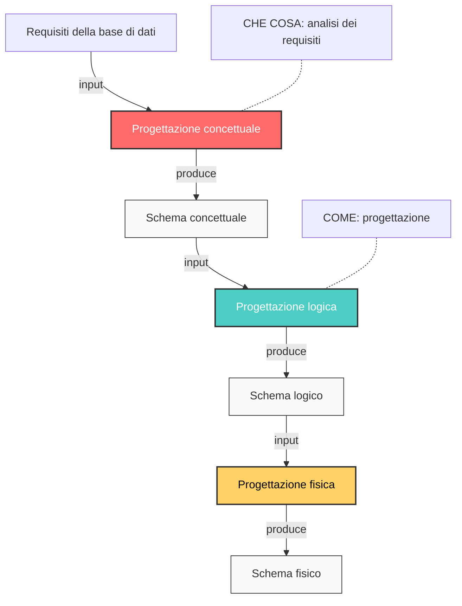

# **Lezione 5 - 19-03-2025**

## **Metodologie e Modelli Progettuali**

Quando iniziamo a modellare un’applicazione, uno dei primi passi è la definizione dello schema logico della base di dati. Tuttavia, questo approccio presenta alcune difficoltà:
- **Da dove iniziare?** Se partiamo direttamente dalla struttura dei dati, rischiamo di perdere di vista la visione generale dell’applicazione.
- **Possiamo perderci nei dettagli?** Se ci focalizziamo troppo sulle singole tabelle e sui loro attributi fin da subito, potremmo trascurare aspetti più ampi del sistema.
- **Come correlare le tabelle?** È necessario stabilire fin da subito le relazioni tra le entità, definendo chiavi primarie e chiavi esterne.
- **Rigidità del modello relazionale** Il modello relazionale, sebbene molto diffuso, presenta una certa rigidità nella gestione delle modifiche e dell’evoluzione del sistema.

La modellazione dei dati è quindi solo una parte dell’intero **processo di sviluppo dei sistemi informativi**, che deve essere inquadrato in un contesto più generale, noto come **ciclo di vita (lifecycle) dei sistemi informativi**.

### **Ciclo di Vita dei Sistemi Informativi**
Il ciclo di vita di un sistema informativo è costituito da un insieme di attività organizzate temporalmente, svolte da analisti, progettisti e utenti durante lo sviluppo e l’uso del sistema. Questo ciclo non è un processo lineare, ma iterativo, nel senso che può essere necessario tornare indietro e rivedere le fasi precedenti.

## **Un Buon Progetto**
Affinché il ciclo di vita di un sistema sia ben strutturato ed efficace, è necessario adottare **linguaggi e modelli appropriati** per descrivere il sistema da progettare. 
Nel contesto delle **basi di dati**, una buona metodologia di progettazione deve includere:
- **Modelli per rappresentare i dati** che siano facili da comprendere e utilizzare, sia per gli sviluppatori che per gli utenti.
- **Decomposizione delle attività in fasi** per gestire meglio la complessità del sistema.
- **Strategie e criteri di scelta** che aiutino a prendere decisioni informate in ogni fase del progetto.

## **Modello e Fasi per il Ciclo di Vita**
Il primo passo nella progettazione è la scelta di un modello per il ciclo di vita. 
Uno dei modelli più conosciuti e utilizzati in passato è il **modello a cascata (waterfall model)**.

### **Waterfall Model (Modello a Cascata)**
Nel modello a cascata, lo sviluppo del sistema avviene attraverso una sequenza ben definita di fasi, ognuna delle quali è completata prima di passare alla successiva. Una caratteristica importante di questo modello è che le fasi **non sono ripetibili**, ovvero una volta conclusa una fase, non si torna indietro (almeno in teoria). 

Le fasi del modello a cascata sono:
1. **Studio di fattibilità**: 
   - Definizione degli obiettivi del sistema.
   - Analisi dei costi e delle priorità.
   - Valutazione dei rischi e delle alternative.
2. **Raccolta e analisi dei requisiti**: 
   - Studio delle caratteristiche desiderate del sistema.
   - Identificazione delle esigenze degli utenti e delle funzionalità necessarie.
3. **Progettazione**: 
   - Definizione dell’architettura del sistema.
   - Modellazione dei dati e delle funzionalità.
4. **Realizzazione**: 
   - Implementazione del sistema, ovvero scrittura del codice.
5. **Validazione e collaudo**:
   - Test del sistema per verificare che funzioni come previsto.
   - Identificazione e correzione di eventuali problemi.
6. **Funzionamento**:
   - Il sistema diventa operativo e viene utilizzato dagli utenti finali.
   - Eventuali aggiornamenti o correzioni vengono apportati in questa fase.

## **Raccolta e Analisi dei Requisiti**

Questa fase è cruciale per il successo del progetto, poiché la qualità dei requisiti raccolti influisce direttamente sulla qualità del sistema finale.

Si divide in due sotto-fasi principali:
1. **Acquisizione dei requisiti**: 
   - Raccogliere informazioni sui bisogni degli utenti e sui vincoli esistenti.
   - Attività complessa, non sempre standardizzabile, perché ogni progetto è diverso.
2. **Analisi dei requisiti**:
   - Una volta raccolti i primi requisiti, si procede con l’analisi e l’organizzazione delle informazioni.
   - Spesso questa analisi porta alla necessità di raccogliere ulteriori informazioni.
   - Possono essere utilizzati linguaggi specifici per rappresentare i requisiti, come UML (Unified Modeling Language).

### **Metodi per Ottenere i Requisiti**
I requisiti possono essere ottenuti attraverso diverse fonti:
- **Direttamente dagli utenti**:
  - Interviste con gli utenti finali.
  - Documentazione dedicata alla raccolta delle esigenze.
- **Dalla documentazione esistente**:
  - Leggi e normative di settore.
  - Regolamenti interni e procedure aziendali.
  - Sistemi informativi preesistenti, per capire cosa può essere migliorato o mantenuto.

## **Interazione con gli Utenti**
Interagire con gli utenti è un aspetto fondamentale per raccogliere i requisiti, ma presenta delle problematiche:
- **Difficoltà nella raccolta delle informazioni**: utenti diversi possono avere visioni e necessità differenti.
- **Visione generale vs. dettagliata**: utenti di livello alto (manager, dirigenti) tendono ad avere una visione più ampia ma meno dettagliata, mentre gli utenti operativi forniscono dettagli pratici ma possono non avere una visione d’insieme.
- **Acquisizione progressiva**: spesso i requisiti non sono completamente definiti fin dall’inizio, ma emergono in modo iterativo attraverso successivi affinamenti.

### **Migliori Pratiche per l’Interazione con gli Utenti**
Per migliorare la raccolta dei requisiti e ridurre gli errori:
- **Verifiche frequenti**: confrontare periodicamente i requisiti raccolti con gli utenti per confermare che siano corretti e coerenti.
- **Utilizzo di esempi**: presentare esempi concreti per chiarire eventuali ambiguità.
- **Definizioni e classificazioni**: richiedere spiegazioni chiare sui concetti utilizzati dagli utenti.
- **Prioritizzazione dei requisiti**: distinguere tra funzionalità essenziali e marginali.

### **Interazione con gli Utenti Tramite Documentazione**
Quando i requisiti vengono estratti da documenti esistenti, è importante seguire alcune regole per garantire chiarezza e coerenza:
- **Standardizzare la struttura delle frasi**: evitare ambiguità e fraintendimenti.
- **Separare dati e funzioni**: distinguere chiaramente le informazioni relative ai dati da quelle relative ai processi.
- **Organizzare termini e concetti**: creare un glossario per evitare interpretazioni errate.
- **Unificare i termini**: evitare sinonimi che potrebbero generare confusione.
- **Esplicitare i riferimenti**: collegare chiaramente concetti e termini tra loro.
- **Riorganizzare le informazioni**: strutturare il documento in modo logico e comprensibile.

## Progettazione

La progettazione è una fase fondamentale del ciclo di vita del software, in cui vengono definiti gli aspetti strutturali e funzionali del sistema.

Per un sistema software, la progettazione consta fondamentalmente di due aspetti:
- **_progettazione dei dati_**: nel caso di sistemi informativi, il progetto dei dati ha un ruolo centrale;
-  **_progettazione delle applicazioni_**;

### Progettare per livelli di astrazione
1. **_Livello concettuale_**. Esprime i requisiti di un sistema in
una descrizione adatta all’analisi dal punto di vista
esterno
2. **_Livello logico_**. Evidenzia l’organizzazione dei dati dal
punto di vista del loro contenuto informativo,
descrivendo la struttura di ciascun record e i
collegamenti tra record diversi.
3. **_Livello fisico_**. A questo livello la base di dati è vista
come un insieme di blocchi fisici su disco. Qui viene
decisa l’allocazione dei dati e le modalità di
memorizzazione dei dati sul disco.

