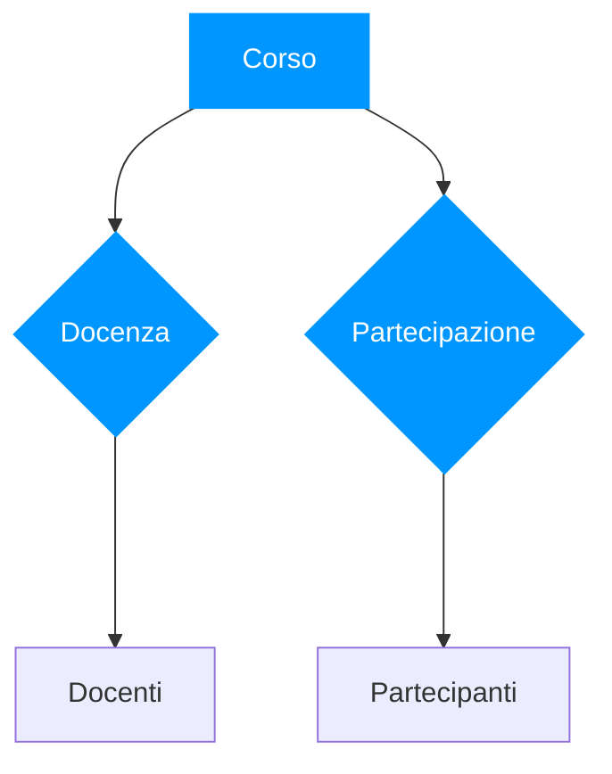
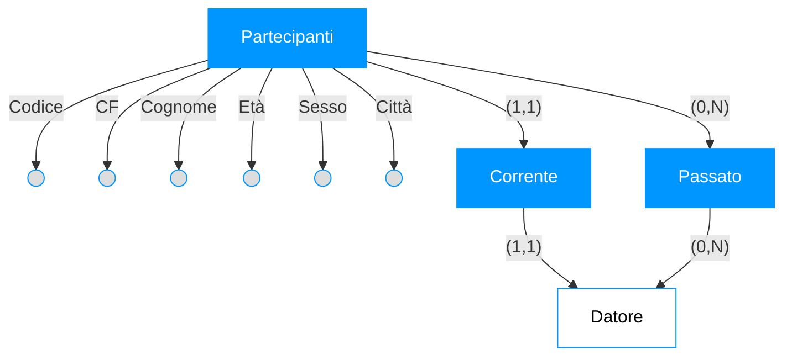
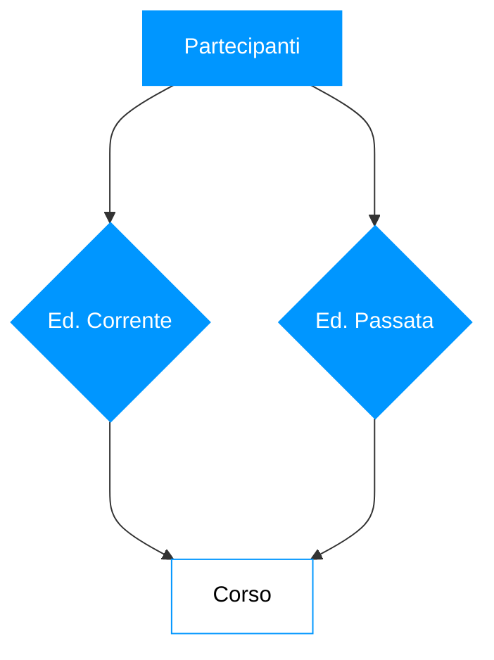
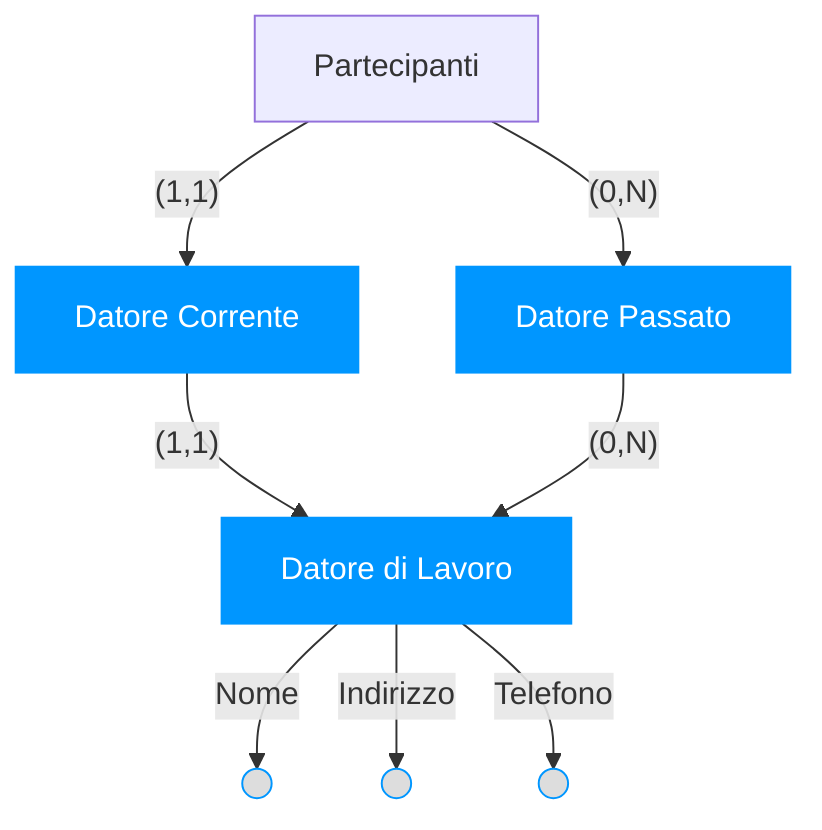
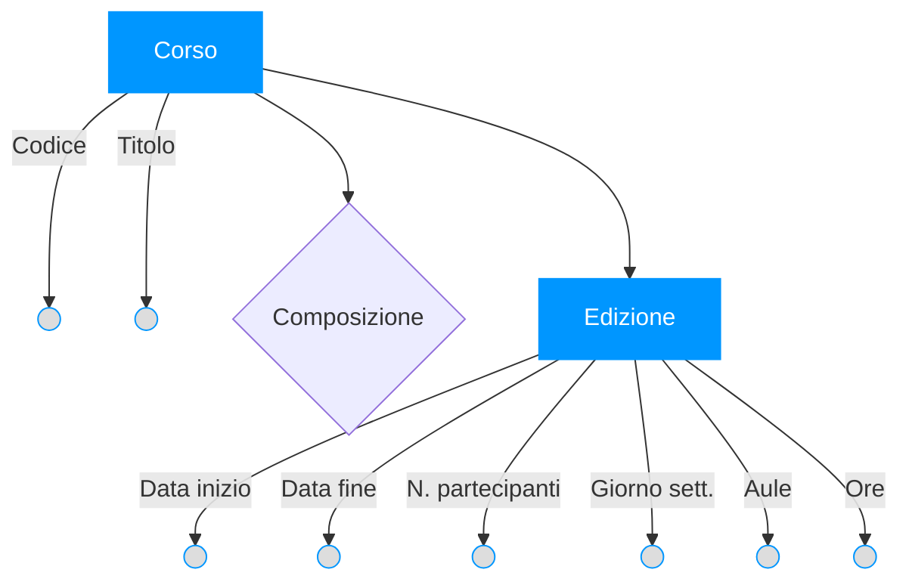
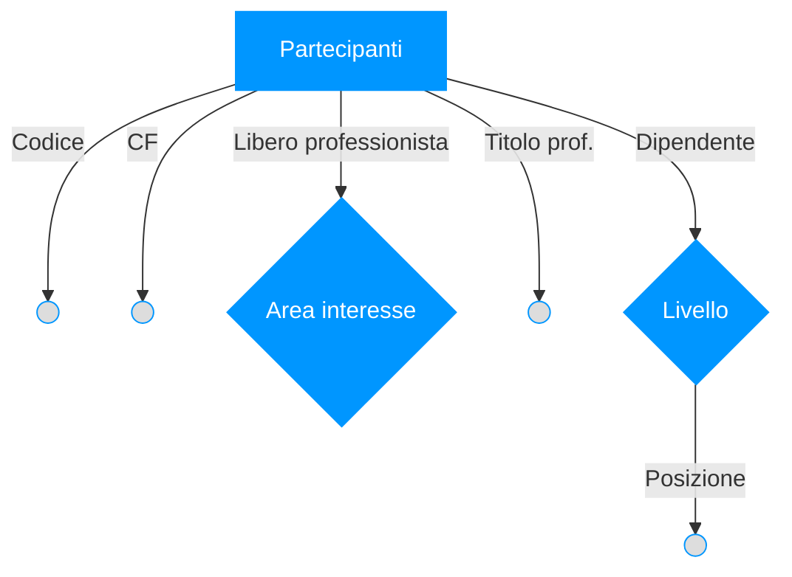

<h1> Lezione 6 - 20-03-2025 </h1>

<h1>📚 Indice</h1>

- [Progettazione Concettuale](#progettazione-concettuale)
  - [Design Pattern](#design-pattern)
  - [Reificazione](#reificazione)
    - [Tipi di Reificazione](#tipi-di-reificazione)
  - [Strategie di progetto](#strategie-di-progetto)
    - [Strategia top-down](#strategia-top-down)
    - [Strategia bottom-up](#strategia-bottom-up)
      - [Nella pratica…](#nella-pratica)
  - [Una metodologia](#una-metodologia)
  - [Qualità di uno schema concettuale](#qualità-di-uno-schema-concettuale)
  - [Strutturazione dei requisiti in gruppi di frasi omogenee](#strutturazione-dei-requisiti-in-gruppi-di-frasi-omogenee)
      - [Esercizio:](#esercizio)

# Progettazione Concettuale
>[!WARNING]
>#### Quale costrutto E-R va utilizzato per rappresentare un concetto presente nelle specifiche?
> 1. Bisogna basarsi sulle definizioni dei costrutti del
modello E-R
>       - se ha proprietà significative e descrive oggetti con esistenza autonoma
>           - entità
>       - se è semplice e non ha proprietà
>           - attributo
>       - se correla due o più concetti
>           - relationship
>       - se è caso particolare di un altro
>           - generalizzazione
## Design Pattern

I Design Pattern rappresentano soluzioni progettuali a problemi comuni, fungendo da modelli riutilizzabili per affrontare sfide ricorrenti nello sviluppo software. 

**_Caratteristiche Fondamentali_**: 
1. Soluzioni progettuali a problemi comuni
2. Largamente usati nell'ingegneria del software
3. Vediamo alcuni pattern comuni nella progettazione concettuale di basi di dati

---

## Reificazione

>[!IMPORTANT]
>La reificazione serve a trasformare concetti che normalmente sarebbero attributi o relazioni in entità autonome, permettendo una modellazione più dettagliata e flessibile dei dati. Il suo scopo principale è risolvere problemi di espressività, normalizzazione e gestione della complessità nei database. 

### Tipi di Reificazione

- **_Reificazione di attributo di entità_**: Trasforma un attributo in un'entità separata per migliorare la modellazione dei dati.

   ```mermaid
      erDiagram
      Persona {
          int ID
          string Nome
      }
      DataNascita {
          int ID
          date Data
      }
      Persona ||--o{ DataNascita : ha
   ```  
  - **_Parte-di_**: Un'entità è parte di un'altra.

    ```mermaid
    erDiagram
      Automobile {
          int ID
          string Modello
      }
      Motore {
          int ID
          string Tipo
      }
      Automobile ||--o{ Motore : "ha un"
     ```

  - **_Istanza-di_**: Un'entità è un'istanza di una categoria più generale.

    ```mermaid
    erDiagram
      Animale {
          int ID
          string Nome
      }
      Cane {
          string Razza
      }
      Animale ||--|{ Cane : "è un"
    ```

- **_Reificazione di relationship binaria_**: Una relazione binaria diventa un'entità.
  ```mermaid
  erDiagram
      Studente {
          int Matricola
          string Nome
      }
      Corso {
          int ID
          string Nome
      }
      Iscrizione {
          date Data
          string Stato
      }
      Studente ||--o{ Iscrizione : "si iscrive a"
      Corso ||--o{ Iscrizione : "ha iscrizione in"
  ```

- **_Reificazione di attributo di relationship_**: Quando un attributo di una relazione è significativo e va reificato.
  ```mermaid
  erDiagram
      Cliente {
          int ID
          string Nome
      }
      Prodotto {
          int ID
          string Nome
      }
      Acquisto {
          int ID
          date Data
          int Quantita
      }
      Cliente ||--o{ Acquisto : "effettua"
      Prodotto ||--o{ Acquisto : "contiene"
  ```

  - **_Caso particolare di entità_**: Quando una relazione diventa un'entità con proprie caratteristiche.
    ```mermaid
    erDiagram
        Autore {
            int ID
            string Nome
        }
        Libro {
            int ID
            string Titolo
        }
        Scrittura {
            int ID
            string Ruolo
        }
        Autore ||--o{ Scrittura : "scrive"
        Libro ||--o{ Scrittura : "è scritto in"
    ```

- **_Relationship ternaria_**: Coinvolge tre entità contemporaneamente.
  ```mermaid
  erDiagram
      Studente {
          int Matricola
          string Nome
      }
      Corso {
          int ID
          string Nome
      }
      Docente {
          int ID
          string Nome
      }
      Assegnazione {
          date Data
      }
      Studente ||--o{ Assegnazione : "partecipa"
      Corso ||--o{ Assegnazione : "assegnato a"
      Docente ||--o{ Assegnazione : "tiene il corso per"
  ```

- **_Reificazione di relationship ternaria_**: Quando una relazione ternaria diventa un'entità.
  ```mermaid
  erDiagram
      Cliente {
          int ID
          string Nome
      }
      Prodotto {
          int ID
          string Nome
      }
      Venditore {
          int ID
          string Nome
      }
      Transazione {
          date Data
          float Prezzo
      }
      Cliente ||--o{ Transazione : "acquista da"
      Prodotto ||--o{ Transazione : "è parte di"
      Venditore ||--o{ Transazione : "vende a"
  ```

## Strategie di progetto
>[!WARNING]
>#### Come procediamo con tante specifiche anche dettagliate? Come ci orientiamo?
>- Strategie:
>   - _**top-down**_
>   - _**bottom-up**_
>   - _**inside-out**_

### Strategia top-down

Per questa strategia si parte da uno schema iniziale che viene successivamente raffinato e integrato per mezzo di primitive che lo trasformano in una serie di schemi intermedi per arrivare allo schema E-R finale.
- Primitive di raffinamento:
    - Da entità a associazione tra entità
    - Da entità a generalizzazione
    - Da associazione a insiemi di associazioni
    - Da associazione a entità con associazioni
    - Introduzione di attributi su entità e associazioni

### Strategia bottom-up

Invece per quest'altra strategia si parte dalle specifiche iniziali e si suddividono fino a dare specifica ad una componente minima di cui si dà lo schema E-R. Gli schemi prodotti vengono fusi e integrati fino ad
ottenere lo schema finale. 
- Primitive di trasformazione:
    - Generazione di entità
    - Generazione di associazione
    - Generazione di generalizzazione

#### Nella pratica…

Si procede di solito con una strategia mista:
  - si individuano i **_concetti principali_** e si realizza uno **_schema scheletro_**;
  - sulla base di questo si può **_decomporre_**;
  - poi si **_raffina_**, si **_espande_**, si **_integra_**;
Definizione dello **_schema scheletro_**: Si individuano i **_concetti più importanti_**, ad esempio perché più citati o perché indicati esplicitamente come cruciali e li si organizza in un **_semplice schema concettuale_**.

## Una metodologia

Il metodo si divide in quattro passaggi:
1. **_Analisi dei requisiti_**:
   1. Analizzare i requisiti ed eliminare le ambiguità
   2. Costruire un glossario dei termini
   3. Raggruppare i requisiti in insiemi omogenei 

2. **_Passo base_**:
   1. Definire uno schema scheletro con i concetti più rilevanti

3. **_Passo iterativo_**:
   1. Raffinare i concetti presenti sulla base delle loro specifiche
   2. Aggiungere concetti per descrivere specifiche non descritte 

4. **_Analisi di qualità_**:
   1. Verificare le qualità dello schema e modificarlo

## Qualità di uno schema concettuale

Lo schema concettuale deve avere al suo interno:
1. **_Correttezza_**;
2. **_Completezza_**;
3. **_Leggibilità_**;
4. e soprattutto... **_minimalità_**;

---

## Strutturazione dei requisiti in gruppi di frasi omogenee

>[!NOTE]
>### 1) Frasi di carattere generale
>Si vuole realizzare una base di dati per una società che
eroga corsi: di ogni corso vogliamo rappresentare i dati
dei partecipanti e dei docenti.
>
>Corso,Partecipante,Docenti --> **_Entità_**
>
>Partecipazione,Docenza --> **_Relationship_**

Creiamo lo scheletro del nostro progetto:



>[!NOTE]
>### 2) Frasi relative ai partecipanti
> Per i partecipanti (circa 5000), identificati da un
codice, rappresentiamo il codice fiscale, il cognome,
l'età, il sesso, la città di nascita, i nomi dei loro attuali
datori di lavoro e di quelli precedenti (insieme alle date
di inizio e fine rapporto), le edizioni dei corsi che
stanno attualmente frequentando e quelli che hanno
frequentato nel passato, con la relativa votazione finale
in decimi.
>
> Codice, CF, Cognome, Età, Sesso, Città --> **_Attributi di partecipanti_**

Non dobbiamo dimenticare che loro hanno dei **_datori di lavoro_** (_con nome_)



<h3 align = "center">2.1) Edizione di un corso, attuale o passato...</h3>




>[!NOTE]
>### 3) Frasi relative ai datori di lavoro
>Relativamente ai datori di lavoro presenti e passati dei
partecipanti, rappresentiamo il nome, l'indirizzo e il
numero di telefono.




>[!NOTE]
> ### 4) Frasi relative ai corsi
> Per i corsi (circa 200), rappresentiamo il titolo e il
codice, le varie edizioni con date di inizio e
fine e, per ogni edizione, rappresentiamo il numero di
partecipanti e il giorno della settimana, le aule e le ore
dove sono tenute le lezioni.



>[!NOTE]
> ### 5) Frasi relative a tipi specifici di partecipanti
> Per i partecipanti che sono liberi professionisti,
rappresentiamo l'area di interesse e, se lo possiedono, il
titolo professionale. Per i partecipanti che sono
dipendenti, rappresentiamo invece il loro livello e la
posizione ricoperta.




>[!NOTE]
> ### 6) Frasi relative ai docenti
> Per i docenti (circa 300), rappresentiamo il cognome,
l'età, la città di nascita, tutti i numeri di telefono, il
titolo del corso che insegnano, di quelli che hanno
insegnato nel passato e di quelli che possono insegnare.
I docenti possono essere dipendenti interni della società
di formazione o collaboratori esterni.

---

#### Esercizio:

>[!NOTE]
> <p>FILM(<u>CF</u>,T,R,A,CN)</p>
> <p>ARTISTI(<u>CA</u>,C,N,S,DN,Naz)</p>
> <p>INTERP(CF,CA,P)</p>
>
> 1. Trovare i titoli dei film nei quali Henry Fonda è stato interprete.

- Attr T in FILM 
- Attr N,C in ARTISTI
    - FILM(CF,T,...)
    - ARTISTI(CA,C,N,...)
    - INTERP(CF,CA,...)

- Passaggi per la risoluzione:

  $$ 1) \space \space F_1 = \pi_\text{CF,T}(\text{FILM}) $$
  $$ 2) \space \space A_1 = \sigma_\text{ N = 'Henry' AND C = 'Folda'}(\text{ARTISTI}) $$
  $$ 3) \space \space A_2 = \pi_\text{CA}(A_1) $$
  $$ 4) \space \space R_1 = \text{INTERP} \bowtie A_2 \rightarrow R_1(\text{CT,CA,P}) $$
  $$ 5) \space \space R_2 = \pi_\text{CF}(R_1) $$
  $$ 6) \space \space R_3 = R_2 \bowtie F_1 $$
  $$ 7) \space \space R_4 = \pi_\text{T}(R_3) $$

- Utilizziamo il calcolo dei domini:

  $$ {(T | F)} : T \rightarrow T:t $$
  $$ F \rightarrow \text{relazione da usare più predicati vincolanti} $$

  - FILM(CF: _f_ , T: _t_ , ...) ∧
  - ARTISTI(CA: _a_ , C: _c_ , N: _n_ , ...) ∧
  - INTERP(CF: _f_ , CA: _a_ , ...) ∧
    - {Nome = "Henry" AND Cognome = "Folda"}

  - Quindi:
    - Domini: { T: t | FILM(CF: _f_ , CA: _a_ , T: _t_ , ...) ∧ | INTERP(CF: _f_ , CA: _a_ , ...)}

- Utilizziamo il calcolo delle tuple
  * Variabile libera: **ttt** (titolo del film)
  * Variabili vincolate: 
      * f : (codice film) 
      * a : (codice artista)

  - Quindi:

    - Tuple: {t ∣∃f,a (FILM(f,t,...)∧INTERP(f,a,...)∧ARTISTI(a,′Fonda′,′Henry′,...))}