<h1> Lezione 7 - 26-03-2025 </h1>

<h1>📚 Indice</h1>

---

# Progettazione Logica

> [!IMPORTANT]
> ## Definizione
> La progettazione logica di una base di dati è la fase in cui si traduce il modello concettuale (di solito un diagramma entità-relazione, ER) in un modello logico adatto a un sistema di gestione di database (DBMS) specifico, come il modello relazionale. 
>
> Questa "traduzione" ovviamente deve avvenire in maniera corretta ed efficiente.

1. Dati in ingresso:
- schema concettuale
- informazioni sul carico applicativo (dimensione dei dati)
- modello logico
2. Dati in uscita:
- schema logico
- documentazione associata

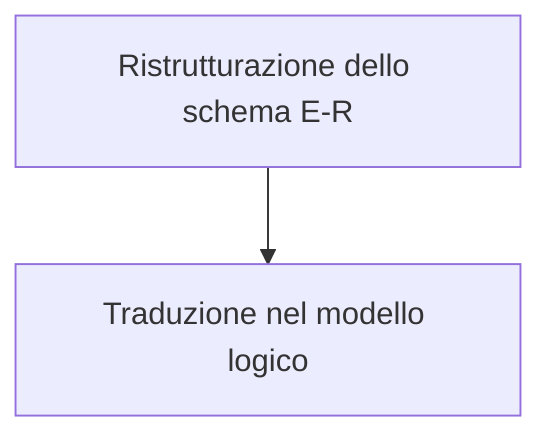

### Ristrutturazione di uno schema E-R

Lo schema E-R viene ristrutturato per 2 motivi principalmente:
1. Semplificare la traduzione
2. "ottimizzare" le prestazioni
    
     >[!WARNING]
      > Come valutiamo le prestazioni???

     >[!TIP]
     > Le prestazioni di uno schema E-R si valutano analizzando il numero di join, la ridondanza dei dati, la frequenza delle operazioni, la selettività degli attributi e il carico del sistema, ottimizzando di conseguenza la struttura per bilanciare efficienza e integrità.

L'osservazione che possiamo fare riguarda uno schema E-R ristrutturato che non è (più) uno schema concettuale nel senso stretto del termine.

### Indicatori per valutare le prestazioni:

Consideriamo degli **_“indicatori”_** dei parametri che
caratterizzano le prestazioni
- **_spazio_**: numero di occorrenze previste
- **_tempo_**: numero di occorrenze (di entità e
relationship) visitate per portare a termine
un’operazione

Quello che vedete qui sotto rappresenta uno schema E-R (Entità-Relazione):

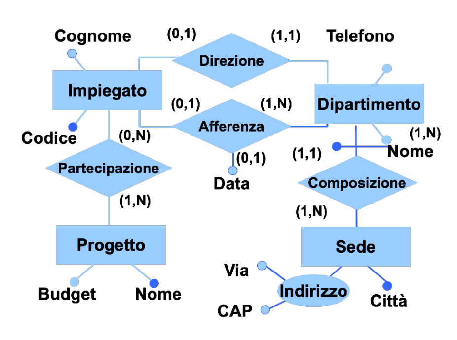

Quando parliamo di ottimizzazione e valutazione delle prestazioni nei riguardi della struttura del database un elemento che ci può venire in aiuto è la **_tavola dei volumi_**.

#### Tavola dei volumi

>[!IMPORTANT]
>## Definizione
>​La tavola dei volumi è uno strumento utilizzato nella progettazione logica delle basi di dati per stimare il numero di occorrenze attese per ciascuna entità e relazione del modello concettuale. Questa stima è fondamentale per valutare le prestazioni del database e per ottimizzare la sua struttura in base al carico previsto. 

>[!TIP]
> ### Componenti principali della tavola dei volumi:
>
>- **_Entità e Relazioni_**: Elenco delle entità e delle relazioni presenti nel modello concettuale.​
Andrea Minini
>
>- **_Volume_**: Stima del numero di istanze previste per ciascuna entità e relazione.​

Creiamo la tabella dei volumi dell'esempio precedente...

| **Concetto**     | **Tipo**    | **Volume** |
|------------------|------------|------------|
| Sede             | Entità     | 10         |
| Dipartimento     | Entità     | 80         |
| Impiegato        | Entità     | 2000       |
| Progetto         | Entità     | 500        |
| Composizione     | Relazione  | 80         |
| Afferenza        | Relazione  | 1900        |
| Direzione        | Relazione  | 80         |
| Partecipazione   | Relazione  | 6000        |

L'operazione che si svolge è quella del ritrovamento di tutti i dati di un impiegato, del dipartimento nel quale lavora e dei progetti ai quali partecipa. 

Per fare ciò creiamo una **_tavola degli accessi_** basata su uno **_schema di navigazione_**.

1. Schema di navigazione:

2. Tavola degli accessi: 

| **Entità/Relazione** | **Tipo**     | **Accessi** | **Tipo di Accesso** |
|----------------------|-------------|------------|--------------------|
| Sede                | Entità      | 500        | Lettura           |
| Dipartimento        | Entità      | 1000       | Lettura/Scrittura |
| Impiegato           | Entità      | 5000       | Lettura/Scrittura |
| Progetto            | Entità      | 3000       | Lettura/Scrittura |
| Composizione        | Relazione   | 2000       | Lettura           |
| Afferenza           | Relazione   | 4000       | Lettura/Scrittura |
| Direzione           | Relazione   | 1500       | Lettura           |
| Partecipazione      | Relazione   | 7000       | Lettura/Scrittura |

## Attività di ristrutturazione

- Analisi delle ridondanze
- Eliminazione delle generalizzazioni
- Partizionamento/accorpamento di entità e relationship
- Scelta degli identificatori primari

### Analisi delle ridondanze:

Una **_ridondanza_** in uno schema E-R è una **_informazione
significativa ma derivabile_** da altre
- In questa fase si decide se eliminare le ridondanze
eventualmente presenti o mantenerle (o anche di
introdurne di nuove)
- Vantaggi delle ridondanze:
  - semplificazione delle interrogazioni
- Svantaggi delle ridondanze:
  - appesantimento degli aggiornamenti
  - maggiore occupazione di spazio

Esistono due forme di ridondanza:

1. **_Attributi derivabili_**:
    - da altri attributi della stessa entità (o relationship)
    - da attributi di altre entità (o relationship) 
2. **_Relationship derivabili_**:
   - dalla composizione di altre (più in generale: cicli di
relationship)

#### Esempi:

1. Attributo derivabile dalla stessa entità:
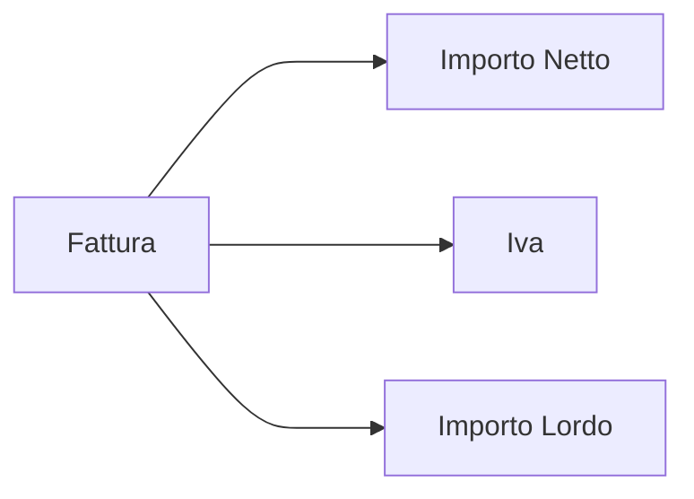
2. Attributo derivabile da altra entità:
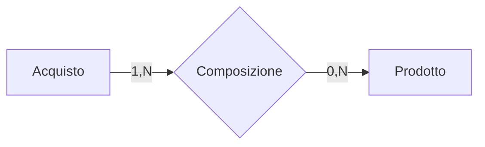

3. Ridondanza dovuta a ciclo:
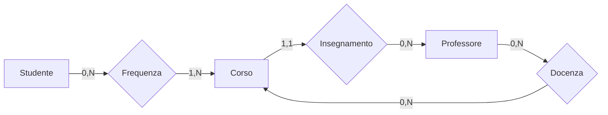

### Analizziamo una ridondanza...

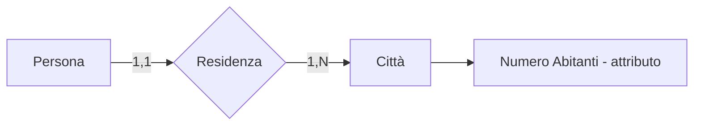
- L’attributo Numero abitanti è ridondante
- Per ottenerlo basta leggere e contare il numero di
occorrenze di Residenza con una specifica città

| **Concetto**         | **Costrutto**                                             | **Accessi**                                            | **Tipo**                                   |
|----------------------|-----------------------------------------------------------|--------------------------------------------------------|--------------------------------------------|
| **Persona**           | Entità che rappresenta un individuo nel sistema.          | 1 accesso per recuperare una persona.                  | Normalizzato                               |
| **Residenza**         | Relazione tra una persona e il luogo di residenza.        | 1 accesso per recuperare la residenza di una persona.  | Normalizzato                               |
| **Città**             | Entità che rappresenta una città.                         | 1 accesso per recuperare la città associata alla residenza. | Normalizzato                               |
| **Numero Abitanti**   | Attributo che rappresenta il numero di abitanti di una città. | L'accesso dipende dalla query per il numero di abitanti. | Ridondante (se duplicato in altre tabelle) |

---

### Eliminazione delle generalizzazioni

- Il modello relazionale non può rappresentare
direttamente le generalizzazioni
- Entità e relationship sono invece direttamente
rappresentabili
- Si eliminano perciò le gerarchie, sostituendole con
entità e relationship

Abbiamo diverse possibilità
1. Accorpamento delle figlie della generalizzazione nel
genitore
2. Accorpamento del genitore della generalizzazione
nelle figlie
3. Sostituzione della generalizzazione con relationship

Come possiamo scegliere? Ci sono diversi criteri:
1. La scelta fra le alternative si può fare basandosi sul
numero e il tipo degli accessi fatti alle singole entità per
eseguire le operazioni
2. È possibile seguire alcune semplici regole generali:
   1. la prima conviene se gli accessi al padre e alle figlie sono
   contestuali;
   2. la seconda conviene se gli accessi alle figlie sono distinti;
   3. la terza conviene se gli accessi alle entità figlie sono
   separati dagli accessi al padre;
   4. sono anche possibili soluzioni “ibride”, soprattutto in
   gerarchie a più livelli.

---

### Partizionamento/accorpamento di entità e relationship

Ristrutturazioni effettuate per rendere più efficienti le
operazioni in base al principio che:
• Gli accessi si riducono
• separando attributi di un concetto che vengono
acceduti separatamente
• raggruppando attributi di concetti diversi
acceduti insieme
• Si considera sempre che ad ogni accesso si legge
l’intera informazione

I casi principali sono i seguenti:

1. **Partizionamento verticale** di entità
2. **Partizionamento orizzontale** di relationship
3. Eliminazione di **attributi multivalore**
4. **Accorpamento** di entità/relationship

#### Esempi:
<h5 align ="center"> 1. Partizionamento verticale:  </h5>

  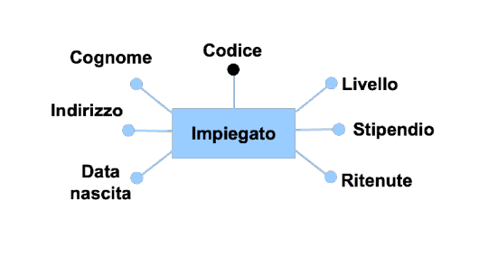
  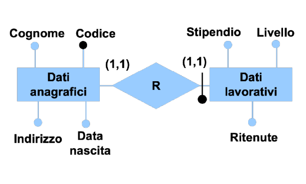

<h5 align ="center"> 2. Partizionamento orizzontale: </h5>

  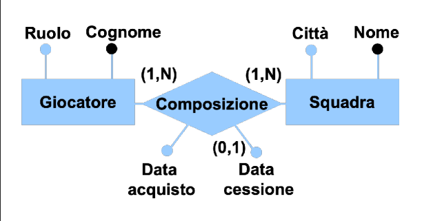
  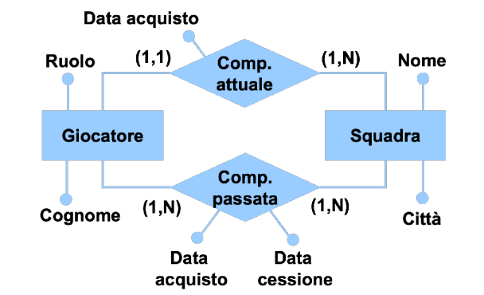

<h5 align ="center"> 3. Eliminazione di attributi multivalore: </h5>

  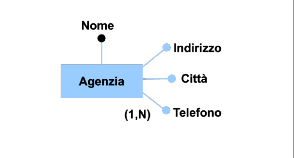
  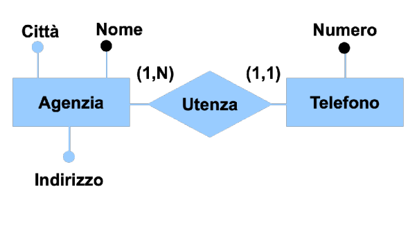

<h5 align ="center"> 4. Accorpamento di E-R: </h5>

  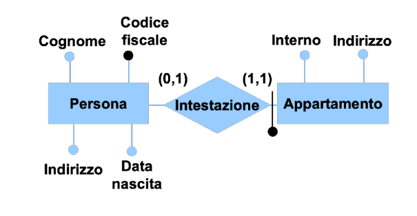
  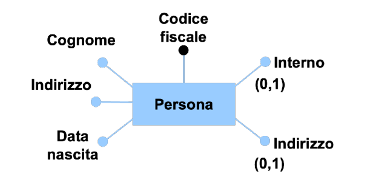

