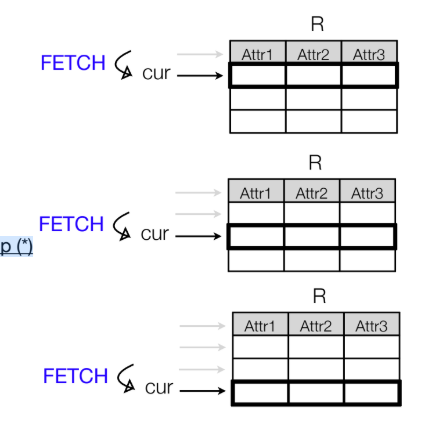
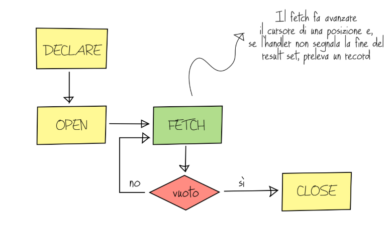

<h1> Lezione 5 SQL - 08/05/2025 </h1>

<h1> Indice </h1>

- [Stored procedure](#stored-procedure)
  - [Che cosa sono le stored procedure](#che-cosa-sono-le-stored-procedure)
    - [Accesso diretto ai dati](#accesso-diretto-ai-dati)
  - [Sicurezza](#sicurezza)
      - [Esempio:](#esempio)
- [Variabili Locali](#variabili-locali)
  - [Che cosa sono le variabili locali](#che-cosa-sono-le-variabili-locali)
  - [Sintassi:](#sintassi)
- [Assegnamento](#assegnamento)
  - [Su cosa si basa l'assegnamento?](#su-cosa-si-basa-lassegnamento)
    - [1. Assegnamento statico con SET (esempio):](#1-assegnamento-statico-con-set-esempio)
    - [2. Assegnamento calcolato con SELECT+INTO](#2-assegnamento-calcolato-con-selectinto)
- [Variabili user-defined:](#variabili-user-defined)
  - [Che cosa sono?](#che-cosa-sono)
- [Tipologie di parametro](#tipologie-di-parametro)
  - [Che cosa sono?](#che-cosa-sono-1)
    - [1. Ingresso](#1-ingresso)
      - [Esempio dell'ingresso:](#esempio-dellingresso)
    - [2. Uscita](#2-uscita)
      - [Esempio di Uscita](#esempio-di-uscita)
- [Istruzioni condizionali](#istruzioni-condizionali)
  - [Che cosa sono?](#che-cosa-sono-2)
    - [1. Esempio `IF`:](#1-esempio-if)
    - [2. Esempio `CASE`](#2-esempio-case)
- [Istruzioni iterative](#istruzioni-iterative)
  - [Che cosa sono:](#che-cosa-sono-3)
    - [1. While](#1-while)
    - [2. Repeat](#2-repeat)
    - [3. Loop](#3-loop)
      - [Esempio di LOOP](#esempio-di-loop)
- [Cursori:](#cursori)
  - [Che cosa sono?](#che-cosa-sono-4)
  - [Dichiarazione](#dichiarazione)
  - [Apertura, fetch e chiusura](#apertura-fetch-e-chiusura)
- [Handler](#handler)
  - [Che cosa sono?](#che-cosa-sono-5)
    - [Esempio di Handler](#esempio-di-handler)
    - [Funzionamento del not found handler](#funzionamento-del-not-found-handler)
- [Stored Procedure con cursore](#stored-procedure-con-cursore)
  - [Chiamata:](#chiamata)
- [Data Manipulation](#data-manipulation)
  - [Che cos'è?](#che-cosè)
  - [Inserimento](#inserimento)
    - [Che cos'è?](#che-cosè-1)
    - [INSERIMENTO CON VALORI STATICI](#inserimento-con-valori-statici)
    - [INSERIMENTO CON VALORI MANCANTI](#inserimento-con-valori-mancanti)
    - [SINTASSI SQL](#sintassi-sql)
    - [INSERIMENTO CON VALORI RICAVATI](#inserimento-con-valori-ricavati)
      - [Esempio di inserimento con valori ricavati](#esempio-di-inserimento-con-valori-ricavati)
  - [Aggiornamento](#aggiornamento)
    - [Che cos'è?](#che-cosè-2)
    - [SINTASSI SQL](#sintassi-sql-1)
      - [Esempio di aggiornamento](#esempio-di-aggiornamento)
  - [Cancellazione](#cancellazione)
    - [Che cos'è?](#che-cosè-3)
    - [SINTASSI SQL](#sintassi-sql-2)
      - [Esempio di cancellazione](#esempio-di-cancellazione)
    - [Riferimento alla target table nella condizione](#riferimento-alla-target-table-nella-condizione)
      - [Esercizio risolto con Derived Table](#esercizio-risolto-con-derived-table)

---

# Stored procedure

## Che cosa sono le stored procedure

Le stored procedure sono programmi dichiarativo-procedurali _(invocate tramite chiamata e possono ricevere e/o restituire valori)_ memorizzati nel DBMS _(supportate dalla versione 5.0 di MySQL)_.

Queste possono essere considerate come un servizio che gli utenti delle applicazioni che usano il database possono **utilizzare senza scrivere codice**.

### Accesso diretto ai dati

COMPUTER --- SELECT FROM WHERE... ----> DBMS

I dati devono essere accessibili e si deve padroneggiare l'uso di SQL

## Sicurezza
Le applicazioni possono essere autorizzate a eseguire stored procedure, ma **avere accesso vietato alle tabelle**

>[!NOTE]
> - Il codice può essere mascherato
> - Restrizioni impostate con opportuni grant
> - I dati grezzi non sono visibili

#### Esempio:

>[!TIP]
>Scrivere una stored procedure che restituisca le specializzazioni mediche offerte dalla clinica

```SQL
DROP PROCEDURE IF EXISTS mostra_specializzazioni;

DELIMITER $$

CREATE PROCEDURE mostra_specializzazioni( )
    BEGIN
        SELECT DISTINCT Specializzazione
        FROM Medico;
    END $$

DELIMITER;
```

- Esecuzione

```terminal
QUERY                                            | Message |
-------------------------------------------------|---------|
DROP PROCEDURE IF EXIST mostra_specializzazioni  |  OK     |
CREATE PROCEDURE mostra_specializzazioni()       |  OK     |
```

>[!NOTE]
> ### Storing...
>Eseguire questo codice effettua la compilazione e lo stoccaggio nel DBMS
> ### Chiamata
> ```SQL
> CALL mostra_specializzazioni( );
> ```
> La chiamata esegue la stored procedure e ottiene
il risultato restituito dall’esecuzione del body

---

# Variabili Locali

## Che cosa sono le variabili locali

Sono usate all’interno di una stored procedure,
per memorizzare informazioni intermedie di ausilio

>[!WARNING]
> DEVONO ESSERE DICHIARATE TUTTE INSIEME ALL'INIZIO DEL BODY!

## Sintassi:

```SQL
DECLARE nom>e_variabile tipo(size) DEFAULT valore_default
```

- **`DECLARE nome_variabile tipo(size)`**: viene dichiarato un int,double,char,varchar,date,datetime (tipizzazione forte, non si possono dichiarare senza specificare il tipo)
- **`(size)`**: capacità della variabile (se non settata, è il valore default del tipo di dato)
- **`DEFAULT valore_default`**: senza default value, il valore iniziale è `NULL`

---

# Assegnamento
## Su cosa si basa l'assegnamento?

È possibile assegnare un valore a una variabile in due modalità:
- **`istruzione SET`**
- **`istruzione SELECT+INTO`**

### 1. Assegnamento statico con SET (esempio):

Supporre di essere nel body di una stored procedure e creare una variabile contenente il minimo numero di visite mensili da effettuare, impostato a 20.

```SQL
DECLARE min_visite_mensili INT DEFAULT 0;
-- .
-- .
-- .
SET min_visite_mensili = 20;
```

>[!WARNING]
> la sintassi imporrebbe l'uso di :=, ma i due punti si possono essere omessi se si usa l'istruzione SET.

### 2. Assegnamento calcolato con SELECT+INTO

Supporre di essere nel body di una stored procedure e creare una variabile contenente il numero di visite effettuate nel mese in corso

```SQL
DECLARE visite_mese_attuale INT DEFAULT 0;
-- .
-- .
-- .
SELECT COUNT(*) INTO visite_mese_attuale
FROM Visita V
WHERE MONTH(V.Data) = MONTH(CURRENT_DATE)
    AND YEAR(V.Data) = YEAR(CURRENT_DATE);

SELECT COUNT(*)
FROM Visita V
WHERE MONTH(V.Data) = MONTH(CURRENT_DATE)
    AND YEAR(V.Data) = YEAR(CURRENT_DATE)
INTO visite_mese_attuale;
```

>[!WARNING]
> ```SQL
> DECLARE visite_mese_attuale VARCHAR(255);
> 
> SELECT * INTO visite_mese_attuale
> FROM Visita
> WHERE MONTH(Data) = MONTH(CURRENT_DATE)
> AND YEAR(V.Data) = YEAR(CURRENT_DATE);
> ```
>
> Nel DECLARE una variabile non può contenere un result set.

---

# Variabili user-defined:
## Che cosa sono?

Sono inizializzate dall’utente senza necessità di dichiarazione, e il loro ciclo di vita equivale alla durata della connection a MySQL server.

- il contenuto è visibile ovunque, ma solo all’utente che
le ha inizializzate, sono case insensitive e il loro identificatore deve iniziare con ‘@’

- tipizzazione debole
  - (non si specifica il tipo della variabile, può contenere qualsiasi
tipo di dato, e tipi di dato diversi in istanti diversi).

>[!WARNING]
> Una variabile locale o user-defined (@) è sempre scalare, non può contenere un result set.

---

# Tipologie di parametro
## Che cosa sono?

Una stored procedure MySQL accetta parametri di tipo

- **ingresso**
- **uscita**
- **ingresso-uscita**

### 1. Ingresso

Un parametro in ingresso **_può essere letto_**, ma non modificato

- i parametri sono in ingresso per default
- equivalente al passaggio per valore

#### Esempio dell'ingresso:

```SQL
DROP PROCEDURE IF EXISTS parcella_media_spec;

DELIMITER $$
CREATE PROCEDURE parcella_media_spec(IN _specializzazione VARCHAR(100))
BEGIN
  SELECT AVG(M.Parcella)
  FROM Medico M
  WHERE M.specializzazione = _specializzazione;
END $$
DELIMITER;

-- Chiamata della stored procedure
CALL parcella_media_spec('Ortopedia'); --chiamata
```

>[!NOTE]
>## Esecuzione
>```terminal
>|AVG(Parcella)|
>|-------------|
>|  170.0000   |

---

### 2. Uscita

Un parametro di uscita **_può essere modificato_** per assumere il valore del risultato della stored procedure

- nella chiamata si possono usare variabili user-defined(quelle che iniziano con '@').

#### Esempio di Uscita
```SQL
DROP PROCEDURE IF EXISTS tot_pazienti_visitati_spec;

DELIMITER $$
CREATE PROCEDURE tot_pazienti_visitati_spect(
                 IN _specializzazione VARCHAR(100)
                 OUT totale_pazienti_ INT)
  BEGIN
    SELECT COUNT(DISTINCT V.Paziente) INTO totale_pazienti_
    FROM Visita V
      INNER JOIN
      Medico M ON V.Medico = M.Matricola
    WHERE M.Specializzazione = _specializzazione;
  END $$
DELIMITER;

CALL tot_pazienti_visitati_spect('Neurologia', @quantiPazienti);

SELECT @quantiPazienti;
```

>[!NOTE]
>## Esecuzione
>```terminal
>|@quantiPazienti|
>|---------------|
>|      18       |

---

# Istruzioni condizionali

## Che cosa sono?

Le istruzioni condizionali permettono di esprimere conizioni modificando il flusso di esecuzione

1. istruzione `IF`
2. istruzione `CASE`

- possono contenere letterali, variabili e funzioni

### 1. Esempio `IF`:

La dicitura per l'`IF` è la seguente:

```SQL
IF --condizione
-- blocco istruzione
ELSE --/ELSEIF
-- blocco istruzione
ENDIF
```


>[!TIP]
>Scrivere una stored procedure che riceva come parametro un inter t e una specializzazione s e restituisca in uscita true se il numero di visite della psecializzazione s nel mese in corso p superiore a t, false se è inferiore, e NULL se è uguale
```SQL
DROP PROCEDURE IF EXISTS visite_sopra_soglia

DELIMITER $$
CREATE PROCEDURE visite_sopra_sogla(IN _t INT, IN _s VARCHAR(100), OUT passed BOOLEAN)
BEGIN
  DECLARE visite_mese_attuale INT DEFAULT 0;
  SET visite_mese_attuale = (
      SELECT COUNT (*)
      FROM VISITA V
        INNER JOIN
        Medico M ON V.Medico = M.Matricola
      WHERE M.Specializzazione = _s
        AND MONTH(V.'Data') = MONTH(CURRENT_DATE)
        AND YEAR(V.'Data') = YEAR(CURRENT_DATE)
  );

  IF visite_mese_attuale > _t THEN
    SET passed = TRUE;
  ELSEIF visite_mese_attuale < _t THEN
    SET passed = FALSE;
  ELSE
    SET passed = NULL;
  END IF;
END $$
DELIMITER;

CALL visite_sopra_soglia(10,'Otorinolaringoiatria', @controllo);
```

### 2. Esempio `CASE`

La dicitura in SQL del `CASE` è la seguente:

```SQL
CASE
  WHEN --condizione
   THEN
    -- blocco istruzione
  WHEN --condizione 
   THEN
    -- blocco istruzione
  ELSE
    -- blocco istruzione
END CASE
```

>[!TIP]
>Scrivere una stored procedure che riceva come parametro un intero t e una specializzazione s e restituisca in uscita una stringa che indichi "Sopra soglia" se il numero di visite della specializzazione s nel mese in corso è superiore a t, "Sotto soglia" se è inferiore, e "Uguale alla soglia" se è uguale.

```SQL
DROP PROCEDURE IF EXISTS verifica_visite_soglia;

DELIMITER $$

CREATE PROCEDURE verifica_visite_soglia(IN _t INT, IN _s VARCHAR(100), OUT risultato VARCHAR(50))
BEGIN
  DECLARE visite_mese_attuale INT DEFAULT 0;
  SET visite_mese_attuale = (
      SELECT COUNT(*)
      FROM Visita V
        INNER JOIN
        Medico M ON V.Medico = M.Matricola
      WHERE M.Specializzazione = _s
        AND MONTH(V.Data) = MONTH(CURRENT_DATE)
        AND YEAR(V.Data) = YEAR(CURRENT_DATE)
  );

  CASE
    WHEN visite_mese_attuale > _t THEN
      SET risultato = 'Sopra soglia';
    WHEN visite_mese_attuale < _t THEN
      SET risultato = 'Sotto soglia';
    ELSE
      SET risultato = 'Uguale alla soglia';
  END CASE;
END $$

DELIMITER;

CALL verifica_visite_soglia(10, 'Cardiologia', @esito);

SELECT @esito;
```

---

# Istruzioni iterative

## Che cosa sono:

Le istruzioni iterative permettono di ripetere blocchi di codice, dipendentemente dalla veridicità di una condizione

1. Istruzioni `WHILE`
2. Istruzioni `REPEAT`
3. Istruzioni `LOOP`

- La condizione può valutare anche delle funzioni

### 1. While

La dicitura in SQL per il WHILE è la seguente:

```SQL

WHILE -- condizione
  DO
    -- blocco istruzioni
END WHILE

-- ovviamente il blocco viene eseguito fino a che la condizione del WHILE non diventa FALSE

```

### 2. Repeat

La dicitura in SQL per il REPEAT è la seguente:

```SQL

REPEAT
  -- blocco istruzioni
UNTIL -- condition
END REPEAT;

-- il REPEAT viene eseguito fintantochè non si verifica la condizione
-- (UNTIL contiene una condizione d'uscita)
```

>[!NOTE]
> ## NOTA BENE: 
> Il `REPEAT` in SQL corrisponde al `DO WHILE` negli altri linguaggi di programmazione.
>

---

### 3. Loop

La dicitura in SQL per il LOOP è la seguente:

```SQL
LOOP
  -- blocco istruzioni
END LOOP;
```

>[!NOTE]
> ## NOTA BENE
> le condizioni di uscita sono gestite dal programmatore e il `LOOP` in SQL corrisponde al `FOR` negli altri linguaggi di programmazione.
>
> ### Istruzioni di salto
> Le istruzioni LEAVE e ITERATE permettono di interrompere un ciclo o passare all'iterazione successiva, rispettivamente.
> - **`LEAVE`**: esce dal ciclo - EQUIVALENTE A BREAK
> - **`ITERATE`**: salta all'iterazione successiva - EQUIVALENTE A CONTINUE

#### Esempio di LOOP

>[!TIP]
> Scrivere una stored procedure che riceve in ingresso un intero i e stampa a video i numeri dispari da 1 a i, separati da virgola

```SQL

DROP PROCEDURE IF EXISTS stampa_dispari;
DELIMITER $$
CREATE PROCEDURE stampa_dispari(IN i INT)
BEGIN
  DECLARE s VARCHAR(255) DEFAULT '';
  DECLARE counter INT DEFAULT 1;

  IF i > 0 THEN
    SET s = '1';
  END IF;

  scan: LOOP
    SET counter = counter + 1;

    IF counter = i+1 THEN
      LEAVE scan;
    END IF;

    IF (counter % 2) = 0 THEN
      ITERATE scan;
    ELSE
      SET s = CONCAT(s, ',', counter);
    END IF;
  END LOOP;

  SELECT s;
END $$
DELIMITER;

CALL stampa_dispari(10);
```

---

# Cursori:
## Che cosa sono?

I cursori sono oggetti che scorrono i record di un result set, solo in avanti, per effettuare delle azioni all'interno di istruzioni iterative.
- come farebbe un puntatore

>[!WARNING]
> I cursori si DICHIARANO non si CREANO!!!

## Dichiarazione

```SQL
DECLARE NomeCursore CURSOR FOR
SQL query;
```

>[!NOTE]
> I cursori si possono dichiarare solo IMMEDIATAMENTE DOPO la dichiarazione di tutte le variabili.

## Apertura, fetch e chiusura

Per usare un cursore lo si deve aprire `OPEN`, poi è possibile effettuare il prelievo `FETCH` riga per riga, infine lo si deve chiudere `CLOSE`.

```SQL
OPEN NomeCursore; -- Apertura 
FETCH NomeCursore INTO ListaVariabili; -- Prelievo
CLOSE NomeCursore; -- Chiusura
```

>[!NOTE]
> - Il cursore deve essere aperto prima di essere usato
> - Il cursore deve essere chiuso dopo l'uso
> - Il cursore può essere aperto solo una volta

>[!WARNING]
> I cursori non possono essere usati in un'istruzione SELECT, ma solo in un'istruzione iterativa (WHILE, REPEAT, LOOP)
> - I cursori non possono essere usati in un'istruzione condizionale (IF, CASE)
> - I cursori non possono essere usati in un'istruzione di modifica (INSERT, UPDATE, DELETE)

---

# Handler
## Che cosa sono?

Gli handler sono Gestori di situazioni, utili tra l'altro quando si usano i cursori per riconoscere la fine del result set.
- Possono essere definiti **subito dopo** le definizioni delle variabili e dei cursori.

### Esempio di Handler

```SQL
DECLARE CONTINUE HANDLER FOR NOT FOUND -- not found esprime
                                       -- l'evento "oggetto non trovato",
                                       -- dove l'oggetto è un record
SET finito = 1;
```

|||
|-|-|-|
|||
|||
|||
|||
|||

Immaginiamo che in questa tabella ci sia un puntatore che scorre i record di una tabella, e che quando il puntatore arrivi alla fine della tabella, l'handler venga attivato e il cursore venga chiuso.
- E' il tipico handler usato per gestire il "fine corsa" nella scansione di un result set effettuata all'interno di un ciclo dove si scorre un cursore.

### Funzionamento del not found handler

```SQL
DELCARE finito INTEGER DEFAULT 0;

DECLARE cur CURSOR FOR
-- query che restituisce il result set R;

DECLARE CONTINUE HANDLER FOR NOT FOUND
SET finito = 1;

/*
ciclo di fetch dove si scorre il cursore di 
una posizione si preleva un record, e lo si processa. Se,
avanzando di una posizione, non c'è un nuovo record la
campanella suona, l'handler la sente, e setta la variabile finito a 1.
*/
```

1. scan: LOOP
2. FETCH cur -- prelievo di un record da R
3. -- controllo finito
4. IF finito è ancora 0
5. -- il cursore ha prelevato un record
6. -- che può essere qui processato
7. ELSE LEAVE scan; -- altrimenti esco dal loop (*)
8. END LOOP scan;



---

>[!NOTE]
> ### Quindi come funziona un cursore?
>
> 

---

# Stored Procedure con cursore

>[!TIP]
> Scrivere una stored procedure che riceve in ingresso una specializzazione s e restituisca i codici fiscali dei pazienti visitati da un solo medico di s, in una stringa del tipo “codFiscale1, ... , codFiscaleN”.

```SQL
DELIMITER $$
CREATE PROCEDURE PazientiSingoloMedico(IN specializzazione CHAR,
OUT codiciFiscali VARCHAR (255))

BEGIN
  DECLARE finito INTEGER DEFAULT 0;
  DECLARE codiceFiscale VARCHAR(255) DEFAULT '';

-- dichiarazione del cursore
DECLARE cursoreCodici CURSOR FOR
  SELECT V.Paziente
  FROM Visita V INNER JOIN Medico M ON V.Medico = M.Matricola
  WHERE M.Specializzazione = specializzazione
  GROUP BY V.Paziente
  HAVING COUNT(DISTINCT V.Medico) = 1;

-- dichiarazione handler
DECLARE CONTINUE HANDLER
  FOR NOT FOUND SET finito = 1;

OPEN cursoreCodici;

-- ciclo di fetch per il prelievo
preleva: LOOP
  FETCH cursoreCodici INTO codiceFiscale;
  IF finito = 1 THEN
    LEAVE preleva;
  END IF;
  SET codiciFiscali = CONCAT(codiceFiscale, ';', codiciFiscali);
  END LOOP preleva;
  CLOSE cursoreCodici;
END $$
DELIMITER;
```
>[!NOTE]
> La stored procedure restituisce i codici fiscali dei pazienti visitati da un solo medico di una specifica specializzazione, in una stringa delimitata da punto e virgola.

## Chiamata:

```SQL
SET @codiciPazienti = '';
CALL PazientiSIngoloMedico('Ortopedia', @codiciPazienti);
SELECT @codiciPazienti;
```

>[!NOTE]
Il risultato viene inserito in @codiciPazienti come unica stringa formattata.

---

# Data Manipulation
## Che cos'è?

Il Data Manipulation è la parte del linguaggio che permette di **inserire, cancellare e aggiornare** interi record o valori di attributi delle tabelle di un database.
- **INSERT**: permette di inserire nuovi record in una tabella
- **UPDATE**: permette di aggiornare i valori di uno o più attributi di uno o più record di una tabella
- **DELETE**: permette di cancellare uno o più record da una tabella

## Inserimento
### Che cos'è?

L'inserimento, considerata una tabella, permette di inserire un nuovo record i cui valori degli attributi possono essere sia statici (specificati dall'utente) che ricavati (ricavati dal database).

### INSERIMENTO CON VALORI STATICI

>[!TIP]
>Inserire nel database un nuovo paziente (record), le cui informazioni sono:
> - Nome: Elvira
> - Cognome: Passerotti
> - Sesso: F
> - Data di nascita: 27 Ottobre 1965
> - Città: Pisa
> - Reddito: 1500 €
> - Codice fiscale: PSSLVR65R67G702U

```SQL
INSERT INTO Paziente
VALUES('PSSLVR65R67G702U','Elvira','Passerotti','F','1965-10-27','Pisa',1500);
```
### INSERIMENTO CON VALORI MANCANTI
>[!TIP]
>Tre giorni fa, la dottoressa Clelia Celesti ha visitato il paziente Edoardo Lepre, codice fiscale ‘slq6’. La visita non è stata inserita. Lo si vuole fare in ritardo ma non si sa più se la visita era mutuata.

```SQL
INSERT INTO Visita(Medico,Paziente,Data)
VALUES(010, 'slq6', CURRENT_DATE - INTERVAL 3 DAY);
```
>[!NOTE]
> L'informazione perduta (mutuata o no) sarà impostata automaticamente al default value (il default value di un attributo si imposta all'attp della creazione della tabella, lo vedremo più avanti...)

### SINTASSI SQL

```SQL
INSERTO INTO Tabella[(Attributo1, Attributo2, ..., AttributoN)]
VALUES (Valore1, Valore2, ..., ValoreN);
```
- **Tabella**: nome della tabella in cui si vogliono inserire i dati - TABELLA TARGET
- **AttributoN**: nome dell'attributo della tabella in cui si vogliono inserire i dati - ATTRIBUTI DA IMPOSTARE
- **ValoreN**: valore da inserire nell'attributo della tabella - VALORI DA ASSEGNARE AGLI ATTRIBUTI

### INSERIMENTO CON VALORI RICAVATI

```SQL
INSERTO INTO Tabella[(Attributo1, Attributo2, ..., AttributoN)]
Query_di_selezione;
```
- La query di selezione deve avere una proiezione coerente con lo schema della tabella target.


#### Esempio di inserimento con valori ricavati

>[!TIP]
> Considerata la tabella VisitaVecchia avente lo schema riportato sotto,
inserire in VisitaVecchia tutte le visite effettuate prima di due anni fa.
>
>VisitaVecchia (CognomePaziente, CognomeMedico, DataVisita, Specializzazione)

```SQL
INSERT INTO VisitaVecchia
  SELECT P.Cognome AS CognomePaziente,
        M.Cognome AS CognomeMedico,
        V.Data AS DataVisita,
        M.Specializzazione
  FROM Visita V
    INNER JOIN Paziente P ON V.Paziente = P.CodiceFiscale
    INNER JOIN Medico M ON V.Medico = M.Matricola
  WHERE YEAR(V.Data) < YEAR(CURRENT_DATE) - 2;
```

---

## Aggiornamento
### Che cos'è?

L'aggiornamento permette di modificare il valore di uno o più attributi di uno o più record di una tabella con valori statici oppure ricavati.
- L'insieme di record si selezione mediante una condizione.

### SINTASSI SQL

```SQL
UPDATE Tabella
SET Attributo1 = Valore1, Attributo2 = Valore2, ..., AttributoN = ValoreN
WHERE Condizione; -- Può essere anche molto espressiva (subquery, join);
```
- **Tabella**: nome della tabella in cui si vogliono aggiornare i dati - TABELLA TARGET
- **AttributoN**: nome dell'attributo della tabella in cui si vogliono aggiornare i dati - ATTRIBUTI DA IMPOSTARE
- **ValoreN**: valore da aggiornare nell'attributo della tabella - VALORI DA ASSEGNARE AGLI ATTRIBUTI
- **Condizione**: condizione che deve essere soddisfatta per aggiornare il record - CONDIZIONE DI SELEZIONE

#### Esempio di aggiornamento
>[!TIP]
> Modificare in “mutuata” tutte le visite del mese corrente, effettuate da pazienti nati prima del 1925

```SQL
UPDATE Visita
SET Mutuata = 1
WHERE MONTH(Data) = MONTH(CURRENT_DATE)
  AND YEAR(Data) = YEAR(CURRENT_DATE)
  AND Paziente IN (SELECT CodiceFiscale
                   FROM Paziente
                   WHERE YEAR(DataNascita) < 1925);
```
- per le condizioni, stessa sintassi delle query di selezione.

---

## Cancellazione
### Che cos'è?
La cancellazione permette di eliminare uno o più record da una tabella, selezionandoli mediante una condizione.

### SINTASSI SQL

```SQL
DELETE FROM Tabella
WHERE Condizione; -- Condizione può essere molto espressiva (subquery, join);
```

- **Tabella**: nome della tabella da cui si vogliono cancellare i dati - TABELLA TARGET
- **Condizione**: condizione che deve essere soddisfatta per cancellare il record - CONDIZIONE DI SELEZIONE

#### Esempio di cancellazione
>[!TIP]
>Il dottor Ettore Grigi ha lasciato la clinica. Rimuovere tutte le sue visite dal database, supponendo che il medico non avesse omonimi nella clinica.

```SQL
DELETE FROM Visita
WHERE Medico = (SELECT Matricola
                 FROM Medico
                 WHERE Nome = 'Ettore' AND Cognome = 'Grigi');
```

### Riferimento alla target table nella condizione
>[!TIP]
> Rimuoviamo dal database tutti i medici di Pisa che non hanno effettuato visite mutuate il mese scorso.

>[!WARNING]
>```SQL
> DELETE FROM Medico
> WHERE Matricola IN
> (
>   SELECT M1.Matricola
>   FROM Medico M1
>   LEFT OUTER JOIN(
>     SELECT V2.Medico AS MedicoMutuato
>     FROM Visita V2
>     INNER JOIN
>     Medico M2 ON V2.Medico = M2.Matricola
>     WHERE M2.Citta = 'Pisa'
>       AND V2.Mutuata IS TRUE
>       AND MONTH(V2.Data) = MONTH(CURRENT_DATE) - 1
>       AND YEAR(V2.Data) = YEAR(CURRENT_DATE)
>  ) AS D
>  ON M1.Matricola = D.MedicoMutuato
> WHERE D.MedicoMutuato IS NULL
>);
>```
>
> SQL non la prende bene e riproduce il seguente errore:
>```terminal
>error : You can't specify target table 'MEDICO' for update in FROM clause
>```
> - Il messaggio di errore è dovuto al fatto che SQL non permette di fare riferimento alla tabella target (Medico) nella condizione di cancellazione.

Possiamo risolvere questo problema grazie alla Derived Table, che permette di creare una tabella temporanea in memoria, che non viene scritta sul disco e non ha un nome.
- La Derived Table viene creata con una subquery, e può essere usata come tabella target in un'istruzione di cancellazione.

#### Esercizio risolto con Derived Table

>[!TIP]
> Rimuoviamo dal database tutti i medici di Pisa che non hanno effettuato visite mutuate il mese scorso.
>
>```SQL
> DELETE FROM Medico
> WHERE Matricola IN(
>  SELECT * FROM (
>    SELECT M1.Matricola
>    FROM Medico M1
>    LEFT OUTER JOIN(
>      SELECT V2.Medico AS MedicoMutuato
>      FROM Visita V2 INNER JOIN Medico M2 ON V2.Medico = M2.Matricola
>      WHERE M2.Citta = 'Pisa' AND V2.Mutuata IS TRUE
>        AND MONTH(V2.Data) = MONTH(CURRENT_DATE) - 1
>        AND YEAR(V2.Data) = YEAR(CURRENT_DATE)
>    ) AS D
>    ON M1.Matricola = D.MedicoMutuato
>    WHERE D.MedicoMutuato IS NULL
>  ) AS D2
>);

---