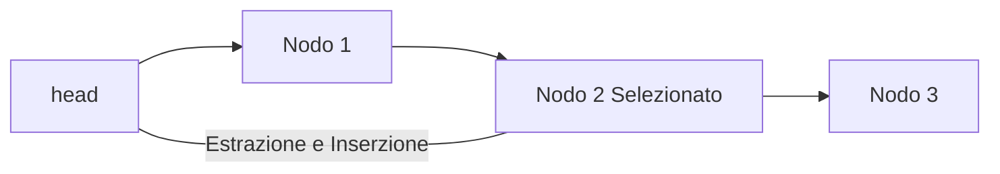
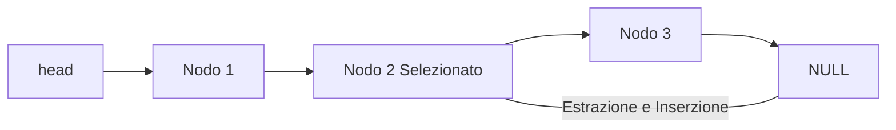

# LAB 2 - 25-03-2025

## Esercizi di progettazione

### Somma Massima - Esercizio:
>[!TIP]
> ### Input:
> - array
> ### Output: 
> - somma massima di gruppi di elementi adiacenti

Due soluzioni:

1. ```cpp
    int somma1(int a[] , int size ){
        int somma;
        int i,j,k;
        int max=a[0];
        for(i=0; i<size; i++) // n
        {
            for(j=i; j<size; j++) // n
            {
            somma=0;
            for(k=i; k<=j; k++) // n
                {
                somma+=a[k];
            }
            if(somma > max) max=somma;
            }
        }
        return max;
    }
    ```
2. ```cpp
    int somma2(int a[] , int size ){
        int somma;
        int i,j;
        int max=a[0];
        for(i=0; i<size; i++)
        {
            somma=0;
            for(j=i; j<size; j++)
            {
                somma+=a[j];
                if(somma > max) max=somma;
            }
        }
        return max;
    }
    ```
>[!NOTE]
> ## Proprietà della somma massima:
> - la somma degli elementi del sotto array di somma massima è sempre positiva
> - Il valore precedente al primo valore del sotto array di somma massima è negativo

e da qui si può creare una terza soluzione:

    ```cpp
    int somma3(int a[] , int size ){
        int somma;
        int i;
        int max=a[0];
        somma = 0;
        for(i=0; i<size; i++)
        {
            if(a[i] >= 0) somma+=a[i];
            else somma=0;
            if(somma > max) max=somma;
        }
        return max;
    }
    ```

### Distinti in array - esercizio:

>[!TIP]
> ### Input: 
> - elementi array
> ### Output:
> - array senza duplicati

La soluzione è la seguente:

```cpp
int main(){
    vector<int> arr = {1, 7, 9, 1, 1, 9};
    sort(arr.begin(), arr.end());
    for(int i = 0; i < arr.size(); ++i){
        if(i == 0){
        cout<<arr[i]<<endl;
        }else{
            if(arr[i] != arr[i-1]){
            cout<<arr[i]<<endl;
            }
        }
    }
}
```

### K interi più frequenti - esercizio:

```cpp

```

### K interi più grandi - esercizio:

```cpp

``` 

---

## Stringhe

Le stringhe sono oggetti che rappresentano sequenze di caratteri.

La classe string standard fornisce supporto per tali oggetti con un'interfaccia simile a quella di un contenitore standard di byte, ma aggiungendo funzionalità specificamente progettate per funzionare con stringhe di caratteri a byte singolo.

La classe string è un'istanza del modello di classe basic_string che utilizza char (ovvero byte) come tipo di carattere , con i suoi char_traits predefiniti e tipi di allocatore (vedere basic_string per maggiori informazioni sul modello). 

```cpp
#include <string>
string parola = "liste";

string frase = "mi piacciono le liste";

string parola2 = "non ";
string frase2 = parola2 + frase;

frase.find(parola);

parola.compare(parola2);
```

### Esercizio:
>[!TIP]
> ### Input:
> - Un testo T formato da più parole
> - Un insieme S di N parole
> ### Output:
>  - Le parole di S contenute in T, ordinate per posizione in T
>  - Le parole di S non contenute in T, in ordine lessicografico

```cpp
// cerca stringhe di S dentro T
void trovaInT( … ){ 
    
}

// implementa confronto per posizione
bool compare1(r1 a, r1 b){ 

}

// implementa confronto lessicografico
bool compare2(string a, string b){

}

int main()
{
    string T;
    int N; // numero di strighe in S
    vector<string> S,R2;
    vector<r1> R1;

    // lettura T ed S
    trovaInT( … );
    sort( R1.begin(), R1.end(), compare1 )
    sort( R2.begin(), R2.end(), compare2 )

    // print
}
```

---

## Liste

```
                      head
                        ↓
                 [value | next]   →   [value | next]   →   [value | next]
```

```
                      head                                       tail
                        ↓                                         ↓
                 [value | next]   →   [value | next]   →   [value | next]
```


### Lettura di una lista:
```cpp
Obj * leggiInput(){
    int value , l;
    cin >> l;
    Obj * head, *newObj;
    for( int i = 0 ; i < l ; ++i )
    {
        cin >> value;
        newObj = new Obj();
        newObj->next_ = head;
        newObj->value_ = value;
        head = newObj;
    }
    return head;
}
```

### Stampa di una lista:


```cpp
void stampaLista( Obj * head ){
    Obj * pointer = head;
    while( pointer != NULL )
    {
        cout << pointer->value_ << endl ;
        pointer = pointer->next_;
    }
    cout << endl;
}

```

### Operazioni su Lista:

1. Ricerco un elemento e lo sposto in testa
    - Scorrere
    - Estrazione
    - Inserzione testa


1. La lista parte dal nodo head e prosegue con Nodo 1, Nodo 2 Selezionato e Nodo 3.

2. Il nodo selezionato (Nodo 2) viene estratto dalla sua posizione originale e reinserito in testa (collegamento diretto a head).


2. Ricerco un elemento e lo sposto in coda
    - Scorrere
    - Estrazione
    - Inserimento in coda...


1. La lista parte da head e termina con NULL, passando per Nodo 1, Nodo 2 Selezionato e Nodo 3.

2. Il nodo selezionato (Nodo 2) viene estratto e reinserito in coda, cioè prima del nodo NULL.