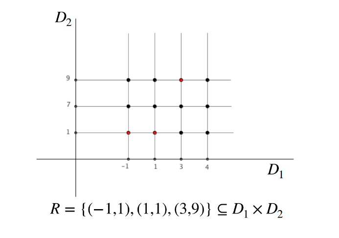

# Lezione 2 - Basi di Dati

## | Modello relazionale
### Modelli logici
* Esistono tre modelli logici tradizionali:
1. **Modello gerarchico**
2. **Modello a rete (reticolare)**
3. **Modello relazionale**

* Esistono anche metodi più recenti come:

1. **Modello a oggetti ( poco diffuso però.. )**
2. **Modello XML**
3. **Modello NoSQL**

#### Modello Gerarchico e reticolare

>[!NOTE]
> Questi sono stati i primi modelli di DBMS, ma sono stati sostituiti dal modello relazionale, che è il più diffuso oggi. Questo è dovuto al fatto che il modello relazionale è più flessibile e permette di gestire dati di qualsiasi tipo, mentre i modelli gerarchico e reticolare sono più rigidi e limitati. 
* Questi due però utilizzano riferimenti espliciti (pointer) per collegare i dati (record), mentre il modello relazionale utilizza chiavi primarie e secondarie per collegare i dati.
* Discutendo del medoto relazionale, questo è basato su **valori**
* Anche **riferimenti** fra dati in strutture (relazioni) diverse sono rappresentati per mezzo dei **valori stessi**, non per mezzo di riferimenti espliciti (pointer).

#### Esempio di modello Relazionale

* Un esempio di modello relazionale è una tabella che rappresenta una relazione tra diverse entità. Ad esempio, una tabella che rappresenta una relazione tra studenti e corsi potrebbe avere le seguenti colonne:

| Matricola | Cognome | Nome | Nascita |
|-----------|---------|------|---------|
| 123456    | Rossi   | Mario| 01/01/1990 |
| 654321    | Bianchi | Luca | 02/02/1991 |
| 789012    | Verdi   | Anna | 03/03/1992 |

* In questo esempio, la tabella rappresenta una relazione tra studenti e i loro dati personali. La chiave primaria è la matricola, che identifica in modo univoco ogni studente.

| Studente | Voto | Corso |
|----------|------|-------|
| 123456   | 28   |   5   |
| 654321   | 25   |   3   |
| 789012   | 27   |   5   |

* In questo esempio, la tabella rappresenta una relazione tra studenti e i loro voti in diversi corsi. La chiave primaria è composta dalla matricola dello studente e dal codice del corso.

### Metodo relazionale:

* Questo metodo venne proposto da Edgar F. Codd nel 1970 e si basa sull'idea di rappresentare i dati in form  a tabulare, dove ogni riga rappresenta un record e ogni colonna rappresenta un attributo del record. Il suo scopo era quello che i dati fossero indipendenti dal modo in cui venivano memorizzati e gestiti.
* Disponibile in DBMS reali nel 1981 con Oracle.
* Si basa sul **concetto matematico** di **relazione** _(attraverso una variante_).
* Le relazioni hanno naturale rappresentazione per mezzo di tabelle.

#### | TURING AWARD |
* L'A.M. Turing Award è il più alto riconoscimento nel campo dell'informatica. E' un premio, assegnato annualmente dalla Association for Computing Machinery (ACM), per contributi significativi alla scienza dell'informatica.
* Il premio viene spesso anche chiamato "premio Nobel dell'informatica" ed è intitolato al matematico inglese Alan Mathison Turing, che ha fatto fondamentali contributi alla teoria dei calcolatori e alla scienza dell'informatica.
>[!NOTE]
> 

>   Association for Computing Machinery (ACM) <a href="https://www.acm.org/">(website)</a>
>   
> 

> 
>   Alcuni Vincitori:  
> | Anno | Vincitore | Nazione | Note |
> | --- | --- | --- | --- |
> | 1971 | John McCarthy | Stati Uniti | Padre dell'AI |
> | 1972 | Edsger W. Dijkstra | Paesi Bassi | Algoritmo del cammino minimo|
> | 1975 | Doanld Knuth | Stati Uniti | The Art of Computer Programming |
> | 1977 | John Backus | Stati Uniti | Linguaggio di programmazione Fortran |
> | 1981 | Edgar F. Codd | Stati Uniti | Database moderni |
> | ...  | ... | ... | ... | 
> | 2016 | Tim Berners-Lee | Regno Unito | World Wide Web |
> | 2018 | Bengio, Hinton, Lecun | Canada, Stati Uniti, Canada | Padrini dell'AI - Deep Learning |

#### Esempio Relazione "Studenti e caffè bevuti"
* S = {Alice, Bob, Chiara, Davide}
  * Insieme degli studenti universitari
* C = {1, 2, 3, 4};
  * Insieme della quantità di caffè bevuti al giorno
* Definiamo la relazione R che descrive quanti caffè ogni studente ha bevuto nel giorno precedente:
  * R = { (Alice, 1), (Bob, 3), (Chiara, 2), (Davide, 4) }
* Interpretazione:
  * Alice ha bevuto 1 caffè
  * Bob ha bevuto 3 caffè
  * Chiara ha bevuto 2 caffè
  * Davide ha bevuto 4 caffè

#### Esempio di Relazione Matematica

* Insieme D1:
  * D1 = {a,b}
* Insieme D2:
  * D2 = {x,y,z}
* Prodotto cartesiano:
  * D1 × D2 = { (a,x), (a,y), (a,z), (b,x), (b,y), (b,z) }
* Relazione R:
  * R = { (a,x), (a,y), (b,z) } (insieme di coppie ordinate) D1 × D2

 
Interpretazione con grafico:
Ogni elemento di D1 è collegato a ogni elemento di D2 tramite una freccia se la coppia ordinata è presente nella relazione R

## | Relazione Matematica
Siano dati n insiemi (anche non disting) D1, D2, ..., Dn. 
La relazione R è un sottoinsieme del prodotto cartesiano D1 × D2 × ... × Dn (insieme delle n-uple ordinate).
Una **relazione** è un sottoinsieme di D1 × D2 × ... × Dn.
- Non c'è un ordinamente tra la n-uple, detta **tupla**.
- Non esistono n-uple **uguali**
- Ogni n-upla è **ordinata**, cioè (a1, a2, ..., an) ≠ (a2, a1, ..., an).
Gli insiemi D1, D2, ..., Dn sono detti **domini** della relazione R.

#### Esempio di Relazione Matematica

* Partite ⊆ String X String X ℕ X ℕ:

|  |  | |  |
|-----------|-----------|---------------|---------------|
| Juve | Lazio | 3 | 1 |
| Lazio | Milan | 2 | 0 |
| Juve | Roma | 0 | 2 | 
| Roma | Milan | 0 | 1 |

* Ciascuno dei domini "ripetuti" ha **due** ruoli diversi, distinguibili solo per la posizione e la struttura è **posizionale**.

| Casa  | Ospite | Reti Casa | Reti Ospite |
|-----------|-----------|---------------|---------------|
| Juve | Lazio | 3 | 1 |
| Lazio | Milan | 2 | 0 |
| Juve | Roma | 0 | 2 | 
| Roma | Milan | 0 | 1 |

* A ciascun dominio si associa un **nome unico** nella tabella, detto **attributo**. che ne descrive il ruolo.

## | Il modello Relazionale è basato sui VALORI
I riferimenti fra dati in relazioni diverse sono
rappresentati per mezzo di valori dei domini che
compaiono nelle n-uple

Studenti

| Matricola | Cognome | Nome | Nascita |
|-----------|---------|------|---------|
| 123456    | Rossi   | Mario| 01/01/1990 |
| 654321    | Bianchi | Luca | 02/02/1991 |
| 789012    | Verdi   | Anna | 03/03/1992 |

Esami

| Studente | Voto | Corso |
|----------|------|-------|
| 123456   | 28   |   2   |
| 654321   | 25   |   3   |
| 789012   | 27   |   1   |

Corsi

| Codice | Titolo     | Docente      |
|--------|------------|--------------|
|   1    | Matematica | Prof. Rossi  |
|   2    | Fisica     | Prof. Bianchi|
|   3    | Chimica    | Prof. Verdi  |

* Per questi esempi:
  * Lo studente con matricola 123456, è collegato all'esame con voto 28, che è collegato al corso con codice 2 che è descritto da "Fisica" tenuto dal "Prof. Bianchi".

### Definizioni:
- **Schema di relazione**: insieme di attributi che descrivono una relazione. Un simbolo R detto **nome della relazione** e un insieme di (nomi di) **attributi** A1, A2, ..., An. Si scrive R(A1, A2, ..., An) - indicato R(X).
  - A ciascun attributo è associato un dominio, che è l'insieme dei valori che l'attributo può assumere.
- **Schema di base di dati**: un insieme di schemi di relazione con nomi diversi, solitamente indicato come R = {R1(X1), R2, ..., Rm(Xm)}.
- **n-UPLA o TUPLA**: una sequenza ordinata di n valori, uno per ciascun attributo dello schema di relazione - su un insieme di attributi X è una **funzione** che associa a ciascun attributo un valore del suo dominio.
  - Il simbolo t[A] denota il valore della n-upla t sull'attributo A.
  - Il simbolo t(Y) con Y ⊆ X denota la n-upla ottenuta da t restringendo il dominio agli attributi in Y.
- **(Istanza di) Relazione** su uno schema R(X) è un insieme di n-uple su X.
- **(Istanza di) Base di dati** su uno schema R è un insieme di relazioni r = {r1, r2, ..., rm} dove ciascuna relazione ri è un'istanza della relazione Ri(Xi).

#### Esempio 1:

Studenti

| Matricola | Cognome | Nome | Nascita |
|-----------|---------|------|---------|
| 123456    | Rossi   | Mario| 01/01/1990 |
| 654321    | Bianchi | Luca | 02/02/1991 |
| 789012    | Verdi   | Anna | 03/03/1992 |

Esami

| Studente | Voto | Corso |
|----------|------|-------|
| 123456   | 28   |   2   |
| 654321   | 25   |   3   |
| 789012   | 27   |   1   |

Corsi

| Codice | Titolo     | Docente      |
|--------|------------|--------------|
|   1    | Matematica | Prof. Rossi  |
|   2    | Fisica     | Prof. Bianchi|
|   3    | Chimica    | Prof. Verdi  |

* Quante relazioni ci sono nella base di dati?
  * 3 relazioni
* Quante tuple totali ci sono nella base di dati?
  * 9 n-uple (3 n-uple per Studenti, 3 n-uple per Esami, 3 n-uple per Corsi)
* Qual è il dominio dell'attributo Voto nella relazione Esami?
  * {25, 27, 28}
* Qual è il dominio dell'attributo Codice nella relazione Corsi?
  * {1, 2, 3}
* Qual è il dominio dell'attributo Studente nella relazione Esami?
  * {123456, 654321, 789012}

#### Esempio 2:

Relazione su singolo attributo:

Studenti

| Matricola | Cognome | Nome | Nascita |
|-----------|---------|------|---------|
| 123456    | Rossi   | Mario| 01/01/1990 |
| 654321    | Bianchi | Luca | 02/02/1991 |
| 789012    | Verdi   | Anna | 03/03/1992 |
| 345678    | Neri    | Giovanni | 04/04/1993 |

Studenti Lavoratori

| Matricola |
|-----------|
| 123456    |
| 789012    |

> [!NOTE]
> * La tabella Studenti Lavoratori è una relazione con un solo attributo (Matricola).
> * Questo dimostra che una relazione non deve necessariamente avere più colonne; può rappresentare un sottoinsieme di un'altra relazione con un solo attributo.
> * La relazione Studenti Lavoratori è un sottoinsieme della relazione Studenti.
> * Ogni valore di Matricola in Studenti Lavoratori deve necessariamente esistere nella relazione Studenti.
> * Questo mostra una relazione uno-a-uno tra le due tabelle.

> [!WARNING]
> Il modello relazionale però impone ai dati una struttura RIGIDA
> * Non è possibile avere una relazione con un numero variabile di attributi.

## | Informazione incompleta

Le informazioni sono rappresentate da n-uple il cui formato deve corrispondere esattamente agli schemi di relazione.
Ma i dati disponibili possono non corrispondere al formato previsto.

#### Esempio:

Persone

|Nome| Secondo nome | Cognome |
|----|--------------|---------|
|Franklin | Delano | Roosevelt |
|Winston | | Churchill |
|Charles | | Darwin |
|Albert |  | Einstein |

> [!NOTE]
> Non conviene usare valori "particolari" del dominio (0, stringa nulla, "99", ...)
> * potrebbero non esistere valori "non utilizzati"
> * valori "non utilizzati" potrebbero diventare significativi
> * in fase di utilizzo (nei programmi) sarebbe necessario ogni volta tener conto del "significato" di questi valori

>[!TIP]
> Si usa un valore distinto aggiunto a tutti i domini ovvero il **VALORE NULLO**:
> * Il valore nullo denota l'assenza di un valore del dominio - aggiunto "ex-macchina", ovvero non è un valore del dominio.
> * Se i valori dell'attributo A appartengono al dominio DA, t[A] è un valore del dominio oppure il valore nullo **NULL**.

Quindi si possono (E DEBBONO) imporre RESTRIZIONI sulla presenza di valori nulli in una relazione.

### Tipi di valore nullo:

Esistono almeno tre casi differenti:

- Valore **sconosciuto**
- Valore **inesistente**
- Valore **indefinito - senza informazione**
>[!WARNING]
>I DBMS non distinguono i tipi di valore nullo

#### Esempio di "_troppi_" valori nulli

Studenti

| Matricola | Cognome | Nome | Nascita |
|-----------|---------|------|---------|
| 123456    | Rossi   | Mario| 01/01/1990 |
| 654321    | Bianchi | Luca | 02/02/1991 |
| **NULL**    | Verdi   | Anna | 03/03/1992 |

Esami

| Studente | Voto | Corso |
|----------|------|-------|
| **NULL** | 28   |   **NULL**  |
| **NULL**  | 25   |   3   |
| 789012   | 27   |   1   |

Corsi

| Codice | Titolo     | Docente      |
|--------|------------|--------------|
|   1    | Matematica | Prof. Rossi  |
|   2    | **NULL**     | **NULL**|
|   3    | Chimica    | Prof. Verdi  |

* Cosa succede quando ci sono troppi valori nulli?
  * Non si può fare nulla di utile con i valori nulli.
  * Fanno male alla Base di Dati
  * Difficoltà nell'integrità dei dati.
    * Se un valore chiave primaria è NULL (come nella relazione Studenti, dove manca la Matricola per Anna), l'integrità della base di dati è compromessa.
    * Le chiavi primarie non dovrebbero mai essere NULL, perché servono a identificare in modo univoco una riga nella tabella
  * Problemi nelle relazioni tra le tabelle
    * Nella tabella Esami, alcuni valori NULL rendono impossibile associare il voto a un determinato studente o corso.
    * Questo rende inutilizzabili i dati per analisi o operazioni come il calcolo della media dei voti per studente o corso.

### Basi di dati "scorrette"

- Esistono istanze di basi di dait che, pur **sintatticamente corrette, non rappresentano informazioni possibili** per l'applicazione di interesse.
  
Degli esempi potrebbero essere:
Esami

|Studente|Voto|Lode|Corso|
|--------|----|----|-----|
|123456  |28  | e lode   |1    |
| 278901 | 25  | e lode  | 3    |
| 789012 | 32 |   | 1    |
|739430 | 24 | | 4 |

Studenti

|Matricola|Cognome|Nome|
|---------|-------|----|
|123456   |Rossi  |Mario|
|278901   |Bianchi|Anna|
|278901   |Verdi  |Giuseppe|

> [!NOTE]
> - Il voto 32 è superiore a 30, e dovrebbe quindi avere la lode.
> - Il voto 28 è inferiore a 30, e non dovrebbe quindi avere la lode.
>   - Stessa cosa per il 25
> - La matricola 739430 non esiste.
> - La matricola 278901 è duplicata.
> - La matricola 789012 non esiste.

>[!IMPORTANT]
> Non avendo vincoli di integrità, non è possibile fare nulla per correggere questi errori e quindi potrebbero essere considerati "corretti".

## | Vincoli di integrità

Si devono associare alla base di dati delle proprietà
che, se soddisfatte, esprimono la sua “correttezza”
rispetto all’applicazione
Queste proprietà sono chiamate **vincoli di integrità** e:
- permettono una descrizione più accurata della realtà
- danno un contribuyo alla "qualità dei dati"
- sono utili nella progettazione
- sono usati dai DBMS per garantire la correttezza della base di dati nella esecuzione delle interrogazioni
I vincoli corrispondono a proprietà del mondo reale
modellato dalla base di dati e interessano tutte le
istanze 
I vincoli sono associati allo schema e si considerano
corrette le sue istanze che soddisfano tutti i vincoli

* Un vincolo di integrità è una **funzione Booleana ( predicato )** che associa, ad ogni istanza della base di dati, il valore **vero** o **falso**.
* Se il predicato associa il valore **vero** all’istanza, essa è **corretta** rispetto al vincolo e la **proprietà è soddisfatta**.
* Esistono due tipi di vincoli di integrità: **vincoli intra-relazionali** e **vincoli inter-relazionali**.
1. **Vincoli intra-relazionali**: riguardano una sola relazione della base di dati.
    - **Vincolo di n-upla**: può essere valutato su ciascuna n-upla della relazione indipendentemente dalle altre. Esempio: _(Voto = 30) OR NOT (Lode = “e lode”)_
    - **Vincolo di dominio**: vincolo di n-upla che riguarda un solo attributo della n-upla. Esempio: _(Voto >= 18) AND (Voto <= 30)_
2. **Vincoli inter-relazionali**: riguardano più relazioni della base di dati.
    - _“Un numero di matricola può comparire nella relazione Esami solo se compare nella relazione Studenti”_

## | Chiave

> [!IMPORTANT]
> Una chiave è un insieme di attributi che permette di identificare univocamente una n-upla in una relazione.
> 
> Formalmente... Una chiave è un insieme K di attributi è definita con il termine come **superchiave** se per ogni coppia di n-uple distinte della relazione, non sono contenute due n-uple distinte t1 e t2 tali che t1[K] = t2[K].
>
> K è una **chiave** per r se è una superchiave minimale di r (cioè non esiste una superchiave K' di r tale che K' è un sottoinsieme proprio di K)

#### Esempio 1:

| Matricola | Cognome | Nome | Corso | Nascita |
|-----------|---------|------|-------|--------|
| 123456    | Rossi   | Mario| Ing. Inf | 01/01/2000 |
| 654321    | Bianchi | Luca | Ing. Inf | 02/02/2001 |
| 789012    | Verdi   | Anna | Ing. Mecc. | 03/03/2002 |
| 345678    | Neri    | Giovanni | Ing. Mecc. | 04/04/2003 |
| 901234    | Russo   | Marco | Ing. Inf | 05/05/2004 |

* Matricola é una chiave:
  * è una superchiave perché per ogni coppia di n-uple distinte, il valore di Matricola è diverso.
  * contiene un solo attributo, quindi è minimale.

#### Esempio 2:

| Matricola | Cognome | Nome | Corso | Nascita |
|-----------|---------|------|-------|--------|
| 123456    | Rossi   | Mario| Ing. Inf | 01/01/2000 |
| 654321    | Bianchi | Luca | Ing. Inf | 02/02/2001 |
| 789012    | Verdi   | Anna | Ing. Mecc. | 03/03/2002 |
| 345678    | Neri    | Giovanni | Ing. Mecc. | 04/04/2003 |
| 901234    | Russo   | Marco | Ing. Inf | 05/05/2004 |

* Cognome, Nome, Nascita è una chiave:
  * è una superchiave perché per ogni coppia di n-uple distinte, il valore di Cognome, Nome, Nascita è diverso.
  * è minimale
* Cognome e Nome non distinguono le n-uple perché esistono persone con lo stesso cognome e nome (ad esempio, due "Mario Rossi").
* Cognome, Nascita non distinguono le n-uple perché due persone possono avere lo stesso cognome e la stessa data di nascita (ad esempio, due fratelli nati lo stesso giorno).
* Nome, Nascita non distinguono le n-uple perché due persone possono avere lo stesso nome e la stessa data di nascita (ad esempio, due "Anna" nate lo stesso giorno ma con cognomi diversi).

> [!NOTE]
> - Una relazione contiene -uple tutte diverse tra loro
>   - Ricordiamoci che è un insieme
> - Ogni relazione ha come superchiave l’insieme degli attributi su cui è definita
>   - Quindi ha (almeno) una chiave
> - L’esistenza delle chiavi garantisce l’accessibilità a ciascun dato della base di dati
> - Le chiavi permettono di correlare i dati in relazioni diverse
> - Le **chiavi definite su schemi di relazioni** sono un tipo di **vincolo di integrità**, detto **vincolo di chiave**

### Chiave primaria:

- Come ci comportiamo se una relazione ha più di una chiave? 
- Scegliamo noi una delle chiavi e la dichiariamo **chiave primaria (primary key)**.
  - Le altre chiavi sono dette **chiavi candidate (candidate keys)**.
- Ogni relazione ha una e una sola chiave primaria.
  - Gli attributi di una chiave primaria sono solitamente "sottolineati"

### Chiavi e valori nulli:
- In presenza di valori nulli, i valori della chiave non permettono:
  - di identificare la n-upla (se la chiave contiene valori nulli)
  - di realizzare facilmente i riferimenti da altre relazoni
  - La presenza di valori nulli nelle chiavi **deve essere limitata**

## | Dipendenze Funzionali
> [!IMPORTANT]
> I vincoli di chiave sono particolari tipi di vincoli, che fanno parte di una categoria più vasta: le dipendenze funzionali
>
> Formalmente... Dati due insiemi di attributi e sulla relazione R , si dice che X **determina** Y (o che Y **dipende** da X) se, per ogni coppia di n-uple uguali su X, esse sono anche uguali su Y.
>
> Le dipendenze funzionali possono essere usate per garantire opportune proprietà di integrità di una base di dati.

## | Integrità Referenziale

- Informazioni in relazioni diverse possono essere correlate attraverso valori comuni
  
  > [!NOTE]
  > In particolare, i valori delle chiavi

> [!IMPORTANT]
> Data una relazione, un insieme di attributi della relazione che corrispondono a una chiave primaria di un’altra relazione è chiamato **chiave esterna (foreign key)**.

> [!NOTE]
> Simili a un "puntatore logico"

#### Esempio _Infrazione - Vigili_:

Infrazioni:
| Codice | Data  | Vigile                              | Prov | Numero |
|--------|-------|-----------------------------------|------|--------|
| 34321  | 1/2/15 | 3987 | MI | 39548K |
| 53524  | 4/3/15 | 3295 | TO | E39548 |
| 64521  | 5/4/16 | 3295 | PR | 839548 |
| 73321  | 5/2/18 | 9345 | PR | 839548 |

Vigili:
|Matricola|Cognome|Nome|
|---------|--------|----|
| 3987    | Rossi  | Mario |
| 3295    | Bianchi| Mario |
| 9345    | Verdi  | Mario |
| 1234    | Neri   | Mario |

> [!NOTE]
> La chiave esterna **Vigile** della relazione **Infrazioni** è correlata alla chiave primaria **Matricola** della relazione **Vigili**

### Vincolo di Integrità Referenziale

> [!IMPORTANT]
> Un **vincolo di integrità referenziale** è un vincolo che stabilisce che i valori di una chiave esterna devono essere uguali a valori di una chiave primaria di un'altra relazione o essere nulli.

> [!NOTE]
> In questo caso l’ordine degli attributi tra le due relazioni non è significativo, ma l’attributo su cui è stabilito il vincolo è significativo.

### Integrità referenziale e valori nulli

In presenza di valori nulli i vincoli possono essere resi
meno restrittivi.

> [!IMPORTANT]
> Il vincolo non è fra ogni valore degli attributi di una relazione R1 e la chiave primaria della relazione R2, ma tra i valori di X diversi da NULL e la chiave primaria di R2.

#### Esempio:

Impiegati:
| Matricola | Cognome | Progetto |
|-----------|---------|----------|
| 34321     | Rossi   | IDEA     |
| 53524     | Neri    | XYZ      |
| 64521     | Verdi   | NULL     |
| 73032     | Bianchi | IDEA     |

Progetti:
| Codice | Inizio | Durata | Costo |
|--------|--------|--------|-------|
| IDEA   | 2000   | 36     | 200   |
| XYZ    | 2001   | 24     | 120   |
| BOH    | 2001   | 24     | 150   |

> [!NOTE]
> 1. La chiave esterna **Progetto** della relazione **Impiegati** è correlata alla chiave primaria **Codice** della relazione **Progetti**
> 2. **Non è necessario** che tutti i valori di Progetto siano presenti nella relazione Progetti
> 3. I valori **NULL sono ammessi**
> 4. Se un valore di Progetto è NULL, non è necessario che esista un valore di Codice uguale a NULL nella relazione Progetti
> 5. Se un valore di Progetto è diverso da NULL, deve esistere un valore di Codice uguale a Progetto nella relazione Progetti

### Operazioni di aggiornamento
1. Operazione di **inseriento**:
   - Violazione dei vincoli intra-relazionali 
   - Violazione dell'integrità referenziale
2. Operazione di **cancellazione**:
   - Violazione dell'integrità referenziale
3. Operazione di **modifica**:
   - modifica = cancellazione + inserimento

### Reazione alla Violazione di Vincoli:
> [!TIP] Cosa succede quando si tenta di compiere un’operazione che viola un vincolo, ad esempio si cerca di inserire nella base di dati un valore non consentito per quell'attributo?
>Sono possibili meccanismi per il supporto alla gestione delle violazioni ("**_azioni compensative_**“)

#### Azioni compensative:
1. Esempio:
   - Viene eliminata una -upla, causando una violazione
2. Comportamento “standard”:
   - Rifiuto dell’operazione: il sistema rifiuta l’operazione che ha causato la violazione
3. Azioni compensative:
   - Eliminazione in cascata: Quando si elimina una tupla dalla relazione R1 che contiene una chiave esterna, tutte le tuple della relazione R2 che contengono il valore della chiave primaria eliminata vengono eliminate.
   - Introduzione di valori nulli: Quando si elimina una tupla dalla relazione R1 che contiene una chiave esterna, tutte le tuple della relazione R2 che contengono il valore della chiave primaria eliminata vengono aggiornate impostando la chiave esterna a NULL.

> [!IMPORTANT]
> > [Qui sono presenti gli esercizi riguardante questa lezione](./Esercizi/Lezione1-2.md) 
