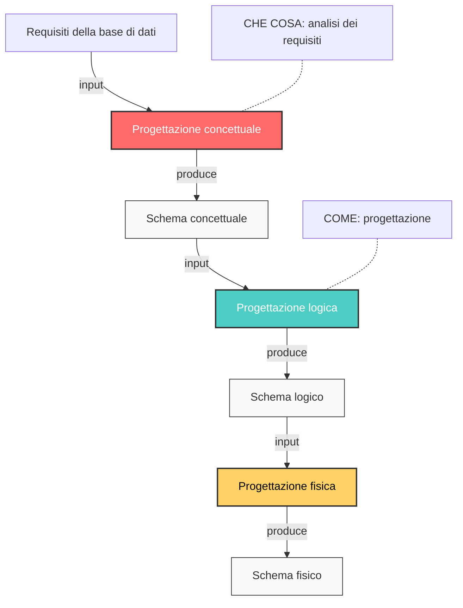
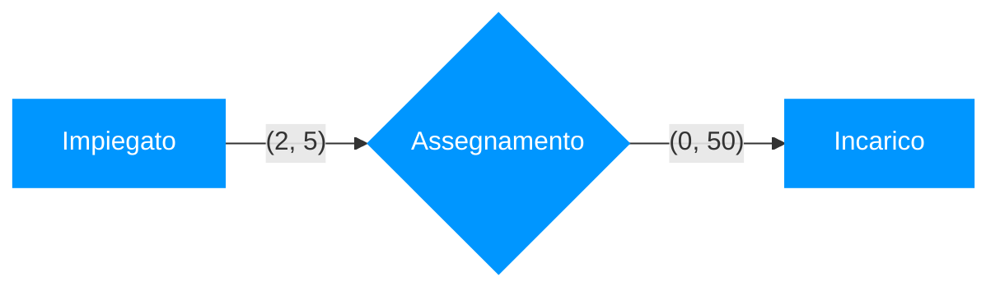
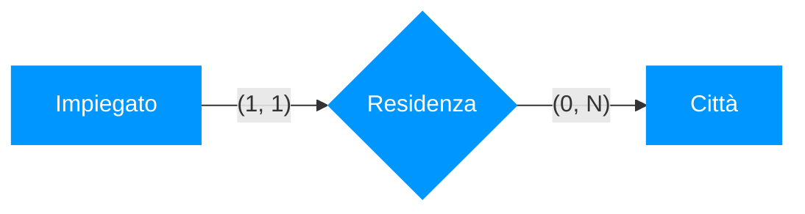
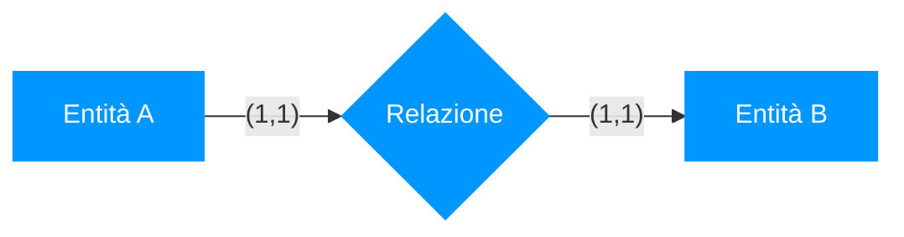
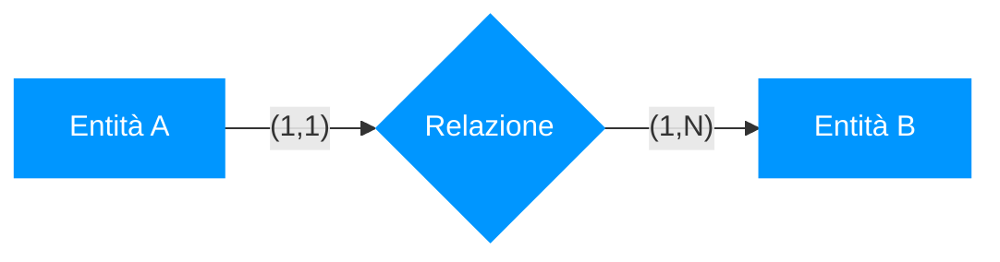
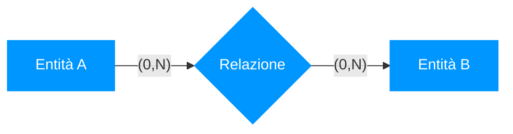

<h1>Lezione 5 - 19-03-2025 - 20-03-2025</h1>

<h1>📚 Indice</h1>

- [**Metodologie e Modelli Progettuali**](#metodologie-e-modelli-progettuali)
  - [**Ciclo di Vita dei Sistemi Informativi**](#ciclo-di-vita-dei-sistemi-informativi)
- [**Un Buon Progetto**](#un-buon-progetto)
- [**Modello e Fasi per il Ciclo di Vita**](#modello-e-fasi-per-il-ciclo-di-vita)
  - [**Waterfall Model (Modello a Cascata)**](#waterfall-model-modello-a-cascata)
- [**Raccolta e Analisi dei Requisiti**](#raccolta-e-analisi-dei-requisiti)
  - [**Metodi per Ottenere i Requisiti**](#metodi-per-ottenere-i-requisiti)
- [**Interazione con gli Utenti**](#interazione-con-gli-utenti)
  - [**Migliori Pratiche per l’Interazione con gli Utenti**](#migliori-pratiche-per-linterazione-con-gli-utenti)
  - [**Interazione con gli Utenti Tramite Documentazione**](#interazione-con-gli-utenti-tramite-documentazione)
- [Progettazione](#progettazione)
  - [Progettare per livelli di astrazione](#progettare-per-livelli-di-astrazione)
- [Modello dei dati](#modello-dei-dati)
  - [Schemi e istanze:](#schemi-e-istanze)
  - [Principali Tipi di Modelli:](#principali-tipi-di-modelli)
    - [Passaggi tra modelli:](#passaggi-tra-modelli)
- [Costrutti di base](#costrutti-di-base)
  - [Entità:](#entità)
  - [Relationship:](#relationship)
    - [Esempi cardinalità:](#esempi-cardinalità)
    - [Esempi tipi di relationship:](#esempi-tipi-di-relationship)
  - [Attributo:](#attributo)
  - [Schema E-R con solo i costrutti base](#schema-e-r-con-solo-i-costrutti-base)
- [Altri Costrutti del Modello E-R](#altri-costrutti-del-modello-e-r)
  - [Identificatore di identità:](#identificatore-di-identità)
  - [Generalizzazione:](#generalizzazione)
    - [Altre proprietà](#altre-proprietà)
    - [Esercizio:](#esercizio)
- [Documentazione associata agli schemi concettuali](#documentazione-associata-agli-schemi-concettuali)
  - [Dizionario dei dati (entità):](#dizionario-dei-dati-entità)
  - [Dizionario dei dati (relationship)](#dizionario-dei-dati-relationship)
  - [Regole di vincolo](#regole-di-vincolo)
  - [Regole di derivazione](#regole-di-derivazione)


## **Metodologie e Modelli Progettuali**

Quando iniziamo a modellare un’applicazione, uno dei primi passi è la definizione dello schema logico della base di dati. Tuttavia, questo approccio presenta alcune difficoltà:
- **Da dove iniziare?** Se partiamo direttamente dalla struttura dei dati, rischiamo di perdere di vista la visione generale dell’applicazione.
- **Possiamo perderci nei dettagli?** Se ci focalizziamo troppo sulle singole tabelle e sui loro attributi fin da subito, potremmo trascurare aspetti più ampi del sistema.
- **Come correlare le tabelle?** È necessario stabilire fin da subito le relazioni tra le entità, definendo chiavi primarie e chiavi esterne.
- **Rigidità del modello relazionale** Il modello relazionale, sebbene molto diffuso, presenta una certa rigidità nella gestione delle modifiche e dell’evoluzione del sistema.

La modellazione dei dati è quindi solo una parte dell’intero **processo di sviluppo dei sistemi informativi**, che deve essere inquadrato in un contesto più generale, noto come **ciclo di vita (lifecycle) dei sistemi informativi**.

### **Ciclo di Vita dei Sistemi Informativi**
Il ciclo di vita di un sistema informativo è costituito da un insieme di attività organizzate temporalmente, svolte da analisti, progettisti e utenti durante lo sviluppo e l’uso del sistema. Questo ciclo non è un processo lineare, ma iterativo, nel senso che può essere necessario tornare indietro e rivedere le fasi precedenti.

## **Un Buon Progetto**
Affinché il ciclo di vita di un sistema sia ben strutturato ed efficace, è necessario adottare **linguaggi e modelli appropriati** per descrivere il sistema da progettare. 
Nel contesto delle **basi di dati**, una buona metodologia di progettazione deve includere:
- **Modelli per rappresentare i dati** che siano facili da comprendere e utilizzare, sia per gli sviluppatori che per gli utenti.
- **Decomposizione delle attività in fasi** per gestire meglio la complessità del sistema.
- **Strategie e criteri di scelta** che aiutino a prendere decisioni informate in ogni fase del progetto.

## **Modello e Fasi per il Ciclo di Vita**
Il primo passo nella progettazione è la scelta di un modello per il ciclo di vita. 
Uno dei modelli più conosciuti e utilizzati in passato è il **modello a cascata (waterfall model)**.

### **Waterfall Model (Modello a Cascata)**
Nel modello a cascata, lo sviluppo del sistema avviene attraverso una sequenza ben definita di fasi, ognuna delle quali è completata prima di passare alla successiva. Una caratteristica importante di questo modello è che le fasi **non sono ripetibili**, ovvero una volta conclusa una fase, non si torna indietro (almeno in teoria). 

Le fasi del modello a cascata sono:
1. **Studio di fattibilità**: 
   - Definizione degli obiettivi del sistema.
   - Analisi dei costi e delle priorità.
   - Valutazione dei rischi e delle alternative.
2. **Raccolta e analisi dei requisiti**: 
   - Studio delle caratteristiche desiderate del sistema.
   - Identificazione delle esigenze degli utenti e delle funzionalità necessarie.
3. **Progettazione**: 
   - Definizione dell’architettura del sistema.
   - Modellazione dei dati e delle funzionalità.
4. **Realizzazione**: 
   - Implementazione del sistema, ovvero scrittura del codice.
5. **Validazione e collaudo**:
   - Test del sistema per verificare che funzioni come previsto.
   - Identificazione e correzione di eventuali problemi.
6. **Funzionamento**:
   - Il sistema diventa operativo e viene utilizzato dagli utenti finali.
   - Eventuali aggiornamenti o correzioni vengono apportati in questa fase.

## **Raccolta e Analisi dei Requisiti**

Questa fase è cruciale per il successo del progetto, poiché la qualità dei requisiti raccolti influisce direttamente sulla qualità del sistema finale.

Si divide in due sotto-fasi principali:
1. **Acquisizione dei requisiti**: 
   - Raccogliere informazioni sui bisogni degli utenti e sui vincoli esistenti.
   - Attività complessa, non sempre standardizzabile, perché ogni progetto è diverso.
2. **Analisi dei requisiti**:
   - Una volta raccolti i primi requisiti, si procede con l’analisi e l’organizzazione delle informazioni.
   - Spesso questa analisi porta alla necessità di raccogliere ulteriori informazioni.
   - Possono essere utilizzati linguaggi specifici per rappresentare i requisiti, come UML (Unified Modeling Language).

### **Metodi per Ottenere i Requisiti**
I requisiti possono essere ottenuti attraverso diverse fonti:
- **Direttamente dagli utenti**:
  - Interviste con gli utenti finali.
  - Documentazione dedicata alla raccolta delle esigenze.
- **Dalla documentazione esistente**:
  - Leggi e normative di settore.
  - Regolamenti interni e procedure aziendali.
  - Sistemi informativi preesistenti, per capire cosa può essere migliorato o mantenuto.

## **Interazione con gli Utenti**
Interagire con gli utenti è un aspetto fondamentale per raccogliere i requisiti, ma presenta delle problematiche:
- **Difficoltà nella raccolta delle informazioni**: utenti diversi possono avere visioni e necessità differenti.
- **Visione generale vs. dettagliata**: utenti di livello alto (manager, dirigenti) tendono ad avere una visione più ampia ma meno dettagliata, mentre gli utenti operativi forniscono dettagli pratici ma possono non avere una visione d’insieme.
- **Acquisizione progressiva**: spesso i requisiti non sono completamente definiti fin dall’inizio, ma emergono in modo iterativo attraverso successivi affinamenti.

### **Migliori Pratiche per l’Interazione con gli Utenti**
Per migliorare la raccolta dei requisiti e ridurre gli errori:
- **Verifiche frequenti**: confrontare periodicamente i requisiti raccolti con gli utenti per confermare che siano corretti e coerenti.
- **Utilizzo di esempi**: presentare esempi concreti per chiarire eventuali ambiguità.
- **Definizioni e classificazioni**: richiedere spiegazioni chiare sui concetti utilizzati dagli utenti.
- **Prioritizzazione dei requisiti**: distinguere tra funzionalità essenziali e marginali.

### **Interazione con gli Utenti Tramite Documentazione**
Quando i requisiti vengono estratti da documenti esistenti, è importante seguire alcune regole per garantire chiarezza e coerenza:
- **Standardizzare la struttura delle frasi**: evitare ambiguità e fraintendimenti.
- **Separare dati e funzioni**: distinguere chiaramente le informazioni relative ai dati da quelle relative ai processi.
- **Organizzare termini e concetti**: creare un glossario per evitare interpretazioni errate.
- **Unificare i termini**: evitare sinonimi che potrebbero generare confusione.
- **Esplicitare i riferimenti**: collegare chiaramente concetti e termini tra loro.
- **Riorganizzare le informazioni**: strutturare il documento in modo logico e comprensibile.

## Progettazione

La progettazione è una fase fondamentale del ciclo di vita del software, in cui vengono definiti gli aspetti strutturali e funzionali del sistema.

Per un sistema software, la progettazione consta fondamentalmente di due aspetti:
- **_progettazione dei dati_**: nel caso di sistemi informativi, il progetto dei dati ha un ruolo centrale;
-  **_progettazione delle applicazioni_**;

### Progettare per livelli di astrazione
1. **_Livello concettuale_**. Esprime i requisiti di un sistema in
una descrizione adatta all’analisi dal punto di vista
esterno
2. **_Livello logico_**. Evidenzia l’organizzazione dei dati dal
punto di vista del loro contenuto informativo,
descrivendo la struttura di ciascun record e i
collegamenti tra record diversi.
3. **_Livello fisico_**. A questo livello la base di dati è vista
come un insieme di blocchi fisici su disco. Qui viene
decisa l’allocazione dei dati e le modalità di
memorizzazione dei dati sul disco.



---

## Modello dei dati

Insieme di costrutti utilizzati per organizzare i dati di interesse e descriverne la dinamica.
Componente fondamentale: meccanismi di strutturazioni (o costruttori di tipo)
Come nei linguaggi di programmazione esistono meccanismi che permettono di definire nuovi tipi, così ogni modello dei dati prevede alcuni costruttori
Ad esempio, il modello relazionale prevede il costruttore relazione, che permette di definire insiemi di record omogenei.

### Schemi e istanze:

- In ogni base di dati esistono:
  - lo schema, sostanzialmente invariante nel tempo, che ne descrive la struttura
  - nel modello relazionale, le intestazioni delle tabelle
- l’istanza, i valori attuali, che possono cambiare anche molto rapidamente
  - nel modello relazionale, il corpo di ciascuna tabella

### Principali Tipi di Modelli:

- **_Modelli logici_**: utilizzati nei DBMS esistenti per l’organizzazione dei dati
  - utilizzati dai programmi
  - indipendenti dalle strutture fisiche
  - esempi: **relazionale**, reticolare, gerarchico, a oggetti
- **_Modelli concettuali_**: permettono di rappresentare i dati in modo
indipendente da ogni sistema
  - cercano di descrivere i concetti del mondo reale
  - sono utilizzati nelle fasi preliminari di progettazione
  - il più noto è il modello **_Entità-Relazione_** (**_Entity-Relationship_**)
    - useremo il termine in inglese per non confondersi con la
    relazione del modello relazionale


#### Passaggi tra modelli:


1. Rappresenta la fase iniziale, in cui vengono raccolti i requisiti e modellati i dati in modo indipendente dalla tecnologia e il diagramma ER (Entità-Relazioni) è uno degli strumenti più usati in questa fase..
2. Trasforma il modello concettuale in un modello logico, più vicino alla struttura di un database ma ancora indipendente dal DBMS e si passa a una rappresentazione tabellare con chiavi primarie e relazioni.
3. Traduce il modello logico in una struttura fisica, ottimizzata per il DBMS scelto e si definiscono dettagli come indici, tipi di dati, partizionamento e storage.

---

>[!IMPORTANT]
> ### Modello E-R
> Il **_modello E-R (Entity-Relationship)_**, introdotto da P. P. Chen nel 1976, è uno strumento fondamentale per la progettazione concettuale dei database. Si è affermato come standard nelle metodologie di progettazione e nei sistemi software di supporto, anche se spesso in una versione leggermente diversa da quella originaria.
>
>I vari costrutti si posso dividere in:
> 1. (il principale) **_Costrutti di base_**: Entità, Relationship, Attributo
> 2. **_Identificatore_**, **_Generalizzazione_** etc.. etc...

---

## Costrutti di base

### Entità:
- Un'**_Entità_** è una classe di oggetti (fatti, persone, cose) della applicazione di interesse con proprietà comuni e con esistenza **_“autonoma”_** 
- Esempi:
   - impiegato, città, conto corrente, ordine, fattura;

- **_Occorrenza (o istanza) di entità_**: è un elemento della classe (l'oggetto, la persona, …, non un valore dei dati legati all’oggetto) ed esiste con proprietà note. 
  - Per esempio, un “impiegato”, non so nulla di lui, ma esiste con proprietà note;

Le entità si rappresentano tramite degli "scatolotti":

<div style="display: flex; flex-wrap: wrap; gap: 20px; margin-bottom: 20px;">
  <div style="background-color: #00a8ff; width: 200px; height: 100px; display: flex; justify-content: center; align-items: center;">
    <span style="color: white; font-size: 20px;">Impiegato</span>
  </div>
  
  <div style="background-color: #00a8ff; width: 200px; height: 100px; display: flex; justify-content: center; align-items: center;">
    <span style="color: white; font-size: 20px;">Dipartimento</span>
  </div>
</div>

<div style="display: flex; flex-wrap: wrap; gap: 20px;">
  <div style="background-color: #00a8ff; width: 200px; height: 100px; display: flex; justify-content: center; align-items: center;">
    <span style="color: white; font-size: 20px;">Città</span>
  </div>
  
  <div style="background-color: #00a8ff; width: 200px; height: 100px; display: flex; justify-content: center; align-items: center;">
    <span style="color: white; font-size: 20px;">Vendita</span>
  </div>
</div>

>
- Ogni entità ha un nome che la identifica
univocamente nello schema:
  - nomi espressivi
  - opportune convenzioni
  - singolare

---

### Relationship:

- Una relationship è un legame logico fra due o più entità, rilevante nell’applicazione di interesse
- Esempi:
  - Residenza (fra persona e città)
  - Esame (fra studente e corso)
- Chiamata anche:
  - relazione, correlazione, associazione


<div style="display: flex; flex-direction: column; gap: 100px;">
  <!-- Prima riga: Studente - Esame - Corso -->
  <div style="display: flex; justify-content: space-between; align-items: center; width: 600px;">
    <!-- Studente -->
    <div style="background-color: #00a8ff; width: 180px; height: 80px; display: flex; justify-content: center; align-items: center;">
      <span style="color: white; font-size: 20px;">Studente</span>
    </div>
    <!-- Linea di collegamento sinistra -->
    <div style="width: 60px; height: 2px; background-color: #0066cc;"></div>
    <!-- Esame (rombo) -->
    <div style="width: 120px; height: 80px; position: relative;">
      <div style="width: 120px; height: 80px; background-color: #00a8ff; clip-path: polygon(50% 0%, 100% 50%, 50% 100%, 0% 50%); display: flex; justify-content: center; align-items: center;">
        <span style="color: white; font-size: 20px; text-align: center;">Esame</span>
      </div>
    </div>
    <!-- Linea di collegamento destra -->
    <div style="width: 60px; height: 2px; background-color: #0066cc;"></div>
    <!-- Corso -->
    <div style="background-color: #00a8ff; width: 180px; height: 80px; display: flex; justify-content: center; align-items: center;">
      <span style="color: white; font-size: 20px;">Corso</span>
    </div>
  </div>
  <!-- Seconda riga: Impiegato - Residenza - Città -->
  <div style="display: flex; justify-content: space-between; align-items: center; width: 600px;">
    <!-- Impiegato -->
    <div style="background-color: #00a8ff; width: 180px; height: 80px; display: flex; justify-content: center; align-items: center;">
      <span style="color: white; font-size: 20px;">Impiegato</span>
    </div>
    <!-- Linea di collegamento sinistra -->
    <div style="width: 60px; height: 2px; background-color: #0066cc;"></div>
    <!-- Residenza (rombo) -->
    <div style="width: 120px; height: 80px; position: relative;">
      <div style="width: 120px; height: 80px; background-color: #00a8ff; clip-path: polygon(50% 0%, 100% 50%, 50% 100%, 0% 50%); display: flex; justify-content: center; align-items: center;">
        <span style="color: white; font-size: 20px; text-align: center;">Residenza</span>
      </div>
    </div>
    <!-- Linea di collegamento destra -->
    <div style="width: 60px; height: 2px; background-color: #0066cc;"></div>
    <!-- Città -->
    <div style="background-color: #00a8ff; width: 180px; height: 80px; display: flex; justify-content: center; align-items: center;">
      <span style="color: white; font-size: 20px;">Città</span>
    </div>
  </div>
</div>

>
- Ogni relationship ha un nome che la identifica univocamente nello schema:
  - nomi espressivi
  - opportune convenzioni
    - singolare
    - sostantivi invece di verbi (se possibile)
      - per non dare un verso alla relationship

1. Una **_occorrenza di una relationship_** binaria è **coppia di occorrenze di entità**, una per ciascuna entità coinvolta
2. Una **_occorrenza di una relationship n-aria è una n-upla di occorrenze di entità_**, una per ciascuna delle entità coinvolte
3. Nell'ambito di una relationship **non ci possono essere occorrenze** (coppie, n-uple) ripetute

**_Cardinalità di relationship_**: Coppia di valori associati a ogni entità che partecipa a una relationship
- specificano il numero minimo e massimo di
occorrenze della relationship cui ciascuna
occorrenza di entità può partecipare

---

#### Esempi cardinalità:



>[!NOTE]
>Per semplicità usiamo solo tre simboli:
>
> - 0 e 1 per la cardinalità minima:
>     - 0 = “partecipazione opzionale”
>     - 1 = “partecipazione obbligatoria”
> - 1 e “N” per la massima:
>     - “N” non pone alcun limite


---

**_Tipi di Relationship_**: Con riferimento alle cardinalità massime, abbiamo
relationship:
- uno a uno
- uno a molti
- molti a molti

#### Esempi tipi di relationship:

<div align = "center"><h3>Uno a Uno</h3>



<h3>Uno a Molti</h3>



<h3>Molti a Molti</h3>


</div>

---

### Attributo:

- Un attributo è una proprietà elementare di un’entità o di una relationship, di interesse ai fini dell’applicazione
- Associa a ogni occorrenza di entità o relationship un valore appartenente a un insieme detto dominio dell’attributo
- **_Attributo composto_**: Raggruppano attributi di una medesima entità o relationship che presentano affinità nel loro significato o uso. Possiamo fare come esempio:
   - Via, Numero civico e CAP formano un Indirizzo

---

### Schema E-R con solo i costrutti base
- Si vuole descrivere l’organizzazione di un’azienda
  - Con sedi diverse
  - Ogni sede è composta di vari dipartimenti
  - Gli impiegati dell’azienda afferiscono ai vari
  dipartimenti e un impiegato li dirige
  - Gli impiegati lavorano su progetti
  - Ogni entità o relationship può avere vari attributi

---

## Altri Costrutti del Modello E-R
- **_Cardinalità_**
   - _di relationship_
   - _di attributo_
- **_Identificatore_**
   - _interno_
   - _esterno_
- **_Generalizzazione_**

---

### Identificatore di identità:

L'**_Identificatore di identità_** è uno “strumento” per l’identificazione univoca delle
occorrenze di un’entità. Questo è costituito da:
1. _attributi dell’entità_: identificatore interno (o chiave);
   ```mermaid
   graph LR
      A[Automobile] --- B[Targa]
      A --- C[Modello]
      A --- D[Motore]

      classDef entity fill:#0096FF,stroke:#0096FF,color:white
      classDef attribute fill:white,stroke:#0096FF,color:black,shape:circle
      
      class A entity
      class B,C,D attribute
   ```

   >

   ```mermaid
   graph LR
      A[Persona] --- B[Data di nascita]
      A --- C[Cognome]
      A --- D[Nome]

      classDef entity fill:#0096FF,stroke:#0096FF,color:white
      classDef attribute fill:white,stroke:#0096FF,color:black,shape:circle
      
      class A entity
      class B,C,D attribute
   ```
2. _(attributi +) l’identificatore interno di entità esterne raggiunta attraverso relationship_: identificatore esterno;

   ```mermaid
   graph LR
      A[Studente] -- "(1,1)" --> B{"Iscrizione"}
      B -- "(0,N)" --> C[Università]
      
      A --> D([Cognome])
      A --> E([Nome])
      A --> F([Anno di corso])
      
      C --> G([Nome])
      C --> H([Indirizzo])
      
      classDef entity fill:#0096FF,stroke:#0096FF,color:white
      classDef relationship fill:#0096FF,stroke:#0096FF,color:white,shape:diamond
      classDef attribute fill:white,stroke:#0096FF,color:black,shape:circle
      
      class A,C entity
      class B relationship
      class D,E,F,G,H attribute
   ```

**_Caratteristiche_**: 
1. Ogni entità deve possedere almeno un identificatore, ma può averne in generale più di uno
2. Una identificazione esterna è possibile solo attraverso una relationship a cui l’entità da identificare partecipa con cardinalità (1, 1);

---

### Generalizzazione:
La **_generalizzazione_** mette in relazione una o più entità E1, E2,…, En con una entità , che le comprende come casi particolari:
- E è una generalizzazione di E1, E2, …, En
- E1, E2, …, En sono specializzazioni (o sottotipi) di E

   ```mermaid
   graph TD
      A[Dipendente] -->|è un| B[Impiegato]
      A -->|è un| C[Funzionario]
      A -->|è un| D[Dirigente]

      style A fill:#0096FF,stroke:#0096FF,color:white
      style B fill:#0096FF,stroke:#0096FF,color:white
      style C fill:#0096FF,stroke:#0096FF,color:white
      style D fill:#0096FF,stroke:#0096FF,color:white
   ```

**_Proprietà_**: Se E (genitore) è generalizzazione di  E1, E2, …, En (figlie):
- ogni proprietà di E è significativa per E1, E2,…, En
- ogni occorrenza di E1, E2, …, En è occorrenza anche di E 

   ```mermaid
   graph TD
      A[Città] -->|0, N| B[Nascita]
      B -->|1, 1| C[Persona]

      C -->|è un| D[Lavoratore]
      C -->|è un| E[Studente]

      D -->|ha| F["<b>Stipendio</b>"]

      C --- CF[Codice fiscale]
      C --- N[Nome]
      C --- E2[Età]

      style A fill:#0096FF,stroke:#0096FF,color:white
      style B fill:#0096FF,stroke:#0096FF,color:white,shape:diamond
      style C fill:#0096FF,stroke:#0096FF,color:white
      style D fill:#0096FF,stroke:#0096FF,color:white
      style E fill:#0096FF,stroke:#0096FF,color:white
      style F fill:white,stroke:black,color:black
   ```

**_Caratteristiche_**: 
1. **_Ereditarietà_**: tutte le proprietà (attributi,
relationship, altre generalizzazioni) dell’entità genitore
vengono ereditate dalle entità figlie e non
rappresentate esplicitamente
2. **_Generalizzazione totale_**: se ogni occorrenza
dell'entità genitore è occorrenza di almeno una delle
entità figlie, altrimenti è parziale
3. **_Generalizzazione esclusiva_**: se ogni occorrenza
dell'entità genitore è occorrenza di al più una delle
entità figlie, altrimenti è sovrapposta

   ```mermaid
   flowchart TD
      A[Persona] --> B{Genere}
      B --> C[Uomo]
      B --> D[Donna]
      
      E[Persona] --> F{Occupazione}
      F --> G[Disoccupato]
      F --> H[Lavoratore]
      
      %% Stili
      classDef bluebox fill:#00a8ff,stroke:#0066cc,color:white
      class A,C,D,E,G,H bluebox
      
      classDef hidden fill:none,stroke:none
      class B,F hidden
   ```

---

#### Altre proprietà

- Possono esistere **_gerarchie a più livelli_** e **_multiple
generalizzazioni_** allo stesso livello
- **_Un’entità_** può essere inclusa **_in più gerarchie_**, come
genitore e/o come figlia
- Se una generalizzazione ha solo un’entità figlia si parla
di **_sottoinsieme_**
- Il genitore di una generalizzazione totale **_può non
avere identificatore_**, purché tutte le entità figlie **_ereditino l'identificatore completo dal genitore_**. 

---

#### Esercizio:

>[!TIP]
>- Le persone hanno codice fiscale, cognome ed età, gli uomini la posizione militare, le donne no
>
> - Gli impiegati hanno lo stipendio e possono essere segretari, direttori o progettisti (un progettista può essere anche responsabile di progetto)
> Gli studenti (che non possono essere impiegati) hanno un numero di matricola;
> 
> - Esistono persone che non sono né impiegati né studenti (ma i dettagli non ci interessano)


---

## Documentazione associata agli schemi concettuali

- Dizionario dei dati:
  - **_entità_**
  - **_relationship_**
- Regole aziendali:
  - **_Vincoli di integrità_**
  - **_Possibili derivazioni_**
- Uno schema E-R **_non è quasi mai sufficiente da solo_** a
rappresentare tutti i dettagli di un’applicazione
- Ci sono **_vincoli non esprimibili_**
- È necessario associare una **_documentazione di supporto_**

### Dizionario dei dati (entità):

| Entità | Descrizione | Attributi | Identificatore|
|--------|----------|--------|--------|
|Impiegato| Dipendente dell'azienda | Codice, Cognome| Codice |
|Progetto|Progetti aziendali|Nome, Budget|Nome|
|Dipartimento|Struttura Aziendale|Nome,Telefono|Nome,Sede|
|Sede|Sede dell'azienda|Città, Indirizzo| Città|

### Dizionario dei dati (relationship)

|Relazioni|Descrizione|Componenti|Attributi|
|-|-|-|-|
|Direzione|Direzione di un dipartimento|Impiegato,Dipartimento||
|Afferenza|Afferenza a un dipartimento|Impiegato,Dipartimento|Data|
|Partecipazione|Partecipazione a un progetto|Impiegato,Progetto||
|Composizione|Composizione dell'azienda|Dipartimento,Sede||

### Regole di vincolo

1. Il direttore di un dipartimento deve a afferire a tale
dipartimento
2. Un impiegato non deve avere uno stipendio
maggiore del direttore del dipartimento al quale
afferisce
3. Un dipartimento con sede a Roma deve essere
diretto da un impiegato con più di dieci anni di
anzianità
4. Un impiegato che non afferisce a nessun
dipartimento non deve partecipare a nessun
progetto

### Regole di derivazione

1. Il numero di impiegati di un dipartimento si ottiene
contando gli impiegati che afferiscono a tale
dipartimento
2. Il budget di un progetto si ottiene moltiplicando per
3 la somma degli stipendi degli impiegati che vi
partecipano
