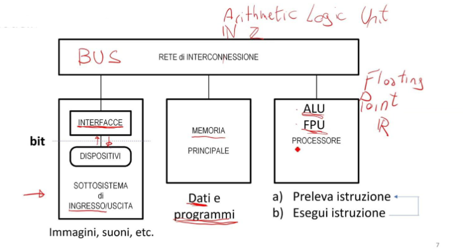
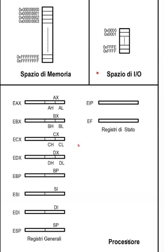
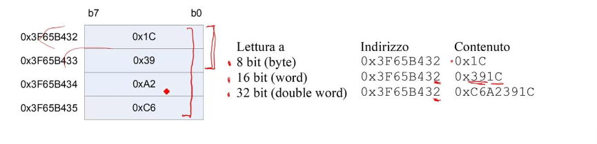

# Lezione 01 (23-09-25) - Base del corso

### Programma del corso

- Linguaggio Assembler
  - quanto serve per poter scrivere programmi semplici;
  - e per poter capire come programmi scritti in linguaggi ad alto livello vengano tradotti in linguaggio macchina;
- Reti logiche
  - reti combinatorie, reti combinatorie per l'aritmetica, reti sequenziali asincrone e sincornizzate;
- Microprogrammazione
  - delle reti sequenziali sincronizzate: come realizzare una rete logica a partire da specifiche date;
- Il *calcolatore* come esempio di rete sequenziale sincronizzata
  - Processore, interfacce di uso comune, convertitori.

>[!IMPORTANT]
>#### Perché si chiama "Reti logiche"?
>  Si guarda all'hardware da una prospettiva funzionale, indipendente dalla tecnologia usata per implementarlo.

--- 

# Programmazione Assembler

>[!WARNING] Assembler e Assembly
> Diciamo che Assembler è il nome del linguaggio, mentre Assembly è il nome del programma che traduce il codice scritto in Assembler in linguaggio macchina e quindi sarebbe più corretto.
> 
> Il linguaggio con cui si scrivono le istruzioni eseguite dal processore
>
> Il processore, ciclicamente:
>  - preleva un'istruzione macchina dalla memoria;
>  - La esegue

### Linguaggio macchina e Assembler

Cosa contiene?
- zeri e uni (linguaggio macchina)

Il linguaggio macchina è una sequenza di zeri ed uni, che il processore interpreta come istruzioni da eseguire (incomprensibile per l'uomo).

Assembler è una sintassi simbolica (human friendly) per rappresentare il linguaggio macchina.
- Assembler è un linguaggio di basso livello, vicino al linguaggio macchina;
- MOV%AX,%BX --> numero binario che il processore interpreta come istruzione macchina.

Il passaggio dell'Assembler al linguaggio macchina si chiama *assemblaggio* ed è compito di un programma chiamato *assembler*. 

### Generalità sull'assembler

Mancano i costrutti di controllo di flusso strutturato tipici dei linguaggi ad alto livello:
- niente quindi... 
  - if...then...else
  - while...do
  - for...to...do
  - switch...case
- Solo costrutti primitivi (salti condizionati e incondizionati) che permettono di realizzare i costrutti di controllo di flusso strutturato.
- Maggior sforzo da parte del programmatore per realizzare programmi complessi.

Mancano tipi di variabile:
- Gli operandi sono stringhe di bit (numeri binari) che il processore interpreta in un certo modo a seconda dell'istruzione che li usa.
- L'interpretazione delle stringhe di bit è nella teta del programmatore, non nei costrutti del linguaggio.

L'assembler è *processor specific*:
- Ogni processore ha il suo linguaggio macchina e quindi il suo assembler.
- Così come lo sono i set di istruzioni dei processori.
- Assembler per Intel x86, ARM, MIPS, ecc.

Il codice Assembler non è mai portabile perché dipende dal processore.
Principi generali validissimi per tutti i processori.
Utilizzo nei sistemi embedded (ovvero sistemi con risorse limitate) e per ottimizzare parti critiche di codice in linguaggi ad alto livello.
Validità culturale per capire come funziona un processore e come i linguaggi ad alto livello vengono tradotti in linguaggio macchina.

#### Schema a blocchi del calcolatore:

## Rappresentazione di numeri naturali e interi

- ALU esegue:
  - operazioni logiche (AND, OR, NOT, XOR) su stringhe di bit;
  - operazioni aritmetiche (ADD, SUB, MUL, DIV)  interpretando le stringhe di bit che maneggia come numeri naturali in base 2 e in numeri interi rappresentati in complemento a 2.
- Rappresentazioni dell'informazione.

## Numero naturali

Su N bit si rappresentano 2N numeri naturali, [0; 2N-1]. La stringa di bit si interpreta come numero naturale in base 2:

$b_{N-1}, b_{N-2}, \ldots, b_{1}, b_{0} \;\;\; \Longleftrightarrow \;\;\; 
X = \sum_{i=0}^{N-1} b_i \cdot 2^i$

- Dove $b_{N-1}$ è il bit più significativo (MSB - Most Significant Bit);
- e invece $b_0$ è il bit meno significativo (LSB - Least Significant Bit).

Per questo possiamo applicare l'algoritmo delle divisioni successive per convertire un numero naturale da base 10 a base 2.

>[!TIP] ESEMPIO:
> #### Convertiamo il numero 53 in base 2
> | Divisione      | Quoziente | Resto | Nota |
> |----------------|-----------|-------|------|
> | 53 ÷ 2         | 26        | 1     | LSB  |
> | 26 ÷ 2         | 13        | 0     |      |
> | 13 ÷ 2         | 6         | 1     |      |
> | 6 ÷ 2          | 3         | 0     |      |
> | 3 ÷ 2          | 1         | 1     |      |
> | 1 ÷ 2          | 0         | 1     | MSB  |
> 
> Leggendo i resti dal basso verso l'alto si ottiene la rappresentazione in base 2 e quindi 53 = 1101012

## Numeri interi in complemento a 2

- Su N bit si rappresentano 2N numeri interi, [-2N-1; 2N-1-1].
- Su 8 e 16 bit l'intervallo è [-128; 127] e [-32768; 32767].
- Il numero intero x viene rappresentato con la stringa di bit X che corrisponde al numero naturale:
  - Se x >= 0, X è la rappresentazione in base 2 di x;
  - Se x < 0, X è la rappresentazione in base 2 di 2N + x.

$
\begin{cases}
x & x \geq 0 \\
2^N + x & x < 0
\end{cases}
$

- Purchè x sia un intero rappresentabile, i cui valori sono compresi nell'intervallo [-2N-1; 2N-1-1].
- Versione equivalente: $ X = |X|_{2^N} $ ovvero il resto della divisione di |X| per 2N.
- La legge inversa (trovare il numeri intero x dalla sua rappresentazione X) è:
&
\begin{cases}
x & X_{N-1} = 0 \\
-(x̅ + 1) & X_{N-1} = 1
\end{cases}
$

- Il complemento è l'opearazione che cambia gli "0" in "1" e gli "1" in "0".
  - Esempio: C2 = 1011 0101 con N = 8 bit
  - x = -(0100 1010 + 1) = -75

### Notazione esadecimale

- Sequenze lunghe di zeri e uni sono difficili da comprendere. 4 bit sono un numero tra 0 e 15 e possiamo associare un simbolo esadecimale a una stringa di 4 bit:

|Quadr. Simb. | Quadr. Simb. |Quadr. Simb. |Quadr. Simb. |
|-------------|---------------|-------------|--------------|
| 0000  | 0 | 0100  | 4 | 1000  | 8 | 1100  | C |
| 0001  | 1 | 0101  | 5 | 1001  | 9 | 1101  | D |
| 0010  | 2 | 0110  | 6 | 1010  | A | 1110  | E |
| 0011  | 3 | 0111  | 7 | 1011  | B | 1111  | F |

- Si scriverà quindi 0xC1 per indicare il byte 1100 | 0001. 
- 0x è il prefisso che indica che il numero è in esadecimale.

---
<h1>Struttura del calcolatore</h1>

    

        <ul>
            <li>Visto da un programmatore Assembler</li>
            <li>Spazio di memoria:
                <ul>
                    <li>Spazio lineare di 232 locazioni (celle) contigue, di capacità un byte ciascuna.</li>
                    <li>Ogni cella identificata da un numero a 32 bit, detto indirizzo.</li>
                    <li>Il processore può accedere (leggere/scrivere) a:
                        <ul>
                            <li>Singola locazione (8 bit);</li>
                            <li>Doppia locazione (16 bit);</li>
                            <li>Quadrupla locazione (32 bit).</li>
                        </ul>
                    </li>
                </ul>
            </li>
        </ul>
    

    

        
    

## Spazio di memoria

- Accessi a 16/32 bit: si usa l'indirizzo più piccolo delle 2/4 locazioni e l'indirizzo più grande contiene i bit più significativi.

- Implementato in tecnologia RAM (memoria volatile)
  - Contenuto casuale al reset;
- Tranne una piccola parte, che deve essere ROM (memoria non volatile) dove risiede il programma di bootstrap (BIOS).
  - Altrimenti il processore non ha istruzioni da prelevare al reset.

- E se nel sistema non ci sono 4Gb (ovvero 232 byte) di RAM?
  - Si mappa la RAM disponibile nei primi indirizzi (da 0 in poi);
  - Il resto dello spazio di memoria non è accessibile (non esiste fisicamente).
- In Assembler gli indirizzi sono SIMBOLICI:
  - La traduzione viene fatta in parte dall'assemblatore e in parte a run time dal sistema operativo (linker e loader).
  - Non è un problema per il programmatore Assembler, che lavora con nomi simbolici.

## Spazio di I/O

- 216 = 64 porte di I/O, ciascuna identificata da un numero a 16 bit (indirizzo di porta).
- Processore: accede in lettura o scrittura a una porta di I/O specifica usando due particolare istruzioni:
  - Spesso una porta solo lettura o solo scrittura.
- Le locazioni di memoria sono identiche, le porte di I/O sono diverse:
  - All'indirizzo della tastiera c'è la tastiera, non il mouse.
  - E' necessario conoscere la mappatura delle porte di I/O (gli indirizzi) per poterle usare.

### Processore

- Registi: piccole locazioni di memoria interne (32 bit) che sono:
  - Generali: per le elaborazioni
  - Di stato: riservati a compiti speciali

- 16 bit bassi dei registri generali riferibili autonomamente (retro-compatibilità con processori a 16 bit).
- Di alcuni registri si possono riferire parti ad 8 bit.

#### Registri generali (non ortogonali):
Alcuni registri utilizzti per particolari funzioni:
- EAX (AX, AH, AL): Accumulatore, utilizzato da alcune istruzioni aritmetiche per contenere operandi e risultati;
- ESI, EDI, EBP: Registri puntatore, utilizzati da alcune istruzioni per contenere indirizzi di memoria;
- ESP: Stack o Pila Pointer, ovvero il registro che punta alla cima di queste due strutture dati (stack e pila);
  
  - >[!TIP] Stack e Pila
    > Stack: struttura dati LIFO (Last In First Out) usata per memorizzare indirizzi di ritorno dalle subroutine e per salvare temporaneamente il contenuto di registri;
    >
    > Pila: struttura dati LIFO usata per memorizzare variabili locali di una funzione;

| Registri generali | Descrizione |
|------------------|-------------|
| EAX (AX, AH, AL) | Accumulatore, utilizzato da alcune istruzioni aritmetiche per contenere operandi e risultati |
| EBX (BX, BH, BL) | Base, utilizzato da alcune istruzioni per contenere operandi e risultati |
| ECX (CX, CH, CL) | Contatore, utilizzato da alcune istruzioni per contenere operandi e risultati |
| EDX (DX, DH, DL) | Data, utilizzato da alcune istruzioni per contenere operandi e risultati |
| ESI (SI)         | Source Index, utilizzato da alcune istruzioni per contenere indirizzi di memoria |
| EDI (DI)         | Destination Index, utilizzato da alcune istruzioni per contenere indirizzi di memoria |
| EBP (BP)         | Base Pointer, utilizzato da alcune istruzioni per contenere indirizzi di memoria |
| ESP (SP)         | Stack Pointer, punta alla cima dello stack |

E = Extended (32 bit, *prima erano registri a 16 bit*).

#### Registri di stato

